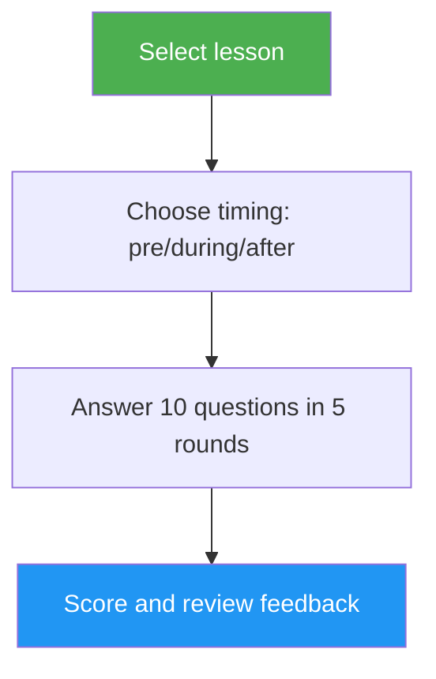

# Lesson Quiz

> Interactive quiz that tests your understanding of a specific Claude Code lesson with 10 questions, per-question feedback, and targeted review guidance.

## Highlights

- 10 questions per lesson mixing conceptual understanding and practical application
- Covers all 10 lessons (01-Slash Commands through 10-CLI)
- Three timing modes: pre-test, progress check, or mastery verification
- Per-question feedback with correct answers and explanations
- Targeted review recommendations pointing to specific lesson sections
- 100-question bank across all lessons in `references/question-bank.md`

## When to Use

| Say this... | Skill will... |
|---|---|
| "quiz me on hooks" | Run a 10-question quiz on Lesson 06: Hooks |
| "lesson quiz 03" | Test your knowledge of Lesson 03: Skills |
| "do I understand MCP" | Assess your understanding of Lesson 05: MCP |
| "practice quiz" | Let you pick a lesson, then quiz you |

## How It Works



## Usage

```
/lesson-quiz [lesson-name-or-number]
```

Examples:
```
/lesson-quiz hooks
/lesson-quiz 03
/lesson-quiz advanced-features
/lesson-quiz           # (prompts for lesson selection)
```

## Output

### Score Report
- Total score out of 10 with grade (Mastered / Proficient / Developing / Beginning)
- Breakdown by question category (conceptual vs. practical)

### Per-Question Feedback
For each incorrect answer:
- What you answered vs. the correct answer
- Explanation of why the correct answer is right
- Specific section of the lesson to review

### Timing-Aware Guidance
- **Pre-test**: Establishes baseline, highlights areas to focus on while studying
- **During**: Identifies what you've grasped and what to revisit
- **After**: Confirms mastery or pinpoints remaining gaps

## Resources

| Path | Description |
|---|---|
| `references/question-bank.md` | 100 pre-written questions (10 per lesson) with answers, explanations, and review pointers |
