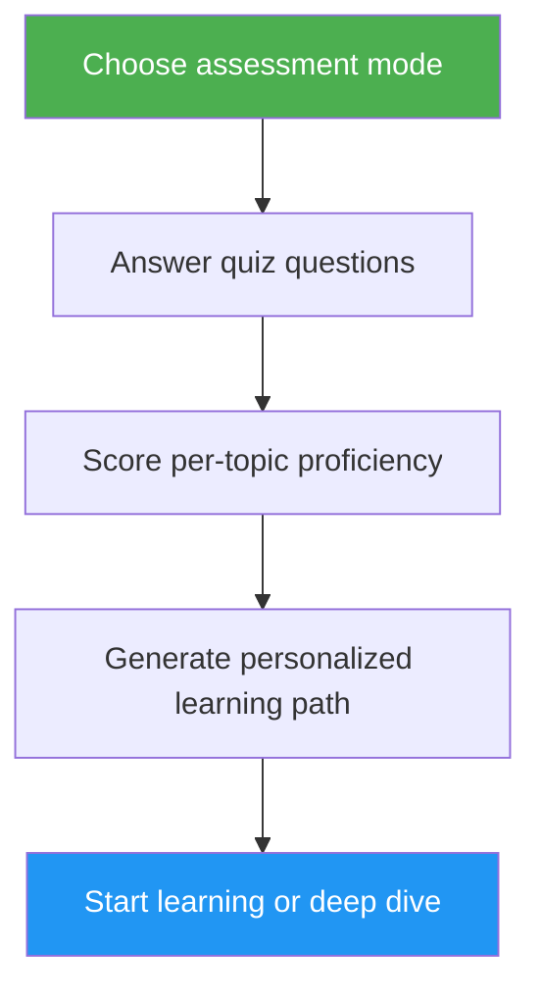

# Self-Assessment & Learning Path Advisor

> Comprehensive Claude Code proficiency assessment that evaluates 10 feature areas, identifies skill gaps, and generates a personalized learning path to level up.

## Highlights

- Two assessment modes: Quick (8 questions, 2 min) and Deep (5 rounds, 5 min)
- Evaluates 10 feature areas: Slash Commands, Memory, Skills, Hooks, MCP, Subagents, Checkpoints, Advanced Features, Plugins, CLI
- Per-topic scoring with mastery levels (None / Basic / Proficient)
- Gap analysis with dependency-aware prioritization
- Personalized learning path with specific exercises and success criteria
- Follow-up actions: start learning, deep dive, practice project, or retake

## When to Use

| Say this... | Skill will... |
|---|---|
| "assess my level" | Run the assessment quiz and determine your level |
| "where should I start" | Evaluate your experience and suggest a starting point |
| "check my skills" | Produce a detailed skill profile across all 10 areas |
| "what should I learn next" | Identify gaps and build a prioritized learning path |

## How It Works



## Assessment Modes

### Quick Assessment (~2 min)
- 8 yes/no experience questions across 2 rounds
- Determines overall level: Beginner / Intermediate / Advanced
- Lists specific gaps with tutorial links
- Best for: first-time users, quick check-ins

### Deep Assessment (~5 min)
- 5 rounds of questions covering 10 feature areas (2 topics per round)
- Per-topic scoring (0-2 points each, 20 points total)
- Mastery table with strength areas, priority gaps, and review items
- Dependency-aware learning path with phases and time estimates
- Recommended practice projects combining gap topics
- Best for: experienced users wanting to level up, periodic skill reviews

## Usage

```
/self-assessment
```

## Output

### Skill Profile Table
Shows per-topic score, mastery level, and status (Learn / Review / Mastered).

### Personalized Learning Path
- Organized into phases based on dependency order
- Each topic includes: tutorial link, focus areas, key exercise, success criterion
- Time estimate adjusted for topics already mastered
- Practice projects combining multiple gap areas

### Follow-up Actions
After results, choose to:
- Start the first gap tutorial with guided exercises
- Deep dive into a specific gap area
- Set up a practice project covering your gaps
- Retake in a different assessment mode
