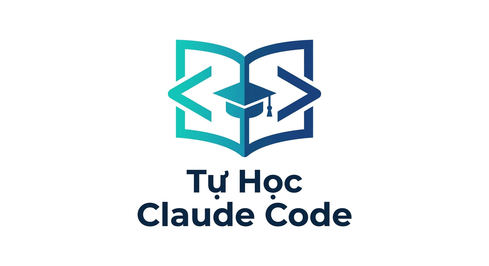

# Dự án tự học Claude Code

  

Hướng dẫn toàn diện để làm chủ Claude Code — từ cơ bản đến nâng cao.
Được thiết kế cho trải nghiệm tự học với quiz, bài tập thực hành, và agent giáo viên.

## Lộ trình học

### Cơ bản — nền tảng
Dành cho người mới bắt đầu. Hiểu các khái niệm cốt lõi.

- [**01 — Slash Commands**](co-ban/01-slash-commands/) — Lệnh gạch chéo và shortcuts
- [**02 — Memory**](co-ban/02-memory/) — Hệ thống bộ nhớ và CLAUDE.md
- [**03 — CLI**](co-ban/03-cli/) — Tham số dòng lệnh và automation

### Trung cấp — mở rộng khả năng
Sau khi nắm vững cơ bản, khám phá sức mạnh thực sự.

- [**04 — Skills**](trung-cap/04-skills/) — Tạo và quản lý agent skills
- [**05 — Subagents**](trung-cap/05-subagents/) — Ủy thác tác vụ cho agent con
- [**06 — MCP**](trung-cap/06-mcp/) — Kết nối dữ liệu bên ngoài
- [**07 — Plugins**](trung-cap/07-plugins/) — Bundled extensions

### Nâng cao — tự động & kiểm soát
Cho người dùng muốn tối ưu hóa workflow.

- [**08 — Hooks**](nang-cao/08-hooks/) — Tự động hóa event-driven
- [**09 — Checkpoints**](nang-cao/09-checkpoints/) — Thử nghiệm an toàn và quay lùi
- [**10 — Advanced**](nang-cao/10-advanced/) — Planning mode, extended thinking

## Hệ thống tự học

Mỗi bài học gồm 4 phần:
- **lesson.md** — Nội dung lý thuyết
- **quiz.md** — Bài kiểm tra (pass >= 8/10)
- **exercises/challenge.md** — Bài tập thực hành
- **exercises/solution.md** — Đáp án tham khảo

### Quy tắc học:
1. Đọc lesson → làm quiz → pass 8/10+ → làm bài tập → hoàn thành
2. Thứ tự bắt buộc: 01 → 02 → ... → 10 (phải pass lesson trước mới qua lesson sau)
3. Nhờ `@teacher` để quiz, review bài tập, hoặc xin gợi ý

### Reset tiến độ:
- Nói `@teacher reset` để rollback tiến độ (toàn bộ, N lessons gần nhất, hoặc 1 lesson cụ thể)

## Bắt đầu

1. Đọc bài [**01 — Slash Commands**](co-ban/01-slash-commands/) trước
2. Làm theo các ví dụ trong từng bài học
3. Làm quiz — pass 8/10+ để qua bài tiếp theo
4. Thực hành bằng cách tạo lệnh/skill của riêng bạn

## Yêu cầu

- Đã cài [Claude Code](https://claude.ai/code)
- Truy cập Claude API hoặc Claude Pro/Max

## Quy ước

- Nội dung hướng dẫn: tiếng Việt
- Lệnh, command, tên skills/plugins: tiếng Anh
- Tên file: kebab-case, không dấu
- Cấu trúc: 3 cấp độ (Cơ Bản → Trung Cấp → Nâng Cao)

## Trạng thái

| Hạng mục | Trạng thái |
|----------|-----------|
| Lesson content (10/10) | ✅ |
| Quiz (10/10) | ✅ |
| Exercises (10/10) | ✅ |
| Teacher agent | ✅ |
| Progress tracking | ✅ |
| Prerequisite enforcement | ✅ |

## 📦 Các Phiên Bản

- **v1.1** (2026-03-31): Hệ thống tự học — quiz, exercises, teacher agent, prerequisite rules
- **v1.0** (2026-03-31): Việt hóa 10 modules, tái cấu trúc 3 cấp độ

---

## Credit

- Ý tưởng và cấu trúc nội dung dựa trên repo [luongnv89/claude-howto](https://github.com/luongnv89/claude-howto.git) — "Master Claude Code in a Weekend"
- Hệ thống [superpowers skills](https://github.com/anthropics/superpowers) — cảm hứng xây dựng agent skills, hooks và quy trình làm việc
- Tài liệu tham khảo từ cộng đồng Claude Code và nhiều nguồn khác trên mạng

Cảm ơn các tác giả đã chia sẻ kiến thức giúp mình xây dựng repo này!

---

**Tác giả**: Dao Trung Thanh
