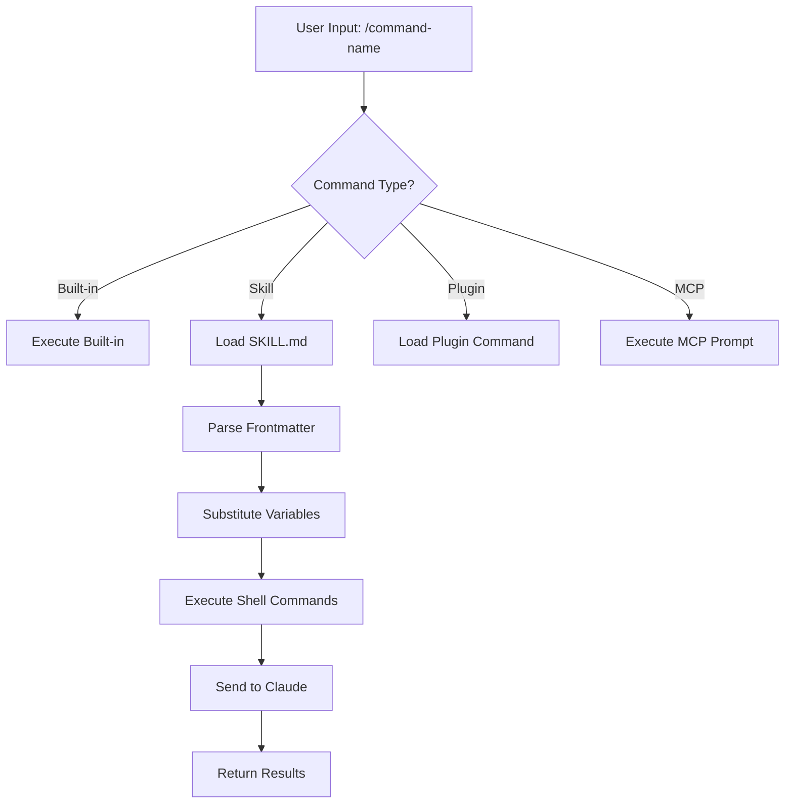
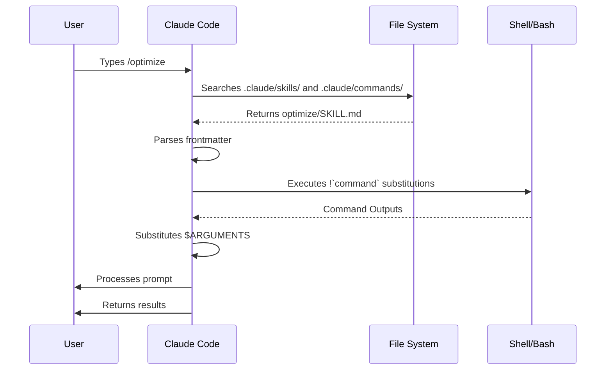

# Lệnh Gạch Chéo (Slash Commands)

## Tổng quan

Lệnh gạch chéo là các đường tắt điều khiển hành vi của Claude trong phiên làm việc tương tác. Chúng bao gồm nhiều loại:

- **Lệnh có sẵn**: Được cung cấp bởi Claude Code (`/help`, `/clear`, `/model`)
- **Skills**: Lệnh do người dùng định nghĩa tạo dưới dạng tệp `SKILL.md` (`/optimize`, `/pr`)
- **Lệnh plugin**: Lệnh từ các plugin đã cài đặt (`/frontend-design:frontend-design`)
- **MCP prompts**: Lệnh từ MCP servers (`/mcp__github__list_prs`)

> **Lưu ý**: Các lệnh gạch chéo tùy chỉnh đã được hợp nhất vào skills. Các tệp trong `.claude/commands/` vẫn hoạt động, nhưng skills (`.claude/skills/`) hiện là phương pháp được khuyến nghị. Cả hai đều tạo đường tắt `/tên-lệnh`. Xem [Hướng dẫn Skills](../../trung-cap/04-skills/) để biết thêm chi tiết.

## Tham Khảo Các Lệnh Có Sẵn

Lệnh có sẵn là các đường tắt cho các hành động thông thường. Có **hơn 55 lệnh có sẵn** và **5 skills đi kèm** sẵn có. Gõ `/` trong Claude Code để xem toàn bộ danh sách, hoặc gõ `/` theo sau bởi bất kỳ ký tự nào để lọc.

| Lệnh | Mục đích |
|---------|---------|
| `/add-dir <path>` | Thêm thư mục làm việc |
| `/agents` | Quản lý cấu hình agent |
| `/branch [name]` | Tạo nhánh cuộc trò chuyện sang phiên mới (bí danh: `/fork`). Lưu ý: `/fork` đã đổi tên thành `/branch` trong v2.1.77 |
| `/btw <question>` | Đặt câu hỏi phụ mà không thêm vào lịch sử |
| `/chrome` | Cấu hình tích hợp trình duyệt Chrome |
| `/clear` | Xóa cuộc trò chuyện (bí danh: `/reset`, `/new`) |
| `/color [color\|default]` | Đặt màu cho thanh nhập lệnh |
| `/compact [instructions]` | Nén cuộc trò chuyện với hướng dẫn tùy chọn |
| `/config` | Mở Cài đặt (bí danh: `/settings`) |
| `/context` | Hiển thị mức sử dụng ngữ cảnh dưới dạng lưới màu |
| `/copy [N]` | Sao chép phản hồi của trợ lý vào clipboard; `w` ghi ra tệp |
| `/cost` | Hiển thị thống kê sử dụng token |
| `/desktop` | Tiếp tục trong ứng dụng Desktop (bí danh: `/app`) |
| `/diff` | Trình xem diff tương tác cho các thay đổi chưa commit |
| `/doctor` | Chẩn đoán sức khỏe cài đặt |
| `/effort [low\|medium\|high\|max\|auto]` | Đặt mức nỗ lực. `max` yêu cầu Opus 4.6 |
| `/exit` | Thoát khỏi REPL (bí danh: `/quit`) |
| `/export [filename]` | Xuất cuộc trò chuyện hiện tại ra tệp hoặc clipboard |
| `/extra-usage` | Cấu hình sử dụng bổ sung cho giới hạn tốc độ |
| `/fast [on\|off]` | Bật/tắt chế độ nhanh |
| `/feedback` | Gửi phản hồi (bí danh: `/bug`) |
| `/help` | Hiển thị trợ giúp |
| `/hooks` | Xem cấu hình hook |
| `/ide` | Quản lý tích hợp IDE |
| `/init` | Khởi tạo `CLAUDE.md`. Đặt `CLAUDE_CODE_NEW_INIT=true` cho luồng tương tác |
| `/insights` | Tạo báo cáo phân tích phiên làm việc |
| `/install-github-app` | Cài đặt ứng dụng GitHub Actions |
| `/install-slack-app` | Cài đặt ứng dụng Slack |
| `/keybindings` | Mở cấu hình phím tắt |
| `/login` | Chuyển đổi tài khoản Anthropic |
| `/logout` | Đăng xuất khỏi tài khoản Anthropic |
| `/mcp` | Quản lý MCP servers và OAuth |
| `/memory` | Chỉnh sửa `CLAUDE.md`, bật/tắt auto-memory |
| `/mobile` | Mã QR cho ứng dụng di động (bí danh: `/ios`, `/android`) |
| `/model [model]` | Chọn model với mũi tên trái/phải cho mức nỗ lực |
| `/passes` | Chia sẻ tuần sử dụng Claude Code miễn phí |
| `/permissions` | Xem/cập nhật quyền (bí danh: `/allowed-tools`) |
| `/plan [description]` | Vào chế độ lập kế hoạch |
| `/plugin` | Quản lý plugin |
| `/pr-comments [PR]` | Lấy bình luận PR từ GitHub |
| `/privacy-settings` | Cài đặt riêng tư (chỉ Pro/Max) |
| `/release-notes` | Xem nhật ký phiên bản |
| `/reload-plugins` | Tải lại các plugin đang hoạt động |
| `/remote-control` | Điều khiển từ xa từ claude.ai (bí danh: `/rc`) |
| `/remote-env` | Cấu hình môi trường từ xa mặc định |
| `/rename [name]` | Đổi tên phiên làm việc |
| `/resume [session]` | Tiếp tục cuộc trò chuyện (bí danh: `/continue`) |
| `/review` | **Đã ngừng** -- cài đặt plugin `code-review` thay thế |
| `/rewind` | Quay lại cuộc trò chuyện và/hoặc mã (bí danh: `/checkpoint`) |
| `/sandbox` | Bật/tắt chế độ sandbox |
| `/schedule [description]` | Tạo/quản lý tác vụ lên lịch |
| `/security-review` | Phân nhánh nhanh bảo mật |
| `/skills` | Liệt kê skills khả dụng |
| `/stats` | Trực quan hóa sử dụng hàng ngày, phiên, chuỗi ngày |
| `/status` | Hiển thị phiên bản, model, tài khoản |
| `/statusline` | Cấu hình dòng trạng thái |
| `/tasks` | Liệt kê/quản lý tác vụ nền |
| `/terminal-setup` | Cấu hình phím tắt terminal |
| `/theme` | Thay đổi chủ đề màu |
| `/vim` | Bật/tắt chế độ Vim/Normal |
| `/voice` | Bật/tắt điều khiển giọng nói nhấn-phím-để-nói |

### Skills Đi Kèm

Các skills này đi kèm với Claude Code và được gọi như lệnh gạch chéo:

| Skill | Mục đích |
|-------|---------|
| `/batch <instruction>` | Điều phối các thay đổi song song quy mô lớn sử dụng worktrees |
| `/claude-api` | Tải tài liệu tham khảo Claude API cho ngôn ngữ dự án |
| `/debug [description]` | Bật ghi log debug |
| `/loop [interval] <prompt>` | Chạy lặp lại prompt theo khoảng thời gian |
| `/simplify [focus]` | Xem lại các tệp đã thay đổi về chất lượng mã |

### Các Lệnh Đã Ngừng Sử Dụng

| Lệnh | Trạng thái |
|---------|--------|
| `/review` | Đã ngừng -- thay thế bởi plugin `code-review` |
| `/output-style` | Đã ngừng từ v2.1.73 |
| `/fork` | Đã đổi tên thành `/branch` (bí danh vẫn hoạt động, v2.1.77) |

### Thay Đổi Gần Đây

- `/fork` đã đổi tên thành `/branch` với `/fork` giữ lại làm bí danh (v2.1.77)
- `/output-style` đã ngừng (v2.1.73)
- `/review` đã ngừng theo hướng plugin `code-review`
- Lệnh `/effort` đã thêm với mức `max` yêu cầu Opus 4.6
- Lệnh `/voice` đã thêm cho điều khiển giọng nói nhấn-phím-để-nói
- Lệnh `/schedule` đã thêm cho tạo/quản lý tác vụ lên lịch
- Lệnh `/color` đã thêm tùy chỉnh thanh nhập lệnh
- Bộ chọn `/model` hiển thị nhãn đọc được (ví dụ: "Sonnet 4.6") thay vì ID model thô
- `/resume` hỗ trợ bí danh `/continue`
- MCP prompts khả dụng dưới dạng lệnh `/mcp__<server>__<prompt>` (xem [MCP Prompts như Lệnh](#mcp-prompts-nhu-lenh))

## Lệnh Tùy Chỉnh (Hiện Là Skills)

Các lệnh gạch chéo tùy chỉnh đã được **hợp nhất vào skills**. Cả hai phương pháp đều tạo lệnh bạn có thể gọi với `/tên-lệnh`:

| Phương pháp | Vị trí | Trạng thái |
|----------|----------|--------|
| **Skills (Khuyến nghị)** | `.claude/skills/<tên>/SKILL.md` | Chuẩn hiện tại |
| **Lệnh cũ** | `.claude/commands/<tên>.md` | Vẫn hoạt động |

Nếu một skill và một lệnh có cùng tên, **skill sẽ ưu tiên hơn**. Ví dụ, khi cả `.claude/commands/review.md` và `.claude/skills/review/SKILL.md` đều tồn tại, phiên bản skill sẽ được sử dụng.

### Đường Di Chuyển Đổi

Các tệp `.claude/commands/` hiện tại của bạn tiếp tục hoạt động mà không cần thay đổi. Để chuyển đổi sang skills:

**Trước khi (Lệnh):**
```
.claude/commands/optimize.md
```

**Sau khi (Skill):**
```
.claude/skills/optimize/SKILL.md
```

### Tại Sao Là Skills?

Skills cung cấp nhiều tính năng hơn so với lệnh cũ:

- **Cấu trúc thư mục**: Gom các tệp script, mẫu, và tệp tham chiếu
- **Tự động gọi**: Claude có thể tự động kích hoạt skills khi liên quan
- **Kiểm soát gọi**: Chọn người dùng, Claude, hoặc cả hai có thể gọi
- **Thực thi subagent**: Chạy skills trong ngữ cảnh cô lập với `context: fork`
- **Hiển thị tiến trình**: Tải các tệp bổ sung chỉ khi cần thiết

### Tạo Lệnh Tùy Chỉnh Dưới Dạng Skill

Tạo thư mục với tệp `SKILL.md`:

```bash
mkdir -p .claude/skills/my-command
```

**Tệp:** `.claude/skills/my-command/SKILL.md`

```yaml
---
name: my-command
description: What this command does and when to use it
---

# Lệnh Của Tôi

Hướng dẫn cho Claude tuân theo khi lệnh này được gọi.

1. Bước đầu tiên
2. Bước thứ hai
3. Bước thứ ba
```

### Tham Chiếu Frontmatter

| Trường | Mục đích | Mặc định |
|-------|---------|---------|
| `name` | Tên lệnh (trở thành `/name`) | Tên thư mục |
| `description` | Mô tả ngắn (giúp Claude biết khi nào sử dụng) | Đoạn văn đầu tiên |
| `argument-hint` | Đối số mong đợi cho tự động hoàn thành | Không có |
| `allowed-tools` | Công cụ skill có thể sử dụng mà không cần quyền | Kế thừa |
| `model` | Model cụ thể để sử dụng | Kế thừa |
| `disable-model-invocation` | Nếu `true`, chỉ người dùng mới có thể gọi (không phải Claude) | `false` |
| `user-invocable` | Nếu `false`, ẩn khỏi menu `/` | `true` |
| `context` | Đặt `fork` để chạy trong subagent cô lập | Không có |
| `agent` | Loại agent khi dùng `context: fork` | `general-purpose` |
| `hooks` | Hooks phạm vi skill (PreToolUse, PostToolUse, Stop) | Không có |

### Đối Số

Lệnh có thể nhận đối số:

**Tất cả đối số với `$ARGUMENTS`:**

```yaml
---
name: fix-issue
description: Fix a GitHub issue by number
---

Sửa vấn đề #$ARGUMENTS theo tiêu chuẩn mã của chúng ta
```

Cách dùng: `/fix-issue 123` --> `$ARGUMENTS` trở thành "123"

**Từng đối số với `$0`, `$1`, v.v.:**

```yaml
---
name: review-pr
description: Review a PR with priority
---

Review PR #$0 với ưu tiên $1
```

Cách dùng: `/review-pr 456 high` --> `$0`="456", `$1`="high"

### Ngữ Cảnh Động Với Lệnh Shell

Thực thi lệnh bash trước prompt sử dụng `!`command``:

```yaml
---
name: commit
description: Create a git commit with context
allowed-tools: Bash(git *)
---

## Ngữ cảnh

- Trạng thái git hiện tại: !`git status`
- Git diff hiện tại: !`git diff HEAD`
- Nhánh hiện tại: !`git branch --show-current`
- Các commit gần đây: !`git log --oneline -5`

## Nhiệm vụ của bạn

Dựa trên các thay đổi trên, tạo một git commit duy nhất.
```

### Tham Chiếu Tệp

Bổ sung nội dung tệp sử dụng `@`:

```markdown
Review triển khai trong @src/utils/helpers.js
So sánh @src/old-version.js với @src/new-version.js
```

## Lệnh Plugin

Plugin có thể cung cấp lệnh tùy chỉnh:

```
/tên-plugin:tên-lệnh
```

Hoặc đơn giản là `/tên-lệnh` khi không có xung đột tên.

**Ví dụ:**
```bash
/frontend-design:frontend-design
/commit-commands:commit
```

## MCP Prompts như Lệnh

MCP servers có thể hiển thị prompts dưới dạng lệnh gạch chéo:

```
/mcp__<tên-server>__<tên-prompt> [đối-số]
```

**Ví dụ:**
```bash
/mcp__github__list_prs
/mcp__github__pr_review 456
/mcp__jira__create_issue "Bug title" high
```

### Cú pháp Quyền MCP

Kiểm soát quyền truy cập MCP server:

- `mcp__github` - Truy cập toàn bộ GitHub MCP server
- `mcp__github__*` - Truy cập wildcard tới tất cả công cụ
- `mcp__github__get_issue` - Truy cập công cụ cụ thể

## Kiến Trúc Lệnh



## Vòng Đời Lệnh



## Các Lệnh Có Sẵn Trong Thư Mục Này

Các lệnh mẫu này có thể được cài đặt như skills hoặc lệnh cũ.

### 1. `/optimize` - Tối Ưu Mã

Phân tích mã cho các vấn đề hiệu suất, rò rỉ bộ nhớ, và cơ hội tối ưu.

**Cách dùng:**
```
/optimize
[Dán mã của bạn]
```

### 2. `/pr` - Chuẩn Bị Pull Request

Hướng dẫn quy trình chuẩn bị PR bao gồm linting, kiểm tra, và định dạng commit.

**Cách dùng:**
```
/pr
```

### 3. `/generate-api-docs` - Tạo Tài Liệu API

Tạo tài liệu API toàn diện từ mã nguồn.

**Cách dùng:**
```
/generate-api-docs
```

### 4. `/commit` - Git Commit Với Ngữ Cảnh

Tạo git commit với ngữ cảnh động từ kho lưu trữ của bạn.

**Cách dùng:**
```
/commit [tùy chọn thông điệp]
```

### 5. `/push-all` - Stage, Commit, và Push

Stage tất cả thay đổi, tạo commit, và push lên remote với kiểm tra an toàn.

**Cách dùng:**
```
/push-all
```

**Kiểm tra An toàn:**
- Bí mật: `.env*`, `*.key`, `*.pem`, `credentials.json`
- Khóa API: Phát hiện khóa thật so với giá trị giữ chỗ
- Tệp lớn: `>10MB` không có Git LFS
- Tệp build: `node_modules/`, `dist/`, `__pycache__/`

### 6. `/doc-refactor` - Tổ Chức Lại Tài Liệu

Tổ chức lại cấu trúc tài liệu dự án cho rõ ràng và dễ tiếp cận.

**Cách dùng:**
```
/doc-refactor
```

### 7. `/setup-ci-cd` - Cấu Hình Pipeline CI/CD

Triển khai pre-commit hooks và GitHub Actions cho đảm bảo chất lượng.

**Cách dùng:**
```
/setup-ci-cd
```

### 8. `/unit-test-expand` - Mở Rộng Phủ Vi Kiểm Tra

Tăng phủ vi kiểm tra bằng cách nhắm vào các nhánh chưa kiểm tra và trường hợp biên.

**Cách dùng:**
```
/unit-test-expand
```

## Cài Đặt

### Dưới Dạng Skills (Khuyến nghị)

Sao chép vào thư mục skills của bạn:

```bash
# Tạo thư mục skills
mkdir -p .claude/skills

# Với mỗi tệp lệnh, tạo thư mục skill
for cmd in optimize pr commit; do
  mkdir -p .claude/skills/$cmd
  cp 01-slash-commands/$cmd.md .claude/skills/$cmd/SKILL.md
done
```

### Dưới Dạng Lệnh Cũ

Sao chép vào thư mục lệnh của bạn:

```bash
# Toàn dự án (nhóm)
mkdir -p .claude/commands
cp 01-slash-commands/*.md .claude/commands/

# Sử dụng cá nhân
mkdir -p ~/.claude/commands
cp 01-slash-commands/*.md ~/.claude/commands/
```

## Tạo Lệnh Của Riêng Bạn

### Mẫu Skill (Khuyến nghị)

Tạo `.claude/skills/my-command/SKILL.md`:

```yaml
---
name: my-command
description: What this command does. Use when [trigger conditions].
argument-hint: [optional-args]
allowed-tools: Bash(npm *), Read, Grep
---

# Tên Lệnh

## Ngữ cảnh

- Nhánh hiện tại: !`git branch --show-current`
- Tệp liên quan: @package.json

## Hướng dẫn

1. Bước đầu tiên
2. Bước thứ hai với đối số: $ARGUMENTS
3. Bước thứ ba

## Định dạng Đầu ra

- Cách định dạng phản hồi
- Những gì cần bao gồm
```

### Lệnh Chỉ Người Dùng (Không Tự Động Gọi)

Dành cho các lệnh có tác động phụ mà Claude không nên tự động kích hoạt:

```yaml
---
name: deploy
description: Deploy to production
disable-model-invocation: true
allowed-tools: Bash(npm *), Bash(git *)
---

Triển khai ứng dụng lên production:

1. Chạy kiểm tra
2. Build ứng dụng
3. Push lên môi trường triển khai
4. Xác minh triển khai
```

## Phương Pháp Tốt Nhất

| Nên | Không nên |
|------|---------|
| Sử dụng tên rõ ràng, hướng hành động | Tạo lệnh cho nhiệm vụ một lần |
| Bao gồm `description` với điều kiện kích hoạt | Xây dựng logic phức tạp trong lệnh |
| Giữ lệnh tập trung vào một nhiệm vụ duy nhất | Cung cấp thông tin nhạy cảm |
| Sử dụng `disable-model-invocation` cho tác động phụ | Bỏ qua trường description |
| Sử dụng tiền tố `!` cho ngữ cảnh động | Giả định Claude biết trạng thái hiện tại |
| Tổ chức các tệp liên quan trong thư mục skill | Đặt tất cả vào một tệp duy nhất |

## Xử Lý Sự Cố

### Không Tìm Thấy Lệnh

**Giải pháp:**
- Kiểm tra tệp nằm trong `.claude/skills/<tên>/SKILL.md` hoặc `.claude/commands/<tên>.md`
- Xác minh trường `name` trong frontmatter khớp với tên lệnh mong đợi
- Khởi động lại phiên Claude Code
- Chạy `/help` để xem các lệnh khả dụng

### Lệnh Không Thực Thi Như Mong Đợi

**Giải pháp:**
- Thêm hướng dẫn cụ thể hơn
- Bao gồm ví dụ trong tệp skill
- Kiểm tra `allowed-tools` nếu sử dụng lệnh bash
- Kiểm tra với đầu vào đơn giản trước

### Xung Đột Skill với Lệnh

Nếu cả hai tồn tại với cùng tên, **skill sẽ ưu tiên hơn**. Xóa một trong hai hoặc đổi tên.

## Hướng Dẫn Liên Quan

- **[Skills](../../trung-cap/04-skills/)** - Tham chiếu đầy đủ về skills (khả năng tự động gọi)
- **[Memory](../../co-ban/02-memory/)** - Ngữ cảnh liên tục với CLAUDE.md
- **[Subagents](../../trung-cap/05-subagents/)** - AI agents ủy quyền
- **[Plugins](../../trung-cap/07-plugins/)** - Bộ sưu tập lệnh gom nhóm
- **[Hooks](../../nang-cao/08-hooks/)** - Tự động hóa hướng sự kiện

## Tài Nguyên Bổ Sung

- [Tài Liệu Chế Độ Tương Tác Chính Thức](https://code.claude.com/docs/en/interactive-mode) - Tham chiếu lệnh có sẵn
- [Tài Liệu Skills Chính Thức](https://code.claude.com/docs/en/skills) - Tham chiếu skills đầy đủ
- [Tham Chiếu CLI](https://code.claude.com/docs/en/cli-reference) - Tùy chọn dòng lệnh

---

*Thuộc bộ hướng dẫn [Tự Học Claude Code](../../)*
