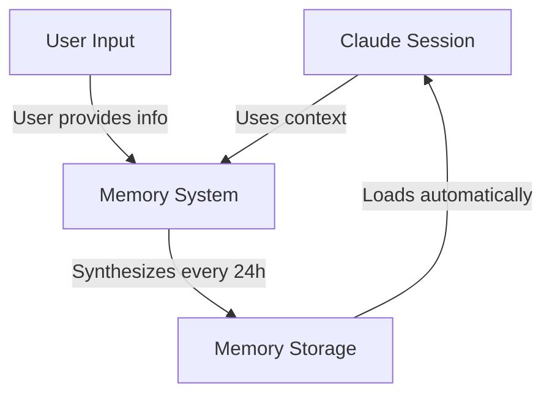
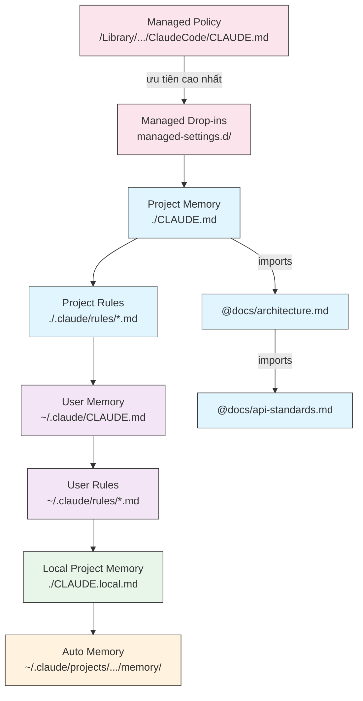
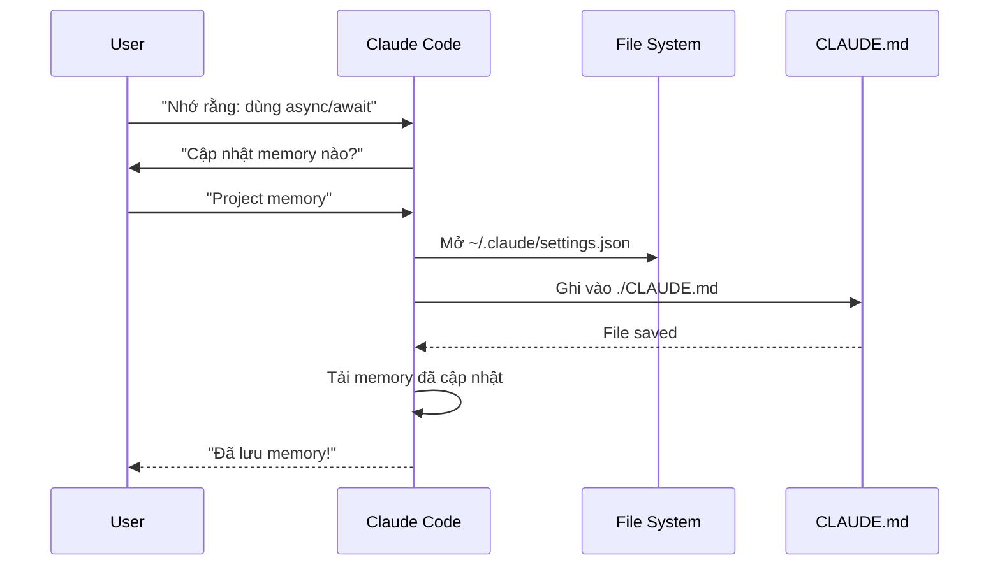
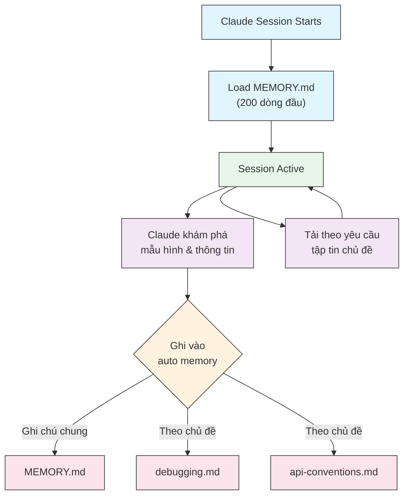
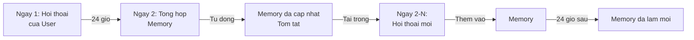

# Hướng dẫn sử dụng Memory

Memory (bộ nhớ) cho phép Claude giữ lại ngữ cảnh xuyên suốt các phiên làm việc và hội thoại. Nó tồn tại dưới hai dạng: tự động tổng hợp trong claude.ai, và dựa trên hệ thống tập tin CLAUDE.md trong Claude Code.

## Tổng quan

Memory trong Claude Code cung cấp ngữ cảnh bền vững được duy trì qua nhiều phiên làm việc và hội thoại. Khác với các cửa sổ ngữ cảnh tạm thời, các tập tin memory cho phép bạn:

- Chia sẻ các tiêu chuẩn dự án với nhóm
- Lưu trữ sở thích phát triển cá nhân
- Duy trì các quy tắc và cấu hình theo từng thư mục
- Nhập tài liệu ngoài
- Quản lý memory như mã nguồn với version control

Hệ thống memory hoạt động ở nhiều cấp độ, từ sở thích cá nhân toàn cục cho đến các thư mục con cụ thể, cho phép kiểm soát chi tiết việc Claude ghi nhớ thông tin gì và cách áp dụng kiến thức đó.

## Tham chiếu nhanh lệnh Memory

| Lệnh | Mục đích | Cách dùng | Khi nào dùng |
|---------|---------|-------|-------------|
| `/init` | Khởi tạo memory dự án | `/init` | Bắt đầu dự án mới, thiết lập CLAUDE.md lần đầu |
| `/memory` | Sửa tập tin memory trong editor | `/memory` | Cập nhật lớn, tổ chức lại, xem lại nội dung |
| Tiền tố `#` | Thêm memory nhanh một dòng | `# quy tắc của bạn ở đây` | Thêm quy tắc nhanh trong hội thoại |
| `# new rule into memory` | Thêm memory tường minh | `# new rule into memory<br/>Quy tắc chi tiết của bạn` | Thêm quy tắc nhiều dòng phức tạp |
| `# remember this` | Memory ngôn ngữ tự nhiên | `# remember this<br/>Hướng dẫn của bạn` | Cập nhật memory dạng hội thoại |
| `@path/to/file` | Nhập nội dung ngoài | `@README.md` hoặc `@docs/api.md` | Tham chiếu tài liệu hiện có trong CLAUDE.md |

## Bắt đầu nhanh: Khởi tạo Memory

### Lệnh `/init`

Lệnh `/init` là cách nhanh nhất để thiết lập memory dự án trong Claude Code. Nó khởi tạo một tập tin CLAUDE.md với tài liệu nền tảng của dự án.

**Cách dùng:**

```bash
/init
```

**Chức năng:**

- Tạo một tập tin CLAUDE.md mới trong dự án (thường tại `./CLAUDE.md` hoặc `./.claude/CLAUDE.md`)
- Thiết lập các quy ước và hướng dẫn của dự án
- Xây dựng nền tảng để duy trì ngữ cảnh xuyên suốt các phiên
- Cung cấp cấu trúc mẫu để ghi lại các tiêu chuẩn dự án

**Chế độ tương tác mở rộng:** Đặt `CLAUDE_CODE_NEW_INIT=true` để kích hoạt luồng tương tác đa pha hướng dẫn bạn thiết lập dự án từng bước:

```bash
CLAUDE_CODE_NEW_INIT=true claude
/init
```

**Khi nào dùng `/init`:**

- Bắt đầu một dự án mới với Claude Code
- Thiết lập tiêu chuẩn mã nguồn và quy ước của nhóm
- Tạo tài liệu về cấu trúc mã nguồn
- Thiết lập phân cấp memory cho phát triển cộng tác

**Luồng ví dụ:**

```markdown
# Trong thư mục dự án của bạn
/init

# Claude tạo CLAUDE.md với cấu trúc như:
# Project Configuration
## Project Overview
- Name: Tên dự án
- Tech Stack: [Danh sách công nghệ]
- Team Size: [Số lượng developer]

## Development Standards
- Quy chuẩn code style
- Yêu cầu testing
- Quy ước workflow Git
```

### Cập nhật Memory nhanh với `#`

Bạn có thể nhanh chóng thêm thông tin vào memory trong bất kỳ hội thoại nào bằng cách bắt đầu tin nhắn bằng `#`:

**Cú pháp:**

```markdown
# quy tắc hoặc hướng dẫn memory của bạn tại đây
```

**Ví dụ:**

```markdown
# Luôn sử dụng chế độ strict TypeScript trong dự án này

# Ưu tiên async/await thay vì promise chains

# Chạy npm test trước mỗi commit

# Sử dụng kebab-case cho tên tập tin
```

**Cách hoạt động:**

1. Bắt đầu tin nhắn bằng `#` theo sau là quy tắc
2. Claude nhận diện đây là yêu cầu cập nhật memory
3. Claude hỏi cập nhật tập tin memory nào (dự án hoặc cá nhân)
4. Quy tắc được thêm vào tập tin CLAUDE.md tương ứng
5. Các phiên tiếp theo sẽ tự động tải ngữ cảnh này

**Các mẫu thay thế:**

```markdown
# new rule into memory
Luôn xác thực dữ liệu đầu vào bằng Zod schema

# remember this
Sử dụng semantic versioning cho mọi bản phát hành

# add to memory
Migration database phải có khả năng đảo ngược
```

### Lệnh `/memory`

Lệnh `/memory` cung cấp quyền truy cập trực tiếp để chỉnh sửa các tập tin memory CLAUDE.md trong các phiên Claude Code. Nó mở các tập tin memory trong trình soạn thảo hệ thống để chỉnh sửa toàn diện.

**Cách dùng:**

```bash
/memory
```

**Chức năng:**

- Mở các tập tin memory trong trình soạn thảo mặc định của hệ thống
- Cho phép thực hiện bổ sung, sửa đổi và tổ chức lại mở rộng
- Truy cập trực tiếp vào tất cả tập tin memory trong phân cấp
- Cho phép quản lý ngữ cảnh bền vững xuyên suốt các phiên

**Khi nào dùng `/memory`:**

- Xem lại nội dung memory hiện có
- Cập nhật mở rộng các tiêu chuẩn dự án
- Tổ chức lại cấu trúc memory
- Thêm tài liệu hoặc hướng dẫn chi tiết
- Duy trì và cập nhật memory khi dự án phát triển

**So sánh: `/memory` vs `/init`**

| Khía cạnh | `/memory` | `/init` |
|--------|-----------|---------|
| **Mục đích** | Sửa tập tin memory hiện có | Khởi tạo CLAUDE.md mới |
| **Khi nào dùng** | Cập nhật/sửa đổi ngữ cảnh dự án | Bắt đầu dự án mới |
| **Hành động** | Mở editor để chỉnh sửa | Tạo template khởi đầu |
| **Luồng làm việc** | Bảo trì liên tục | Thiết lập một lần |

**Luồng ví dụ:**

```markdown
# Mở memory để chỉnh sửa
/memory

# Claude hiển thị lựa chọn:
# 1. Managed Policy Memory
# 2. Project Memory (./CLAUDE.md)
# 3. User Memory (~/.claude/CLAUDE.md)
# 4. Local Project Memory

# Chọn option 2 (Project Memory)
# Trình soạn thảo mặc định mở với nội dung ./CLAUDE.md

# Thực hiện thay đổi, lưu và đóng editor
# Claude tự động tải lại memory đã cập nhật
```

**Sử dụng Memory Import:**

Tập tin CLAUDE.md hỗ trợ cú pháp `@path/to/file` để bao gồm nội dung ngoài:

```markdown
# Project Documentation
Xem @README.md cho tổng quan dự án
Xem @package.json cho các lệnh npm khả dụng
Xem @docs/architecture.md cho thiết kế hệ thống

# Nhập từ thư mục home dùng đường dẫn tuyệt đối
@~/.claude/my-project-instructions.md
```

**Tính năng import:**

- Hỗ trợ cả đường dẫn tương đối và tuyệt đối (ví dụ: `@docs/api.md` hoặc `@~/.claude/my-project-instructions.md`)
- Hỗ trợ import đệ quy với độ sâu tối đa 5
- Lần đầu import từ vị trí ngoài sẽ kích hoạt hộp thoại phê duyệt vì lý do bảo mật
- Các chỉ thị import không được xử lý trong markdown code spans hoặc code blocks (nên ghi lại chúng trong ví dụ là an toàn)
- Tránh trùng lặp bằng cách tham chiếu tài liệu hiện có
- Tự động đưa nội dung tham chiếu vào ngữ cảnh của Claude

## Kiến trúc Memory

Memory trong Claude Code tuân theo hệ thống phân cấp nơi các phạm vi khác nhau phục vụ các mục đích khác nhau:



## Phân cấp Memory trong Claude Code

Claude Code sử dụng hệ thống memory phân cấp đa tầng. Các tập tin memory được tự động tải khi Claude Code khởi động, với các cấp cao hơn được ưu tiên hơn.

**Phân cấp Memory đầy đủ (theo thứ tự ưu tiên):**

1. **Managed Policy** - Hướng dẫn toàn tổ chức
   - macOS: `/Library/Application Support/ClaudeCode/CLAUDE.md`
   - Linux/WSL: `/etc/claude-code/CLAUDE.md`
   - Windows: `C:\Program Files\ClaudeCode\CLAUDE.md`

2. **Managed Drop-ins** - Các tập tin policy đã gộp theo alphabet (v2.1.83+)
   - Thư mục `managed-settings.d/` bên cạnh CLAUDE.md của managed policy
   - Các tập tin được gộp theo thứ tự alphabet để quản lý policy mô-đun

3. **Project Memory** - Ngữ cảnh chia sẻ nhóm (quản lý bởi version control)
   - `./.claude/CLAUDE.md` hoặc `./CLAUDE.md` (trong thư mục gốc repository)

4. **Project Rules** - Hướng dẫn mô-đun theo chủ đề
   - `./.claude/rules/*.md`

5. **User Memory** - Sở thích cá nhân (cho mọi dự án)
   - `~/.claude/CLAUDE.md`

6. **User-Level Rules** - Quy tắc cá nhân (cho mọi dự án)
   - `~/.claude/rules/*.md`

7. **Local Project Memory** - Sở thích cá nhân theo dự án
   - `./CLAUDE.local.md`

> **Lưu ý**: `CLAUDE.local.md` không được đề cập trong [tài liệu chính thức](https://code.claude.com/docs/en/memory) tính đến tháng 3 năm 2026. Nó vẫn có thể hoạt động như một tính năng kế thừa. Với dự án mới, cân nhắc sử dụng `~/.claude/CLAUDE.md` (cấp user) hoặc `.claude/rules/` (cấp dự án, có scope theo đường dẫn) thay thế.

8. **Auto Memory** - Nhật ký và nhận định tự động của Claude
   - `~/.claude/projects/<project>/memory/`

**Hành vi khám phá Memory:**

Claude tìm kiếm các tập tin memory theo thứ tự sau, với các vị trí xuất hiện trước được ưu tiên hơn:



## Loại trừ tập tin CLAUDE.md với `claudeMdExcludes`

Trong các monorepo lớn, một số tập tin CLAUDE.md có thể không liên quan đến công việc hiện tại. Cài đặt `claudeMdExcludes` cho phép bỏ qua các tập tin CLAUDE.md cụ thể để chúng không được tải vào ngữ cảnh:

```jsonc
// Trong ~/.claude/settings.json hoặc .claude/settings.json
{
  "claudeMdExcludes": [
    "packages/legacy-app/CLAUDE.md",
    "vendors/**/CLAUDE.md"
  ]
}
```

Các mẫu được so khớp với đường dẫn tương đối so với thư mục gốc dự án. Đặc biệt hữu ích cho:

- Monorepo với nhiều dự án con, chỉ một số là liên quan
- Repository chứa các tập tin CLAUDE.md của bên thứ ba hoặc vendor
- Giảm nhiễu trong cửa sổ ngữ cảnh của Claude bằng cách loại trừ hướng dẫn cũ hoặc không liên quan

## Phân cấp tập tin Settings

Các cài đặt Claude Code (bao gồm `autoMemoryDirectory`, `claudeMdExcludes` và cấu hình khác) được giải quyết từ phân cấp năm cấp độ, với cấp cao hơn được ưu tiên hơn:

| Cấp | Vị trí | Phạm vi |
|-------|----------|-------|
| 1 (Cao nhất) | Managed policy (cấp hệ thống) | Thực thi toàn tổ chức |
| 2 | `managed-settings.d/` (v2.1.83+) | Drop-in policy mô-đun, gộp theo alphabet |
| 3 | `~/.claude/settings.json` | Sở thích người dùng |
| 4 | `.claude/settings.json` | Cấp dự án (commit vào git) |
| 5 (Thấp nhất) | `.claude/settings.local.json` | Overrides cục bộ (bỏ qua bởi git) |

**Cấu hình theo nền tảng (v2.1.51+):**

Settings cũng có thể được cấu hình thông qua:
- **macOS**: tập tin property list (plist)
- **Windows**: Windows Registry

Các cơ chế native theo nền tảng này được đọc cùng lúc với các tập tin settings JSON và tuân theo cùng quy tắc ưu tiên.

## Hệ thống quy tắc mô-đun

Tạo các quy tắc có tổ chức, theo từng đường dẫn bằng cấu trúc thư mục `.claude/rules/`. Quy tắc có thể được định nghĩa ở cả cấp dự án và cấp user:

```
your-project/
├── .claude/
│   ├── CLAUDE.md
│   └── rules/
│       ├── code-style.md
│       ├── testing.md
│       ├── security.md
│       └── api/                  # Hỗ trợ thư mục con
│           ├── conventions.md
│           └── validation.md

~/.claude/
├── CLAUDE.md
└── rules/                        # Quy tắc cấp user (cho mọi dự án)
    ├── personal-style.md
    └── preferred-patterns.md
```

Các quy tắc được khám phá đệ quy trong thư mục `rules/`, bao gồm mọi thư mục con. Quy tắc cấp user tại `~/.claude/rules/` được tải trước các quy tắc cấp dự án, cho phép thiết lập mặc định cá nhân mà dự án có thể ghi đè.

### Quy tắc theo đường dẫn với YAML Frontmatter

Định nghĩa các quy tắc chỉ áp dụng cho các đường dẫn tập tin cụ thể:

```markdown
---
paths: src/api/**/*.ts
---

# Quy tắc phát triển API

- Tất cả endpoint API phải bao gồm xác thực đầu vào
- Sử dụng Zod cho xác thực schema
- Ghi lại tất cả tham số và kiểu trả về
- Bao gồm xử lý lỗi cho mọi thao tác
```

**Ví dụ mẫu Glob Pattern:**

- `**/*.ts` - Tất cả tập tin TypeScript
- `src/**/*` - Tất cả tập tin trong src/
- `src/**/*.{ts,tsx}` - Nhiều extension
- `{src,lib}/**/*.ts, tests/**/*.test.ts` - Nhiều mẫu

### Thư mục con và Symlinks

Các quy tắc trong `.claude/rules/` hỗ trợ hai tính năng tổ chức:

- **Thư mục con**: Quy tắc được khám phá đệ quy, nên bạn có thể tổ chức chúng thành các thư mục theo chủ đề (ví dụ: `rules/api/`, `rules/testing/`, `rules/security/`)
- **Symlinks**: Symlinks được hỗ trợ để chia sẻ quy tắc giữa nhiều dự án. Ví dụ, bạn có thể symlink một tập tin quy tắc dùng chung từ vị trí trung tâm vào thư mục `.claude/rules/` của mỗi dự án

## Bảng vị trí Memory

| Vị trí | Phạm vi | Ưu tiên | Chia sẻ | Truy cập | Phù hợp nhất cho |
|----------|-------|----------|--------|--------|----------|
| `/Library/Application Support/ClaudeCode/CLAUDE.md` (macOS) | Managed Policy | 1 (Cao nhất) | Tổ chức | Hệ thống | Chính sách toàn công ty |
| `/etc/claude-code/CLAUDE.md` (Linux/WSL) | Managed Policy | 1 (Cao nhất) | Tổ chức | Hệ thống | Tiêu chuẩn tổ chức |
| `C:\Program Files\ClaudeCode\CLAUDE.md` (Windows) | Managed Policy | 1 (Cao nhất) | Tổ chức | Hệ thống | Hướng dẫn doanh nghiệp |
| `managed-settings.d/*.md` (cùng chỗ với policy) | Managed Drop-ins | 1.5 | Tổ chức | Hệ thống | Tập tin policy mô-đun (v2.1.83+) |
| `./CLAUDE.md` hoặc `./.claude/CLAUDE.md` | Project Memory | 2 | Nhóm | Git | Tiêu chuẩn nhóm, kiến trúc chia sẻ |
| `./.claude/rules/*.md` | Project Rules | 3 | Nhóm | Git | Quy tắc mô-đun theo đường dẫn |
| `~/.claude/CLAUDE.md` | User Memory | 4 | Cá nhân | Filesystem | Sở thích cá nhân (mọi dự án) |
| `~/.claude/rules/*.md` | User Rules | 5 | Cá nhân | Filesystem | Quy tắc cá nhân (mọi dự án) |
| `./CLAUDE.local.md` | Project Local | 6 | Cá nhân | Git (bỏ qua) | Sở thích cá nhân theo dự án |
| `~/.claude/projects/<project>/memory/` | Auto Memory | 7 (Thấp nhất) | Cá nhân | Filesystem | Nhật ký và nhận định tự động của Claude |

## Vòng đời cập nhật Memory

Dưới đây là cách các bản cập nhật memory lưu thông qua các phiên Claude Code:



## Auto Memory

Auto memory là một thư mục bền vững nơi Claude tự động ghi lại các nhận định, mẫu hình và thông tin chi tiết khi làm việc với dự án của bạn. Khác với tập tin CLAUDE.md mà bạn tự viết và bảo trì, auto memory được Claude tự ghi trong các phiên.

### Auto Memory hoạt động thế nào

- **Vị trí**: `~/.claude/projects/<project>/memory/`
- **Điểm vào**: `MEMORY.md` là tập tin chính trong thư mục auto memory
- **Tập tin theo chủ đề**: Các tập tin bổ sung cho chủ đề cụ thể (ví dụ: `debugging.md`, `api-conventions.md`)
- **Hành vi tải**: 200 dòng đầu tiên của `MEMORY.md` được tải vào hệ thống khi bắt đầu phiên. Các tập tin theo chủ đề được tải theo yêu cầu, không khi khởi động.
- **Đọc/ghi**: Claude đọc và ghi các tập tin memory trong phiên khi發現 ra các mẫu hình và kiến thức dự án cụ thể

### Kiến trúc Auto Memory



### Cấu trúc thư mục Auto Memory

```
~/.claude/projects/<project>/memory/
├── MEMORY.md              # Điểm vào (200 dòng đầu tải khi khởi động)
├── debugging.md           # Tập tin chủ đề (tải khi cần)
├── api-conventions.md     # Tập tin chủ đề (tải khi cần)
└── testing-patterns.md    # Tập tin chủ đề (tải khi cần)
```

### Yêu cầu phiên bản

Auto memory yêu cầu **Claude Code v2.1.59 trở lên**. Nếu đang dùng phiên bản cũ hơn, hãy nâng cấp trước:

```bash
npm install -g @anthropic-ai/claude-code@latest
```

### Thư mục Auto Memory tùy chỉnh

Theo mặc định, auto memory được lưu trong `~/.claude/projects/<project>/memory/`. Bạn có thể thay đổi vị trí này bằng cài đặt `autoMemoryDirectory` (có từ **v2.1.74**):

```jsonc
// Trong ~/.claude/settings.json hoặc .claude/settings.local.json (chỉ settings user/local)
{
  "autoMemoryDirectory": "/duong-dan-den-thu-muc/memory/tuy-chinh"
}
```

> **Lưu ý**: `autoMemoryDirectory` chỉ có thể được đặt trong settings cấp user (`~/.claude/settings.json`) hoặc settings cục bộ (`.claude/settings.local.json`), không phải trong settings chính sách dự án hoặc managed.

Hữu ích khi bạn muốn:

- Lưu auto memory ở vị trí dùng chung hoặc đồng bộ hóa
- Tách auto memory khỏi thư mục cấu hình Claude mặc định
- Sử dụng đường dẫn dành riêng cho dự án nằm ngoài phân cấp mặc định

### Chia sẻ Worktree và Repository

Tất cả worktree và thư mục con trong cùng một git repository chia sẻ chung một thư mục auto memory. Điều này có nghĩa chuyển đổi giữa các worktree hoặc làm việc trong các thư mục con khác nhau của cùng repo sẽ đọc và ghi vào cùng các tập tin memory.

### Memory cho Subagent

Subagent (sinh ra qua các công cụ như Task hoặc thực thi song song) có thể có ngữ cảnh memory riêng. Sử dụng trường frontmatter `memory` trong định nghĩa subagent để chỉ định phạm vi memory nào cần tải:

```yaml
memory: user      # Chỉ tải memory cấp user
memory: project   # Chỉ tải memory cấp dự án
memory: local     # Chỉ tải memory cục bộ
```

Điều này cho phép subagent hoạt động với ngữ cảnh tập trung thay vì kế thừa toàn bộ phân cấp memory.

### Điều khiển Auto Memory

Auto memory có thể được điều khiển qua biến môi trường `CLAUDE_CODE_DISABLE_AUTO_MEMORY`:

| Giá trị | Hành vi |
|-------|----------|
| `0` | Bắt buộc auto memory **bật** |
| `1` | Bắt buộc auto memory **tắt** |
| *(không đặt)* | Hành vi mặc định (auto memory bật) |

```bash
# Tắt auto memory cho một phiên
CLAUDE_CODE_DISABLE_AUTO_MEMORY=1 claude

# Bật auto memory tường minh
CLAUDE_CODE_DISABLE_AUTO_MEMORY=0 claude
```

## Thư mục bổ sung với `--add-dir`

Cờ `--add-dir` cho phép Claude Code tải các tập tin CLAUDE.md từ các thư mục bổ sung ngoài thư mục làm việc hiện tại. Hữu ích cho các thiết lập monorepo hoặc đa dự án nơi cần ngữ cảnh từ các thư mục khác.

Để kích hoạt tính năng này, đặt biến môi trường:

```bash
CLAUDE_CODE_ADDITIONAL_DIRECTORIES_CLAUDE_MD=1
```

Sau đó khởi chạy Claude Code với cờ:

```bash
claude --add-dir /path/to/other/project
```

Claude sẽ tải CLAUDE.md từ thư mục bổ sung được chỉ định cùng với các tập tin memory từ thư mục làm việc hiện tại.

## Ví dụ thực tế

### Ví dụ 1: Cấu trúc Project Memory

**Tập tin:** `./CLAUDE.md`

```markdown
# Project Configuration

## Project Overview
- **Name**: E-commerce Platform
- **Tech Stack**: Node.js, PostgreSQL, React 18, Docker
- **Team Size**: 5 developers
- **Deadline**: Q4 2025

## Architecture
@docs/architecture.md
@docs/api-standards.md
@docs/database-schema.md

## Development Standards

### Code Style
- Use Prettier for formatting
- Use ESLint with airbnb config
- Maximum line length: 100 characters
- Use 2-space indentation

### Naming Conventions
- **Files**: kebab-case (user-controller.js)
- **Classes**: PascalCase (UserService)
- **Functions/Variables**: camelCase (getUserById)
- **Constants**: UPPER_SNEK_CASE (API_BASE_URL)
- **Database Tables**: snake_case (user_accounts)

### Git Workflow
- Branch names: `feature/description` or `fix/description`
- Commit messages: Follow conventional commits
- PR required before merge
- All CI/CD checks must pass
- Minimum 1 approval required

### Testing Requirements
- Minimum 80% code coverage
- All critical paths must have tests
- Use Jest for unit tests
- Use Cypress for E2E tests
- Test filenames: `*.test.ts` or `*.spec.ts`

### API Standards
- RESTful endpoints only
- JSON request/response
- Use HTTP status codes correctly
- Version API endpoints: `/api/v1/`
- Document all endpoints with examples

### Database
- Use migrations for schema changes
- Never hardcode credentials
- Use connection pooling
- Enable query logging in development
- Regular backups required

### Deployment
- Docker-based deployment
- Kubernetes orchestration
- Blue-green deployment strategy
- Automatic rollback on failure
- Database migrations run before deploy

## Common Commands

| Command | Purpose |
|---------|---------|
| `npm run dev` | Start development server |
| `npm test` | Run test suite |
| `npm run lint` | Check code style |
| `npm run build` | Build for production |
| `npm run migrate` | Run database migrations |

## Team Contacts
- Tech Lead: Sarah Chen (@sarah.chen)
- Product Manager: Mike Johnson (@mike.j)
- DevOps: Alex Kim (@alex.k)

## Known Issues & Workarounds
- PostgreSQL connection pooling limited to 20 during peak hours
- Workaround: Implement query queuing
- Safari 14 compatibility issues with async generators
- Workaround: Use Babel transpiler

## Related Projects
- Analytics Dashboard: `/projects/analytics`
- Mobile App: `/projects/mobile`
- Admin Panel: `/projects/admin`
```

### Ví dụ 2: Directory-Specific Memory

**Tập tin:** `./src/api/CLAUDE.md`

```markdown
# API Module Standards

This file overrides root CLAUDE.md for everything in /src/api/

## API-Specific Standards

### Request Validation
- Use Zod for schema validation
- Always validate input
- Return 400 with validation errors
- Include field-level error details

### Authentication
- All endpoints require JWT token
- Token in Authorization header
- Token expires after 24 hours
- Implement refresh token mechanism

### Response Format

All responses must follow this structure:

```json
{
  "success": true,
  "data": { /* actual data */ },
  "timestamp": "2025-11-06T10:30:00Z",
  "version": "1.0"
}
```

Error responses:
```json
{
  "success": false,
  "error": {
    "code": "VALIDATION_ERROR",
    "message": "User message",
    "details": { /* field errors */ }
  },
  "timestamp": "2025-11-06T10:30:00Z"
}
```

### Pagination
- Use cursor-based pagination (not offset)
- Include `hasMore` boolean
- Limit max page size to 100
- Default page size: 20

### Rate Limiting
- 1000 requests per hour for authenticated users
- 100 requests per hour for public endpoints
- Return 429 when exceeded
- Include retry-after header

### Caching
- Use Redis for session caching
- Cache duration: 5 minutes default
- Invalidate on write operations
- Tag cache keys with resource type
```

### Ví dụ 3: Personal Memory

**Tập tin:** `~/.claude/CLAUDE.md`

```markdown
# My Development Preferences

## About Me
- **Experience Level**: 8 years full-stack development
- **Preferred Languages**: TypeScript, Python
- **Communication Style**: Direct, with examples
- **Learning Style**: Visual diagrams with code

## Code Preferences

### Error Handling
I prefer explicit error handling with try-catch blocks and meaningful error messages.
Avoid generic errors. Always log errors for debugging.

### Comments
Use comments for WHY, not WHAT. Code should be self-documenting.
Comments should explain business logic or non-obvious decisions.

### Testing
I prefer TDD (test-driven development).
Write tests first, then implementation.
Focus on behavior, not implementation details.

### Architecture
I prefer modular, loosely-coupled design.
Use dependency injection for testability.
Separate concerns (Controllers, Services, Repositories).

## Debugging Preferences
- Use console.log with prefix: `[DEBUG]`
- Include context: function name, relevant variables
- Use stack traces when available
- Always include timestamps in logs

## Communication
- Explain complex concepts with diagrams
- Show concrete examples before explaining theory
- Include before/after code snippets
- Summarize key points at the end

## Project Organization
I organize my projects as:

   project/
   ├── src/
   │   ├── api/
   │   ├── services/
   │   ├── models/
   │   └── utils/
   ├── tests/
   ├── docs/
   └── docker/

## Tooling
- **IDE**: VS Code with vim keybindings
- **Terminal**: Zsh with Oh-My-Zsh
- **Format**: Prettier (100 char line length)
- **Linter**: ESLint with airbnb config
- **Test Framework**: Jest with React Testing Library
```

_Bai kiem tra cua toi_
Yeu cau Claude luu mot quy tac moi


Claude chua luu quy tac vi toi khong co tap tin `CLAUDE.md` o bat ky dau. Sau do yeu cau Claude xac nhan vi tri.


### Ví dụ 4: Cập nhật Memory trong phiên

Bạn có thể thêm quy tắc mới vào memory trong một phiên Claude Code đang hoạt động. Có hai cách để làm điều này:

#### Phuong phap 1: Yeu cau truc tiep

```markdown
User: Nho rang toi thich su dung React hooks thay vi class components
     cho tat ca component moi.

Claude: Toi dang them dieu do vao memory. Cap nhat vao tap tin memory nao?
        1. Project memory (./CLAUDE.md)
        2. Personal memory (~/.claude/CLAUDE.md)

User: Project memory

Claude: ✅ Da luu memory!

Them vao ./CLAUDE.md:
---

### Phat trien Component
- Su dung functional components voi React Hooks
- Uu tien hooks hon class components
- Custom hooks cho logic tai su dung
- Su dung useCallback cho event handlers
- Su dung useMemo cho cac phep tinh ton kem
```

#### Phuong phap 2: Su dung mau "# new rule into memory"

Ban cung co the su dung mau tong quat "# new rule into memory" de kich hoat cap nhat memory:

```markdown
User: # new rule into memory
      Luon xac thuc du lieu dau vao bang Zod schema truoc khi xu ly.

Claude: Toi dang luu quy tac nay vao memory. Tap tin memory nao nen dung?
        1. Project memory (./CLAUDE.md)
        2. Personal memory (~/.claude/CLAUDE.md)

User: Project memory

Claude: ✅ Da luu memory!

Them vao ./CLAUDE.md:
---

### Xac thuc du lieu dau vao
- Luon xac thuc du lieu dau vao bang Zod schema truoc khi xu ly
- Dinh nghia schema o dau moi tap tin xu ly API
- Tra ve status 400 voi loi xac thuc
```

#### Mẹo thêm Memory

- Cụ thể và hành động trong các quy tắc
- Nhóm các quy tắc liên quan dưới tiêu đề mục
- Cập nhật các mục hiện có thay vì sao chép nội dung
- Chọn phạm vi memory phù hợp (dự án hoặc cá nhân)

## So sánh tính năng Memory

| Tính năng | Claude Web/Desktop | Claude Code (CLAUDE.md) |
|---------|-------------------|------------------------|
| Tự động tổng hợp | ✅ Mỗi 24h | ❌ Thủ công |
| Xuyên dự án | ✅ Chia sẻ | ❌ Theo dự án |
| Truy cập nhóm | ✅ Dự án chia sẻ | ✅ Theo dõi Git |
| Tìm kiếm | ✅ Tích hợp | ✅ Thông qua `/memory` |
| Chỉnh sửa | ✅ Trong chat | ✅ Sửa tập tin trực tiếp |
| Nhập/Xuất | ✅ Có | ✅ Sao chép/dán |
| Bền vững | ✅ 24h+ | ✅ Vĩnh viễn |

### Memory trong Claude Web/Desktop

#### Dòng thời gian tổng hợp Memory



**Ví dụ tóm tắt Memory:**

```markdown
## Claude's Memory of User

### Professional Background
- Senior full-stack developer with 8 years experience
- Focus on TypeScript/Node.js backends and React frontends
- Active open source contributor
- Interested in AI and machine learning

### Project Context
- Currently building e-commerce platform
- Tech stack: Node.js, PostgreSQL, React 18, Docker
- Working with team of 5 developers
- Using CI/CD and blue-green deployments

### Communication Preferences
- Prefers direct, concise explanations
- Likes visual diagrams and examples
- Appreciates code snippets
- Explains business logic in comments

### Current Goals
- Improve API performance
- Increase test coverage to 90%
- Implement caching strategy
- Document architecture
```

## Thực hành tốt nhất

### Nen lam - Nhung gi nen du dua vao

- **Cụ thể và chi tiết**: Sử dụng hướng dẫn rõ ràng, chi tiết thay vì hướng dẫn mơ hồ
  - ✅ Tốt: "Sử dụng thụt lề 2 khoảng trắng cho tất cả tập tin JavaScript"
  - ❌ Tránh: "Tuân theo thực hành tốt nhất"

- **Giữ tổ chức**: Cấu trúc tập tin memory với các phần và tiêu đề markdown rõ ràng

- **Sử dụng đúng cấp độ phân cấp**:
  - **Managed policy**: Chính sách toàn công ty, tiêu chuẩn bảo mật, yêu cầu tuân thủ
  - **Project memory**: Tiêu chuẩn nhóm, kiến trúc, quy ước mã hóa (commit vào git)
  - **User memory**: Sở thích cá nhân, phong cách giao tiếp, lựa chọn công cụ
  - **Directory memory**: Quy tắc và overrides dành riêng cho module

- **Tận dụng import**: Sử dụng cú pháp `@path/to/file` để tham chiếu tài liệu hiện có
  - Hỗ trợ đến 5 cấp độ lồng đệ quy
  - Tránh trùng lặp giữa các tập tin memory
  - Ví dụ: `Xem @README.md cho tổng quan dự án`

- **Ghi lại các lệnh thường dùng**: Bao gồm các lệnh sử dụng nhiều để tiết kiệm thời gian

- **Quản lý version cho project memory**: Commit các tập tin CLAUDE.md cấp dự án vào git để nhóm dùng chung

- **Xem lại định kỳ**: Cập nhật memory thường xuyên khi dự án phát triển và yêu cầu thay đổi

- **Cung cấp ví dụ cụ thể**: Bao gồm các đoạn mã và các tình huống cụ thể

### Khong nen lam - Nhung gi nen tranh

- **Không lưu trữ bí mật**: Không bao giờ bao gồm API keys, mật khẩu, token hoặc thông tin xác thực

- **Không bao gồm dữ liệu nhạy cảm**: Không có PII, thông tin riêng tư hoặc bí mật độc quyền

- **Không sao chép nội dung**: Sử dụng import (`@path`) để tham chiếu tài liệu hiện có thay thế

- **Không mơ hồ**: Tránh các tuyên bố chung chung như "tuân theo thực hành tốt nhất" hoặc "viết mã tốt"

- **Không quá dài**: Giữ các tập tin memory tập trung và dưới 500 dòng

- **Không tổ chức quá mức**: Sử dụng phân cấp có chiến lược; không tạo quá nhiều thư mục con ghi đè

- **Không quên cập nhật**: Memory lỗi thời có thể gây nhầm lẫn và thực hành cũ

- **Không vượt quá giới hạn lồng**: Memory import hỗ trợ tối đa 5 cấp độ lồng

### Mẹo quản lý Memory

**Chọn đúng cấp độ memory:**

| Truong hop su dung | Cap memory | Ly do |
|----------|-------------|-----------|
| Chính sách bảo mật công ty | Managed Policy | Áp dụng cho mọi dự án toàn tổ chức |
| Hướng dẫn code style của nhóm | Project | Chia sẻ với nhóm qua git |
| Phím tắt trình soạn thảo yêu thích | User | Sở thích cá nhân, không chia sẻ |
| Tiêu chuẩn module API | Directory | Chỉ dành riêng cho module đó |

**Luồng cập nhật nhanh:**

1. Cho quy tắc đơn: Sử dụng tiền tố `#` trong hội thoại
2. Cho nhiều thay đổi: Sử dụng `/memory` để mở editor
3. Cho thiết lập ban đầu: Sử dụng `/init` để tạo template

**Thực hành import tốt:**

```markdown
# Tot: Tham chieu tai lieu hien co
@README.md
@docs/architecture.md
@package.json

# Tranh: Sao chep noi dung da ton tai o noi khac
# Thay vi sao chep noi dung tu README vao CLAUDE.md, chi can import no
```

## Hướng dẫn cài đặt

### Thiết lập Project Memory

#### Phương pháp 1: Sử dụng lệnh `/init` (Khuyến nghị)

Cách nhanh nhất để thiết lập project memory:

1. **Điều hướng đến thư mục dự án:**
   ```bash
   cd /path/to/your/project
   ```

2. **Chạy lệnh init trong Claude Code:**
   ```bash
   /init
   ```

3. **Claude sẽ tạo và điền CLAUDE.md** với cấu trúc template

4. **Tùy chỉnh tập tin đã tạo** cho phù hợp với nhu cầu dự án

5. **Commit vào git:**
   ```bash
   git add CLAUDE.md
   git commit -m "Khoi tao memory du an voi /init"
   ```

#### Phương pháp 2: Tạo thủ công

Nếu bạn thích thiết lập thủ công:

1. **Tạo CLAUDE.md trong thư mục gốc dự án:**
   ```bash
   cd /path/to/your/project
   touch CLAUDE.md
   ```

2. **Thêm tiêu chuẩn dự án:**
   ```bash
   cat > CLAUDE.md << 'EOF'
# Project Configuration

## Project Overview
- **Name**: Ten du an
- **Tech Stack**: Liệt kê công nghệ
- **Team Size**: So luong developer

## Development Standards
- Tieu chuan ma nguon
- Quy uoc ten
- Yeu cau testing
EOF
   ```

3. **Commit vào git:**
   ```bash
   git add CLAUDE.md
   git commit -m "Them cau hinh memory du an"
   ```

#### Phương pháp 3: Cập nhật nhanh với `#`

Khi đã có CLAUDE.md, thêm quy tắc nhanh trong hội thoại:

```markdown
# Su dung semantic versioning cho moi ban phat hanh

# Luon chay test truoc khi commit

# Uu tien composition hon inheritance
```

Claude sẽ nhắc bạn chọn tập tin memory nào cần cập nhật.

### Thiết lập Personal Memory

1. **Tạo thư mục ~/.claude:**
   ```bash
   mkdir -p ~/.claude
   ```

2. **Tạo CLAUDE.md cá nhân:**
   ```bash
   touch ~/.claude/CLAUDE.md
   ```

3. **Thêm sở thích của bạn:**
   ```bash
   cat > ~/.claude/CLAUDE.md << 'EOF'
# Sở thích phát triển của tôi

## Ve toi
- Trinh do: [Trình độ của bạn]
- Ngon ngu yeu thich: [Ngôn ngữ của bạn]
- Phong cach giao tiep: [Phong cách của bạn]

## Sở thích mã nguồn
- [Sở thích của bạn]
EOF
   ```

### Thiết lập Directory-Specific Memory

1. **Tạo memory cho thư mục cụ thể:**
   ```bash
   mkdir -p /path/to/directory/.claude
   touch /path/to/directory/CLAUDE.md
   ```

2. **Thêm quy tắc cho thư mục:**
   ```bash
   cat > /path/to/directory/CLAUDE.md << 'EOF'
# Tieu chuan [Ten thu muc]

Tap tin ghi de CLAUDE.md goc cho thu muc nay.

## [Tieu chuan cu the]
EOF
   ```

3. **Commit vào version control:**
   ```bash
   git add /path/to/directory/CLAUDE.md
   git commit -m "Them cau hinh memory [thu muc]"
   ```

### Xác minh thiết lập

1. **Kiểm tra vị trí memory:**
   ```bash
   # Memory thư mục gốc dự án
   ls -la ./CLAUDE.md

   # Memory cá nhân
   ls -la ~/.claude/CLAUDE.md
   ```

2. **Claude Code sẽ tự động tải** các tập tin này khi bắt đầu phiên

3. **Kiểm thử với Claude Code** bằng cách bắt đầu phiên mới trong dự án

## Tài liệu chính thức

Để biết thông tin cập nhật nhất, tham khảo tài liệu Claude Code chính thức:

- **[Tài liệu Memory](https://code.claude.com/docs/en/memory)** - Tham chiếu hệ thống memory đầy đủ
- **[Tham chiếu lệnh Slash](https://code.claude.com/docs/en/interactive-mode)** - Tất cả lệnh tích hợp bao gồm `/init` và `/memory`
- **[Tham chiếu CLI](https://code.claude.com/docs/en/cli-reference)** - Tài liệu giao diện dòng lệnh

### Chi tiết kỹ thuật chính từ tài liệu chính thức

**Tải Memory:**

- Tất cả tập tin memory được tự động tải khi Claude Code khởi động
- Claude di chuyển lên trên từ thư mục làm việc hiện tại để khám phá các tập tin CLAUDE.md
- Các tập tin trong cây con được khám phá và tải theo ngữ cảnh khi truy cập các thư mục đó

**Cú pháp Import:**

- Sử dụng `@path/to/file` để bao gồm nội dung ngoài (ví dụ: `@~/.claude/my-project-instructions.md`)
- Hỗ trợ cả đường dẫn tương đối và tuyệt đối
- Hỗ trợ import đệ quy với độ sâu tối đa 5
- Lần đầu import ngoài sẽ kích hoạt hộp thoại phê duyệt
- Không được xử lý trong markdown code spans hoặc code blocks
- Tự động đưa nội dung tham chiếu vào ngữ cảnh của Claude

**Thứ tự ưu tiên phân cấp Memory:**

1. Managed Policy (ưu tiên cao nhất)
2. Managed Drop-ins (`managed-settings.d/`, v2.1.83+)
3. Project Memory
4. Project Rules (`.claude/rules/`)
5. User Memory
6. User-Level Rules (`~/.claude/rules/`)
7. Local Project Memory
8. Auto Memory (ưu tiên thấp nhất)

## Liên kết các khái niệm liên quan

### Điểm tích hợp
- [Giao thức MCP](../../trung-cap/04-skills/) - Truy cập dữ liệu thời gian thực cùng với memory
- [Slash Commands](../../co-ban/01-slash-commands/) - Phím tắt cho phiên làm việc
- [Skills](../../trung-cap/04-skills/) - Luồng tự động hóa với ngữ cảnh memory

### Tính năng Claude liên quan
- [Claude Web Memory](https://claude.ai) - Tự động tổng hợp
- [Tài liệu Memory chính thức](https://code.claude.com/docs/en/memory) - Tài liệu từ Anthropic
