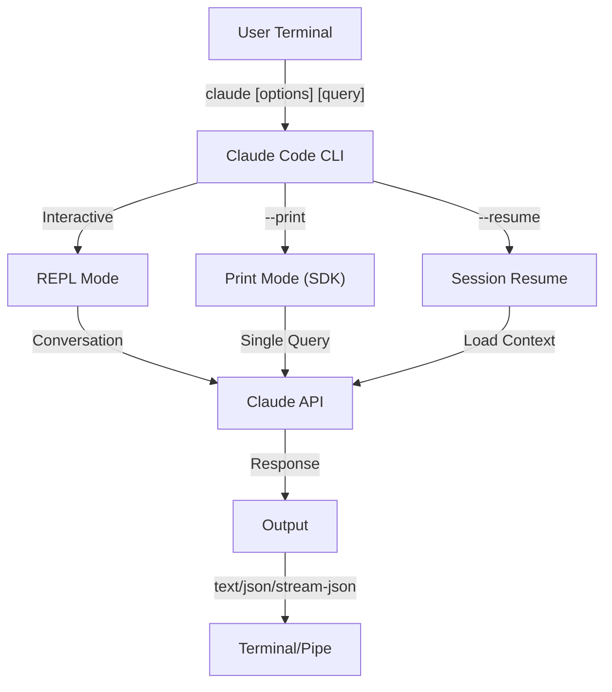
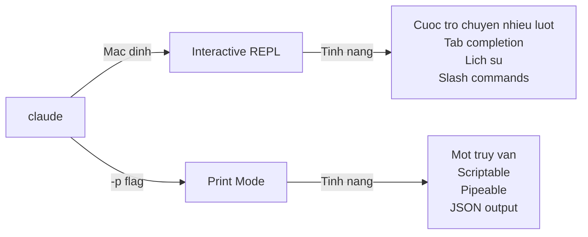

# Tham Khao CLI

## Tong Quan

Claude Code CLI (Command Line Interface - Giao Dien Dong Lenh) la cach chinh de tuong tac voi Claude Code. No cung cap cac tuy chon manh me de chay truy van, quan ly phien lam viec, cau hinh model va tich hop Claude vao quy trinh phat trien cua ban.

## Kien Truc



## Menh Lenh CLI

| Menh Lenh | Mo Ta | Vi Du |
|---------|-------------|---------|
| `claude` | Khoi dong interactive REPL | `claude` |
| `claude "query"` | Khoi dong REPL voi prompt ban dau | `claude "explain this project"` |
| `claude -p "query"` | Print mode - truy van roi thoat | `claude -p "explain this function"` |
| `cat file \| claude -p "query"` | Xu ly noi dung pipe | `cat logs.txt \| claude -p "explain"` |
| `claude -c` | Tiep tuc cuoc tro chuyen gan nhat | `claude -c` |
| `claude -c -p "query"` | Tiep tuc o print mode | `claude -c -p "check for type errors"` |
| `claude -r "<session>" "query"` | Tiep tuc phien theo ID hoac ten | `claude -r "auth-refactor" "finish this PR"` |
| `claude update` | Cap nhat len phien ban moi nhat | `claude update` |
| `claude mcp` | Cau hinh MCP servers | Xem [Tai lieu MCP](../../trung-cap/06-mcp/) |
| `claude mcp serve` | Chay Claude Code nhu MCP server | `claude mcp serve` |
| `claude agents` | Liet ke cac subagents da cau hinh | `claude agents` |
| `claude auto-mode defaults` | In ra cac quy tac mac dinh cua auto mode duoi dang JSON | `claude auto-mode defaults` |
| `claude remote-control` | Khoi dong Remote Control server | `claude remote-control` |
| `claude plugin` | Quan ly plugins (cai dat, bat, tat) | `claude plugin install my-plugin` |
| `claude auth login` | Dang nhap (ho tro `--email`, `--sso`) | `claude auth login --email user@example.com` |
| `claude auth logout` | Dang xuat tai khoan hien tai | `claude auth logout` |
| `claude auth status` | Kiem tra trang thai dang nhap (exit 0 neu da dang nhap, 1 neu chua) | `claude auth status` |

## Cco Co Ban

| Co | Mo Ta | Vi Du |
|------|-------------|---------|
| `-p, --print` | In phan hoi ma khong dung interactive mode | `claude -p "query"` |
| `-c, --continue` | Tai cuoc tro chuyen gan nhat | `claude --continue` |
| `-r, --resume` | Tiep tuc phien cu the theo ID hoac ten | `claude --resume auth-refactor` |
| `-v, --version` | Hien thi so phien ban | `claude -v` |
| `-w, --worktree` | Khoi dong trong git worktree co lap | `claude -w` |
| `-n, --name` | Ten hien thi cua phien | `claude -n "auth-refactor"` |
| `--from-pr <number>` | Tiep tuc phien lien ket voi GitHub PR | `claude --from-pr 42` |
| `--remote "task"` | Tao phien web tren claude.ai | `claude --remote "implement API"` |
| `--remote-control, --rc` | Phien interactive voi Remote Control | `claude --rc` |
| `--teleport` | Tiep tuc phien web cuc bo | `claude --teleport` |
| `--teammate-mode` | Che do hien thi nhom agent | `claude --teammate-mode tmux` |
| `--bare` | Che do toi gian (bo qua hooks, skills, plugins, MCP, auto memory, CLAUDE.md) | `claude --bare` |
| `--enable-auto-mode` | Mo khoa auto permission mode | `claude --enable-auto-mode` |
| `--channels` | Dang ky cac plugin thuoc MCP channel | `claude --channels discord,telegram` |
| `--chrome` / `--no-chrome` | Bat/tat tich hop trinh duyet Chrome | `claude --chrome` |
| `--effort` | Dat muc do co gang suy nghi | `claude --effort high` |
| `--init` / `--init-only` | Chay cac initialization hooks | `claude --init` |
| `--maintenance` | Chay cac maintenance hooks roi thoat | `claude --maintenance` |
| `--disable-slash-commands` | Tat toan bo skills va slash commands | `claude --disable-slash-commands` |
| `--no-session-persistence` | Tat luu phien (print mode) | `claude -p --no-session-persistence "query"` |

### Interactive vs Print Mode



**Interactive Mode** (mac dinh):
```bash
# Khoi dong phien interactive
claude

# Khoi dong voi prompt ban dau
claude "explain the authentication flow"
```

**Print Mode** (khong interactive):
```bash
# Mot truy van, roi thoat
claude -p "what does this function do?"

# Xu ly noi dung file
cat error.log | claude -p "explain this error"

# Ket hop voi cac cong cu khac
claude -p "list todos" | grep "URGENT"
```

## Model & Cau Hinh

| Co | Mo Ta | Vi Du |
|------|-------------|---------|
| `--model` | Dat model (sonnet, opus, haiku, hoac ten day du) | `claude --model opus` |
| `--fallback-model` | Tu dong chuyen model khi bi qua tai | `claude -p --fallback-model sonnet "query"` |
| `--agent` | Chi dinh agent cho phien | `claude --agent my-custom-agent` |
| `--agents` | Dinh nghia custom subagents qua JSON | Xem [Cau Hinh Agents](#cau-hinh-agents) |
| `--effort` | Dat muc co gang (low, medium, high, max) | `claude --effort high` |

### Vi Du Chon Model

```bash
# Dung Opus 4.6 cho cong viec phuc tap
claude --model opus "design a caching strategy"

# Dung Haiku 4.5 cho cong viec nhanh
claude --model haiku -p "format this JSON"

# Ten model day du
claude --model claude-sonnet-4-6-20250929 "review this code"

# Voi fallback cho do tin cay
claude -p --model opus --fallback-model sonnet "analyze architecture"

# Dung opusplan (Opus len ke hoach, Sonnet thuc thi)
claude --model opusplan "design and implement the caching layer"
```

## Tuy Chinh System Prompt

| Co | Mo Ta | Vi Du |
|------|-------------|---------|
| `--system-prompt` | Thay the toan bo prompt mac dinh | `claude --system-prompt "You are a Python expert"` |
| `--system-prompt-file` | Tai prompt tu file (print mode) | `claude -p --system-prompt-file ./prompt.txt "query"` |
| `--append-system-prompt` | Them vao prompt mac dinh | `claude --append-system-prompt "Always use TypeScript"` |

### Vi Du System Prompt

```bash
# Nhan dien tuy chinh hoan chinh
claude --system-prompt "You are a senior security engineer. Focus on vulnerabilities."

# Them huong dan cu the
claude --append-system-prompt "Always include unit tests with code examples"

# Tai prompt phuc tap tu file
claude -p --system-prompt-file ./prompts/code-reviewer.txt "review main.py"
```

### So Sanh Cac Co System Prompt

| Co | Hanh vi | Interactive | Print |
|------|----------|-------------|-------|
| `--system-prompt` | Thay the toan bo system prompt mac dinh | ✅ | ✅ |
| `--system-prompt-file` | Thay the bang prompt tu file | ❌ | ✅ |
| `--append-system-prompt` | Them vao system prompt mac dinh | ✅ | ✅ |

**Chi dung `--system-prompt-file` o print mode. Voi interactive mode, dung `--system-prompt` hoac `--append-system-prompt`.**

## Quan Ly Cong Cu & Quyen

| Co | Mo Ta | Vi Du |
|------|-------------|---------|
| `--tools` | Gioi han cac built-in tools co san | `claude -p --tools "Bash,Edit,Read" "query"` |
| `--allowedTools` | Cac cong cu thuc thi ma khong yeu cau xac nhan | `"Bash(git log:*)" "Read"` |
| `--disallowedTools` | Cac cong cu bi xoa khoi context | `"Bash(rm:*)" "Edit"` |
| `--dangerously-skip-permissions` | Bo qua toan bo prompt xin quyen | `claude --dangerously-skip-permissions` |
| `--permission-mode` | Bat dau voi permission mode chi dinh | `claude --permission-mode auto` |
| `--permission-prompt-tool` | MCP tool cho xu ly quyen | `claude -p --permission-prompt-tool mcp_auth "query"` |
| `--enable-auto-mode` | Mo khoa auto permission mode | `claude --enable-auto-mode` |

### Vi Du Ve Quyen

```bash
# Che do chi doc de review code
claude --permission-mode plan "review this codebase"

# Gioi han chi cong cu an toan
claude --tools "Read,Grep,Glob" -p "find all TODO comments"

# Cho phep lenh git cu the khong can prompt
claude --allowedTools "Bash(git status:*)" "Bash(git log:*)"

# Chan cac thao tac nguy hiem
claude --disallowedTools "Bash(rm -rf:*)" "Bash(git push --force:*)"
```

## Dinh Dang & Dau Ra

| Co | Mo Ta | Tuy Chon | Vi Du |
|------|-------------|---------|---------|
| `--output-format` | Chi dinh dinh dang dau ra (print mode) | `text`, `json`, `stream-json` | `claude -p --output-format json "query"` |
| `--input-format` | Chi dinh dinh dang dau vao (print mode) | `text`, `stream-json` | `claude -p --input-format stream-json` |
| `--verbose` | Bat ghi nhat ky chi tiet | | `claude --verbose` |
| `--include-partial-messages` | Bao gom cac su kien streaming | Yeu cau `stream-json` | `claude -p --output-format stream-json --include-partial-messages "query"` |
| `--json-schema` | Lay JSON da xac thuc schema | | `claude -p --json-schema '{"type":"object"}' "query"` |
| `--max-budget-usd` | Chi tieu toi da cho print mode | | `claude -p --max-budget-usd 5.00 "query"` |

### Vi Du Dinh Dang Dau Ra

```bash
# Van ban thuan (mac dinh)
claude -p "explain this code"

# JSON cho xu lap trinh
claude -p --output-format json "list all functions in main.py"

# Streaming JSON cho xu ly thoi gian thuc
claude -p --output-format stream-json "generate a long report"

# Cau truc dau ra voi xac thuc schema
claude -p --json-schema '{"type":"object","properties":{"bugs":{"type":"array"}}}' \
  "find bugs in this code and return as JSON"
```

## Khong Lam Viec & Thu Muc

| Co | Mo Ta | Vi Du |
|------|-------------|---------|
| `--add-dir` | Them thu muc lam viec phu | `claude --add-dir ../apps ../lib` |
| `--setting-sources` | Cau hinh nguon phan tach dau phay | `claude --setting-sources user,project` |
| `--settings` | Tai cau hinh tu file hoac JSON | `claude --settings ./settings.json` |
| `--plugin-dir` | Tai plugins tu thu muc (lap lai duoc) | `claude --plugin-dir ./my-plugin` |

### Vi Du Nhieu Thu Muc

```bash
# Lam viec tren nhieu thu muc du an
claude --add-dir ../frontend ../backend ../shared "find all API endpoints"

# Tai cau hinh tuy chinh
claude --settings '{"model":"opus","verbose":true}' "complex task"
```

## Cau Hinh MCP

| Co | Mo Ta | Vi Du |
|------|-------------|---------|
| `--mcp-config` | Tai MCP servers tu JSON | `claude --mcp-config ./mcp.json` |
| `--strict-mcp-config` | Chi dung cau hinh MCP chi dinh | `claude --strict-mcp-config --mcp-config ./mcp.json` |
| `--channels` | Dang ky cac plugin thuoc MCP channel | `claude --channels discord,telegram` |

### Vi Du MCP

```bash
# Tai GitHub MCP server
claude --mcp-config ./github-mcp.json "list open PRs"

# Che do nghiem ngat - chi cac server chi dinh
claude --strict-mcp-config --mcp-config ./production-mcp.json "deploy to staging"
```

## Quan Ly Phien Lam Viec

| Co | Mo Ta | Vi Du |
|------|-------------|---------|
| `--session-id` | Dung session ID cu the (UUID) | `claude --session-id "550e8400-..."` |
| `--fork-session` | Tao phien moi khi tiep tuc | `claude --resume abc123 --fork-session` |

### Vi Du Phien Lam Viec

```bash
# Tiep tuc cuoc tro chuyen cuoi
claude -c

# Tiep tuc phien co ten
claude -r "feature-auth" "continue implementing login"

# Nhan nhanh phien de thu nghiem
claude --resume feature-auth --fork-session "try alternative approach"

# Dung session ID cu the
claude --session-id "550e8400-e29b-41d4-a716-446655440000" "continue"
```

### Nhan Nhanh Phien (Session Fork)

Tao nhanh tu phien co san de thu nghiem:

```bash
# Nhan nhanh phien de thu cach tiep can khac
claude --resume abc123 --fork-session "try alternative implementation"

# Nhan nhanh voi thong diep tuy chinh
claude -r "feature-auth" --fork-session "test with different architecture"
```

**Truong Hop Su Dung:**
- Thu cach trie khai khac ma khong mat phien goc
- Thu nghiem cac cach tiep can khac nhau song song
- Tao nhanh tu cong viec da thanh cong cho cac bien the
- Kiem tra thay doi pha vo ma khong anh huong phien chinh

Phien goc khong bi thay doi, va phien nhanh tro thanh phien doc lap moi.

## Tinh Nang Nang Cao

| Co | Mo Ta | Vi Du |
|------|-------------|---------|
| `--chrome` | Bat tich hop trinh duyet Chrome | `claude --chrome` |
| `--no-chrome` | Tat tich hop trinh duyet Chrome | `claude --no-chrome` |
| `--ide` | Tu dong ket noi IDE neu co | `claude --ide` |
| `--max-turns` | Gioi han so luot agentic (khong interactive) | `claude -p --max-turns 3 "query"` |
| `--debug` | Bat che do debug voi loc | `claude --debug "api,mcp"` |
| `--enable-lsp-logging` | Bat ghi nhat ky LSP chi tiet | `claude --enable-lsp-logging` |
| `--betas` | Beta headers cho yeu cau API | `claude --betas interleaved-thinking` |
| `--plugin-dir` | Tai plugins tu thu muc (lap lai duoc) | `claude --plugin-dir ./my-plugin` |
| `--enable-auto-mode` | Mo khoa auto permission mode | `claude --enable-auto-mode` |
| `--effort` | Dat muc do co gang suy nghi | `claude --effort high` |
| `--bare` | Che do toi gian (bo qua hooks, skills, plugins, MCP, auto memory, CLAUDE.md) | `claude --bare` |
| `--channels` | Dang ky cac plugin thuoc MCP channel | `claude --channels discord` |
| `--fork-session` | Tao session ID moi khi tiep tuc | `claude --resume abc --fork-session` |
| `--max-budget-usd` | Chi tieu toi da (print mode) | `claude -p --max-budget-usd 5.00 "query"` |
| `--json-schema` | JSON dau ra da xac thuc | `claude -p --json-schema '{"type":"object"}' "q"` |

### Vi Du Nang Cao

```bash
# Gioi han hanh dong tu dong
claude -p --max-turns 5 "refactor this module"

# Debug cac goi API
claude --debug "api" "test query"

# Bat tich hop IDE
claude --ide "help me with this file"
```

## Cau Hinh Agents <a id="cau-hinh-agents"></a>

Co `--agents` chap nhan mot doi tuong JSON dinh nghia cac subagent tuy chinh cho mot phien.

### Dinh Dang JSON Agents

```json
{
  "agent-name": {
    "description": "Required: when to invoke this agent",
    "prompt": "Required: system prompt for the agent",
    "tools": ["Optional", "array", "of", "tools"],
    "model": "optional: sonnet|opus|haiku"
  }
}
```

**Truong Bat Buoc:**
- `description` - Mo ta ngon ngu tu nhien khi nao dung agent nay
- `prompt` - System prompt dinh nghia vai tro va hanh vi cua agent

**Truong Tuy Chon:**
- `tools` - Mang cac tool co san (ke thua toan bo neu bo qua)
  - Dinh dang: `["Read", "Grep", "Glob", "Bash"]`
- `model` - Model su dung: `sonnet`, `opus`, hoac `haiku`

### Vi Du Agents Day Du

```json
{
  "code-reviewer": {
    "description": "Expert code reviewer. Use proactively after code changes.",
    "prompt": "You are a senior code reviewer. Focus on code quality, security, and best practices.",
    "tools": ["Read", "Grep", "Glob", "Bash"],
    "model": "sonnet"
  },
  "debugger": {
    "description": "Debugging specialist for errors and test failures.",
    "prompt": "You are an expert debugger. Analyze errors, identify root causes, and provide fixes.",
    "tools": ["Read", "Edit", "Bash", "Grep"],
    "model": "opus"
  },
  "documenter": {
    "description": "Documentation specialist for generating guides.",
    "prompt": "You are a technical writer. Create clear, comprehensive documentation.",
    "tools": ["Read", "Write"],
    "model": "haiku"
  }
}
```

### Vi Du Menh Lenh Agents

```bash
# Dinh nghia agents inline
claude --agents '{
  "security-auditor": {
    "description": "Security specialist for vulnerability analysis",
    "prompt": "You are a security expert. Find vulnerabilities and suggest fixes.",
    "tools": ["Read", "Grep", "Glob"],
    "model": "opus"
  }
}' "audit this codebase for security issues"

# Tai agents tu file
claude --agents "$(cat ~/.claude/agents.json)" "review the auth module"

# Ket hop voi cac co khac
claude -p --agents "$(cat agents.json)" --model sonnet "analyze performance"
```

### Thu Tu Uu Tien Agent

Khi co nhieu dinh nghia agent chung, chung duoc tai theo thu tu uu tien sau:
1. **Dinh nghia CLI** (co `--agents`) - Danh rieng cho phien
2. **Cap nguoi dung** (`~/.claude/agents/`) - Toan bo du an
3. **Cap du an** (`.claude/agents/`) - Du an hien tai

Agents dinh nghia CLI ghi de ca user va project agents cho phien do.

---

## Truong Hop Su Dung Gia Tri Cao

### 1. Tich Hop CI/CD

Dung Claude Code trong CI/CD pipelines de tu dong review code, kiem tra va tai lieu.

**Vi Du GitHub Actions:**

```yaml
name: AI Code Review

on: [pull_request]

jobs:
  review:
    runs-on: ubuntu-latest
    steps:
      - uses: actions/checkout@v4

      - name: Install Claude Code
        run: npm install -g @anthropic-ai/claude-code

      - name: Run Code Review
        env:
          ANTHROPIC_API_KEY: ${{ secrets.ANTHROPIC_API_KEY }}
        run: |
          claude -p --output-format json \
            --max-turns 1 \
            "Review the changes in this PR for:
            - Security vulnerabilities
            - Performance issues
            - Code quality
            Output as JSON with 'issues' array" > review.json

      - name: Post Review Comment
        uses: actions/github-script@v7
        with:
          script: |
            const fs = require('fs');
            const review = JSON.parse(fs.readFileSync('review.json', 'utf8'));
            // Xu ly va dang binh luan review
```

**Jenkins Pipeline:**

```groovy
pipeline {
    agent any
    stages {
        stage('AI Review') {
            steps {
                sh '''
                    claude -p --output-format json \
                      --max-turns 3 \
                      "Analyze test coverage and suggest missing tests" \
                      > coverage-analysis.json
                '''
            }
        }
    }
}
```

### 2. Pipe Script

Xu ly file, log va du lieu qua Claude de phan tich.

**Phan Tich Log:**

```bash
# Phan tich error logs
tail -1000 /var/log/app/error.log | claude -p "summarize these errors and suggest fixes"

# Tim mau trong access logs
cat access.log | claude -p "identify suspicious access patterns"

# Phan tich lich su git
git log --oneline -50 | claude -p "summarize recent development activity"
```

**Xu Ly Code:**

```bash
# Review file cu the
cat src/auth.ts | claude -p "review this authentication code for security issues"

# Sinh tai lieu
cat src/api/*.ts | claude -p "generate API documentation in markdown"

# Tim va uu tien TODOs
grep -r "TODO" src/ | claude -p "prioritize these TODOs by importance"
```

### 3. Luong Lam Viec Nhieu Phien

Quan ly du an phuc tap voi nhieu luoc tro chuyen.

```bash
# Khoi dong phien tren nhanh feature
claude -r "feature-auth" "let's implement user authentication"

# Sau do, tiep tuc phien
claude -r "feature-auth" "add password reset functionality"

# Nhan nhanh de thu cach tiep can khac
claude --resume feature-auth --fork-session "try OAuth instead"

# Chuyen giua cac phien feature
claude -r "feature-payments" "continue with Stripe integration"
```

### 4. Cau Hinh Agent Tuy Chinh

Dinh nghia cac agent chuyen biet cho quy trinh cua nhom.

```bash
# Luu config agents vao file
cat > ~/.claude/agents.json << 'EOF'
{
  "reviewer": {
    "description": "Code reviewer for PR reviews",
    "prompt": "Review code for quality, security, and maintainability.",
    "model": "opus"
  },
  "documenter": {
    "description": "Documentation specialist",
    "prompt": "Generate clear, comprehensive documentation.",
    "model": "sonnet"
  },
  "refactorer": {
    "description": "Code refactoring expert",
    "prompt": "Suggest and implement clean code refactoring.",
    "tools": ["Read", "Edit", "Glob"]
  }
}
EOF

# Dung agents trong phien
claude --agents "$(cat ~/.claude/agents.json)" "review the auth module"
```

### 5. Xu Ly Hang Loat

Xu ly nhieu truy van voi cau hinh giong nhau.

```bash
# Xu ly nhieu file
for file in src/*.ts; do
  echo "Processing $file..."
  claude -p --model haiku "summarize this file: $(cat $file)" >> summaries.md
done

# Review code hang loat
find src -name "*.py" -exec sh -c '
  echo "## $1" >> review.md
  cat "$1" | claude -p "brief code review" >> review.md
' _ {} \;

# Sinh test cho tat ca module
for module in $(ls src/modules/); do
  claude -p "generate unit tests for src/modules/$module" > "tests/$module.test.ts"
done
```

### 6. Phat Trien An Toan

Dung dieu khuyen quyen de van hanh an toan.

```bash
# Security audit chi doc
claude --permission-mode plan \
  --tools "Read,Grep,Glob" \
  "audit this codebase for security vulnerabilities"

# Chan lenh nguy hiem
claude --disallowedTools "Bash(rm:*)" "Bash(curl:*)" "Bash(wget:*)" \
  "help me clean up this project"

# Tu dong hoa gioi han
claude -p --max-turns 2 \
  --allowedTools "Read" "Glob" \
  "find all hardcoded credentials"
```

### 7. Tich Hop JSON API

Dung Claude nhu API lap trinh duoc voi phan tich `jq`.

```bash
# Phan tich cau truc
claude -p --output-format json \
  --json-schema '{"type":"object","properties":{"functions":{"type":"array"},"complexity":{"type":"string"}}}' \
  "analyze main.py and return function list with complexity rating"

# Tich hop voi jq de xu ly
claude -p --output-format json "list all API endpoints" | jq '.endpoints[]'

# Dung trong scripts
RESULT=$(claude -p --output-format json "is this code secure? answer with {secure: boolean, issues: []}" < code.py)
if echo "$RESULT" | jq -e '.secure == false' > /dev/null; then
  echo "Security issues found!"
  echo "$RESULT" | jq '.issues[]'
fi
```

### Vi Du Phan Tich jq

Phan tich va xu ly dau ra JSON cua Claude bang `jq`:

```bash
# Trich xuat truong cu the
claude -p --output-format json "analyze this code" | jq '.result'

# Loc phan tu mang
claude -p --output-format json "list issues" | jq -r '.issues[] | select(.severity=="high")'

# Trich xuat nhieu truong
claude -p --output-format json "describe the project" | jq -r '.{name, version, description}'

# Chuyen sang CSV
claude -p --output-format json "list functions" | jq -r '.functions[] | [.name, .lineCount] | @csv'

# Xu ly co dieu kien
claude -p --output-format json "check security" | jq 'if .vulnerabilities | length > 0 then "UNSAFE" else "SAFE" end'

# Trich xuat gia tri long nhau
claude -p --output-format json "analyze performance" | jq '.metrics.cpu.usage'

# Xu ly toan bo mang
claude -p --output-format json "find todos" | jq '.todos | length'

# Bien doi dau ra
claude -p --output-format json "list improvements" | jq 'map({title: .title, priority: .priority})'
```

---

## Models

Claude Code ho tro nhieu model voi kha nang khac nhau:

| Model | ID | Context Window | Ghi Chu |
|-------|-----|----------------|-------|
| Opus 4.6 | `claude-opus-4-6` | 1M tokens | Co kha nang nhat, muc co gang thich ung |
| Sonnet 4.6 | `claude-sonnet-4-6` | 1M tokens | Can bang toc do va kha nang |
| Haiku 4.5 | `claude-haiku-4-5` | 1M tokens | Nhanh nhat, tot cho viec nhanh |

### Chon Model

```bash
# Dung ten ngan
claude --model opus "complex architectural review"
claude --model sonnet "implement this feature"
claude --model haiku -p "format this JSON"

# Dung alias opusplan (Opus len ke hoach, Sonnet thuc thi)
claude --model opusplan "design and implement the API"

# Chuyen che do nhanh trong phien
/fast
```

### Muc Do Co Gang (Opus 4.6)

Opus 4.6 ho tro suy luan thich ung voi cac muc co gang:

```bash
# Dat muc co gang qua co CLI
claude --effort high "complex review"

# Dat muc co gang qua slash command
/effort high

# Dat muc co gang qua bien moi truong
export CLAUDE_CODE_EFFORT_LEVEL=high   # low, medium, high, hoac max (chi Opus 4.6)
```

Tu khoa "ultrathink" trong prompts kich hoat suy luan sau. Muc co gang `max` chi danh cho Opus 4.6.

---

## Cac Bien Moi Truong Quan Trong

| Variable | Mo Ta |
|----------|-------------|
| `ANTHROPIC_API_KEY` | Khoa API de xac thuc |
| `ANTHROPIC_MODEL` | Ghi de model mac dinh |
| `ANTHROPIC_CUSTOM_MODEL_OPTION` | Tuy chon model tuy chinh cho API |
| `ANTHROPIC_DEFAULT_OPUS_MODEL` | Ghi de ID model Opus mac dinh |
| `ANTHROPIC_DEFAULT_SONNET_MODEL` | Ghi de ID model Sonnet mac dinh |
| `ANTHROPIC_DEFAULT_HAIKU_MODEL` | Ghi de ID model Haiku mac dinh |
| `MAX_THINKING_TOKENS` | Dat ngan sach token cho extended thinking |
| `CLAUDE_CODE_EFFORT_LEVEL` | Dat muc co gang (`low`/`medium`/`high`/`max`) |
| `CLAUDE_CODE_SIMPLE` | Che do toi gian, dat boi co `--bare` |
| `CLAUDE_CODE_DISABLE_AUTO_MEMORY` | Tat cap nhat CLAUDE.md tu dong |
| `CLAUDE_CODE_DISABLE_BACKGROUND_TASKS` | Tat thuc thi tac vu nen |
| `CLAUDE_CODE_DISABLE_CRON` | Tat cac tac vu cron/scheduled |
| `CLAUDE_CODE_DISABLE_GIT_INSTRUCTIONS` | Tat huong dan lien quan git |
| `CLAUDE_CODE_DISABLE_TERMINAL_TITLE` | Tat cap nhat tieu de terminal |
| `CLAUDE_CODE_DISABLE_1M_CONTEXT` | Tat context window 1M tokens |
| `CLAUDE_CODE_DISABLE_NONSTREAMING_FALLBACK` | Tat fallback khong streaming |
| `CLAUDE_CODE_ENABLE_TASKS` | Bat tinh nang dac ta danh sach |
| `CLAUDE_CODE_TASK_LIST_ID` | Thu muc tac vu duoc chia se giua cac phien |
| `CLAUDE_CODE_ENABLE_PROMPT_SUGGESTION` | Bat/tat go y prompt (`true`/`false`) |
| `CLAUDE_CODE_EXPERIMENTAL_AGENT_TEAMS` | Bat nhom agent thuc nghiem |
| `CLAUDE_CODE_NEW_INIT` | Dung luồng khoi tao moi |
| `CLAUDE_CODE_SUBAGENT_MODEL` | Model cho thuc thi subagent |
| `CLAUDE_CODE_PLUGIN_SEED_DIR` | Thu muc cho file seed plugin |
| `CLAUDE_CODE_SUBPROCESS_ENV_SCRUB` | Var env can scrub tu subprocesses |
| `CLAUDE_AUTOCOMPACT_PCT_OVERRIDE` | Ghi de ty le auto-compaction |
| `CLAUDE_STREAM_IDLE_TIMEOUT_MS` | Timeout stream idle tinh bang mili giay |
| `SLASH_COMMAND_TOOL_CHAR_BUDGET` | Ngan sach ky tu cho slash command tools |
| `ENABLE_TOOL_SEARCH` | Bat kha nang tim kiem tool |
| `MAX_MCP_OUTPUT_TOKENS` | Toi da token cho dau ra MCP tool |

---

## Tham Khao Nhanh

### Lenh Ph Bien Nhat

```bash
# Phien interactive
claude

# Cau hoi nhanh
claude -p "how do I..."

# Tiep tuc cuoc tro chuyen
claude -c

# Xu ly file
cat file.py | claude -p "review this"

# JSON output cho scripts
claude -p --output-format json "query"
```

### Ket Hop Co

| Truong Hop | Lenh |
|----------|---------|
| Review code nhanh | `cat file \| claude -p "review"` |
| Dau ra co cau truc | `claude -p --output-format json "query"` |
| Tham do an toan | `claude --permission-mode plan` |
| Tu dong hoa voi an toan | `claude --enable-auto-mode --permission-mode auto` |
| Tich hop CI/CD | `claude -p --max-turns 3 --output-format json` |
| Tiep tuc cong viec | `claude -r "session-name"` |
| Model tuy chinh | `claude --model opus "complex task"` |
| Che do toi gian | `claude --bare "quick query"` |
| Chay co ngan sach | `claude -p --max-budget-usd 2.00 "analyze code"` |

---

## Xu Ly Su Co

### Khong Tim Thay Lenh

**Van de:** `claude: command not found`

**Giai phap:**
- Cai dat Claude Code: `npm install -g @anthropic-ai/claude-code`
- Kiem tra PATH bao gom thu muc npm global bin
- Thu chay voi duong dan day du: `npx claude`

### Van De Khoa API

**Van de:** Xac thuc khong thanh cong

**Giai phap:**
- Dat khoa API: `export ANTHROPIC_API_KEY=your-key`
- Kiem tra khoa hop le va du credit
- Xac minh quyen cua khoa cho model yeu cau

### Khong Tim Thay Phien

**Van de:** Khong the tiep tuc phien

**Giai phap:**
- Liet ke cac phien co san de tim ten/ID dung
- Phien co the het han sau thoi gian khong hoat dong
- Dung `-c` de tiep tuc phien gan nhat

### Van De Dinh Dang Dau Ra

**Van de:** JSON bi loi

**Giai phap:**
- Dung `--json-schema` de ap dat cau truc
- Them huong dan JSON ro rang trong prompt
- Dung `--output-format json` (khong chi yeu cau JSON trong prompt)

### Tu Choi Quyen

**Van de:** Thuc thi tool bi chan

**Giai phap:**
- Kiem tra cai dat `--permission-mode`
- Xem lai cac co `--allowedTools` va `--disallowedTools`
- Dung `--dangerously-skip-permissions` cho tu dong hoa (can than)

---

## Tai Nguyen Bo Sung

- **[Official CLI Reference](https://code.claude.com/docs/en/cli-reference)** - Tham khao lenh day du
- **[Headless Mode Documentation](https://code.claude.com/docs/en/headless)** - Thuc thi tu dong
- **[Slash Commands](../../co-ban/01-slash-commands/)** - Phim tat tuy chinh trong Claude
- **[Memory Guide](../../co-ban/02-memory/)** - Context lien tuc qua CLAUDE.md
- **[MCP Protocol](../../trung-cap/06-mcp/)** - Tich hop cong cu ben ngoai
- **[Advanced Features](../../nang-cao/10-advanced/)** - Che do lap ke hoach, extended thinking
- **[Subagents Guide](../../trung-cap/05-subagents/)** - Thuc thi tac vu uy quyen

---

*Phan cua bo huong dan [Tự Học Claude Code](../../)*
