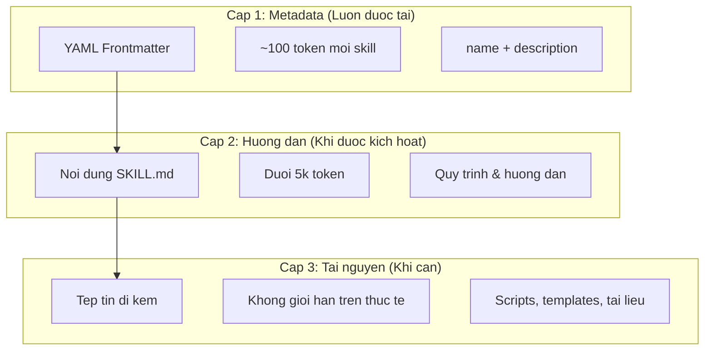
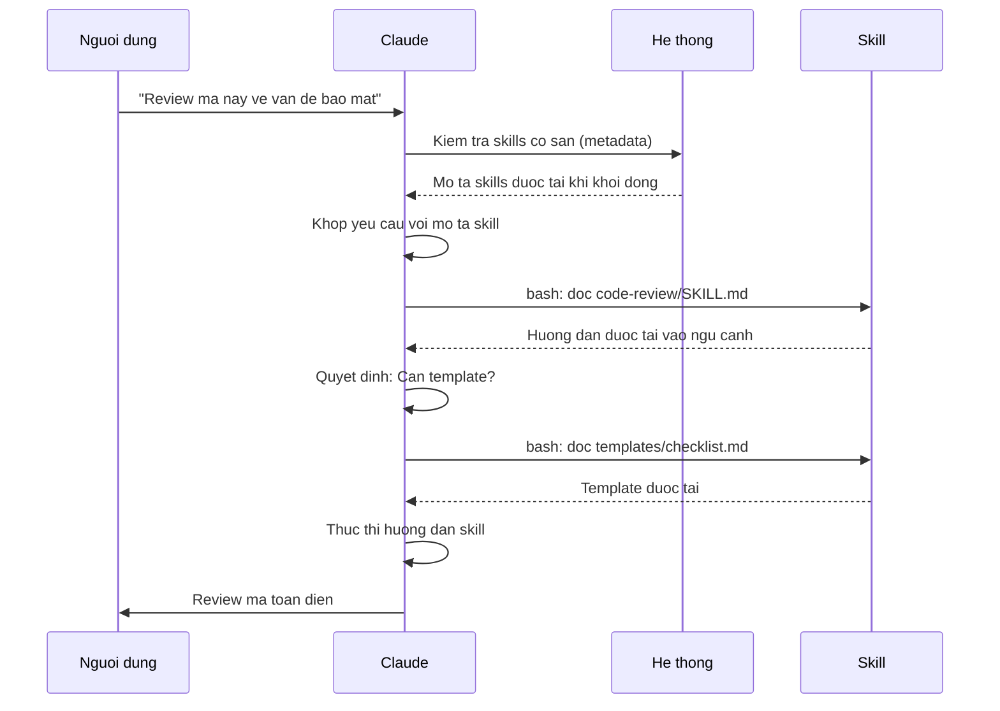

# Huong Dan Agent Skills

Agent Skills la nhung kha nang co the tai su dung, dua tren he thong tap tin, mo rong chuc nang cua Claude. Chung dong goi chuyen mon theo linh vuc, quy trinh lam viec va nhung thuc hanh tot nhat thanh cac thanh phan co the phat hien ma Claude tu dong su dung khi co lien quan.

## Tong Quan

**Agent Skills** la nhung kha nang mo dun bien cac agent da dung thanh chuyen gia. Khac voi prompt (huong dan cap do hoi thoai cho mot lan thuc hien), Skills duoc tai theo yeu cau va loai bo nhu cau lap di lap lai cung huong dan qua nhieu cuoc hoi thoai.

### Loi Ich Chinh

- **Chuyen gia hoa Claude**: Tieu chuan hoa kha nang cho cac tac vu theo linh vuc
- **Giam lap lai**: Tao mot lan, su dung tu dong qua cac cuoc hoi thoai
- **Ket hop kha nang**: Ghep cac Skills de xay dung quy trin phuc tap
- **Mở rong quy trinh**: Tai su dung skills qua nhieu du an va nhom
- **Duy tri chat luong**: Nhung thuc hanh tot nhat duoc tich hop truc tiep vao quy trinh

Skills tuan theo chuan mo [Agent Skills](https://agentskills.io), hoat dong tren nhieu cong cu AI. Claude Code mo rong chuan nay voi cac tinh nang bo sung nhu kiem soat goi, thuc thi subagent, va tiem ngup ngu canh dong.

> **Luu y**: Lenh slash tuy chinh da duoc hop nhat vao skills. Tep tin trong `.claude/commands/` van hoat dong va ho tro cac truong frontmatter tuong tu. Skills duoc khuyen nghi cho phat trien moi. Khi ca hai ton tai cung duong dan (vi du `.claude/commands/review.md` va `.claude/skills/review/SKILL.md`), skill uu tien hon.

## Skills Hoat Dong Nhu The Nao: Progressive Disclosure

Skills tan dung kien truc **progressive disclosure** -- Claude tai thong tin theo tung giai doan khi can, thay vi tieu thu ngu canh ngay tu dau. Dieu nay cho phep quan ly ngu canh hieu qua trong khi van duy tri kha nang mo rong khong gioi han.

### Ba Cap Do Tai



| Cap | Khi duoc tai | Chi phi Token | Noi dung |
|-------|------------|------------|---------|
| **Cap 1: Metadata** | Luon (khi khoi dong) | ~100 token moi Skill | `name` va `description` tu YAML frontmatter |
| **Cap 2: Huong dan** | Khi Skill duoc kich hoat | Duoi 5k token | Noi dung SKILL.md voi huong dan |
| **Cap 3+: Tai nguyen** | Khi can | Khong gioi han tren thuc te | Tep tin di kem thuc thi qua bash ma khong tai noi dung vao ngu canh |

Nghia la ban co the cai nhieu Skills ma khong bi phat ngu canh -- Claude chi biet Skill ton tai va khi nao dung den cho den khi thuc su duoc kich hoat.

## Quy Trinh Tai Skill



## Loai Skills & Vi Tri

| Loai | Vi tri | Pham vi | Chia se | Phu hop cho |
|------|----------|-------|--------|----------|
| **Doanh nghiep** | Cai dat quan ly | Tat ca nguoi dung | Co | Tieu chuan toan to chuc |
| **Ca nhan** | `~/.claude/skills/<ten-skill>/SKILL.md` | Ca nhan | Khong | Quy trinh ca nhan |
| **Du an** | `.claude/skills/<ten-skill>/SKILL.md` | Nhom | Co (qua git) | Tieu chuan nhom |
| **Plugin** | `<plugin>/skills/<ten-skill>/SKILL.md` | Noi bat | Tuy thuoc | Dong goi voi plugin |

Khi skills cung ten o cac cap do, vi tri uu tien cao hon thang: **enterprise > personal > project**. Plugin skills su dung namespace `plugin-name:skill-name` nen khong the xung dot.

### Tu Dong Phat Hien

**Thu muc long nhau**: Khi lam viec voi tep tin trong thu muc con, Claude Code tu dong phat hien skills tu thu muc `.claude/skills/` long nhau. Vi du, neu dang chinh sua tep tin trong `packages/frontend/`, Claude Code cung tim kiem skills trong `packages/frontend/.claude/skills/`. Ho tro mo hinh monorepo.

**Thu muc `--add-dir`**: Skills tu thu muc them qua `--add-dir` duoc tai tu dong voi phat hien thay doi truc tiep. Moi thay doi tren tep tin skill trong cac thu muc nay co hieu luc ngay lap tuc ma khong can khoi dong lai Claude Code.

**Ngan sach description**: Mo ta skill (metadata Cap 1) bi gioi han **2% cua context window** (du phong: **16.000 ky tu**). Neu co nhieu skill, mot so co the bi loai tru. Chay `/context` de kiem tra canh bao. Ghi de ngan sach voi bien moi truong `SLASH_COMMAND_TOOL_CHAR_BUDGET`.

## Tao Skill Tuy Chinh

### Cau Truc Thu muc Co Ban

```
my-skill/
├── SKILL.md           # Huong dan chinh (bat buoc)
├── template.md        # Template de Claude dien vao
├── examples/
│   └── sample.md      # Vi du dau ra mong doi
└── scripts/
    └── validate.sh    # Script Claude co the thuc thi
```

### Dinh Dang SKILL.md

```yaml
---
name: your-skill-name
description: Mo ta ngan gon Skill lam gi va khi nao su dung
---

# Ten Skill Cua Ban

## Huong dan
Cung cap huong dan tung buoc ro rang cho Claude.

## Vi du
Cho vi du cu the ve viec su dung Skill nay.
```

### Truong Bat Buoc

- **name**: chu thuong, so, dau gach (toi da 64 ky tu). Khong duoc chua "anthropic" hoac "claude".
- **description**: Skill lam gi VA khi nao su dung (toi da 1024 ky tu). Truong nay rat quan trong de Claude biet khi nao kich hoat skill.

### Truong Frontmatter Tuy Chon

```yaml
---
name: my-skill
description: Skill lam gi va khi nao su dung
argument-hint: "[ten-tep] [dinh-dang]"       # Goi y autocomplete
disable-model-invocation: true               # Chi nguoi dung moi goi duoc
user-invocable: false                        # An khoi menu slash
allowed-tools: Read, Grep, Glob              # Han che quyen truy cap cong cu
model: opus                                  # Model cu the
effort: high                                 # muc do co gang (low, medium, high, max)
context: fork                                # Chay trong subagent tach biet
agent: Explore                               # Loai agent (voi context: fork)
shell: bash                                  # Shell cho lenh: bash (mac dinh) hoac powershell
hooks:                                       # Hooks pham vi skill
  PreToolUse:
    - matcher: "Bash"
      hooks:
        - type: command
          command: "./scripts/validate.sh"
---
```

| Truong | Mo ta |
|-------|-------------|
| `name` | Chu thuong, so, dau gach (toi da 64 ky tu). Khong duoc chua "anthropic" hoac "claude". |
| `description` | Skill lam gi VA khi nao su dung (toi da 1024 ky tu). Quan trong cho tu dong kich hoat. |
| `argument-hint` | Goi y hien thi trong menu autocomplete `/` (vd: `"[ten-tep] [dinh-dang]"`). |
| `disable-model-invocation` | `true` = chi nguoi dung goi qua `/ten`. Claude khong bao gio tu goi. |
| `user-invocable` | `false` = an khoi menu `/`. Chi Claude tu dong goi duoc. |
| `allowed-tools` | Danh sach cong cu cach nhau boi dau phay ma skill co the dung ma khong yeu cau xac nhan. |
| `model` | Ghi de model khi skill dang hoat dong (vd: `opus`, `sonnet`). |
| `effort` | Muc do co gang khi skill dang hoat dong: `low`, `medium`, `high`, hoac `max`. |
| `context` | `fork` de chay skill trong subagent voi cua so ngu canh rieng. |
| `agent` | Loai subagent khi `context: fork` (vd: `Explore`, `Plan`, `general-purpose`). |
| `shell` | Shell dung cho lenh `` !`lenh` `` va scripts: `bash` (mac dinh) hoac `powershell`. |
| `hooks` | Hooks pham vi vong doi skill (cung dinh dang voi hooks toan cuc). |

## Loai Noi Dung Skill

Skills co the chua hai loai noi dung, moi loai phu hop voi muc dich khac nhau:

### Noi Dung Tham Khao

Bo sung kien thuc Claude ap dung vao cong viec hien tai -- quy uoc, mau, style guide, kien thuc linh vuc. Chay inline trong ngu canh hoi thoai.

```yaml
---
name: api-conventions
description: Mau thiet ke API cho codebase nay
---

Khi viet endpoint API:
- Su dung quy uoc dat ten RESTful
- Tra ve dinh dang loi nhat quan
- Bao gom xac thuc yeu cau
```

### Noi Dung Tac Vu

Huong dan tung buoc cho hanh dong cu the. Thuong duoc goi truc tiep voi `/ten-skill`.

```yaml
---
name: deploy
description: Trien khai ung dung len production
context: fork
disable-model-invocation: true
---

Trien khai ung dung:
1. Chay bo test
2. Build ung dung
3. Day len target trien khai
```

## Kiem Soat Goi Skill

Mac dinh, ca ban va Claude deu co the goi bat ky skill nao. Hai truong frontmatter kiem soat ba che do goi:

| Frontmatter | Ban co the goi | Claude co the goi |
|---|---|---|
| (mac dinh) | Co | Co |
| `disable-model-invocation: true` | Co | Khong |
| `user-invocable: false` | Khong | Co |

**Dung `disable-model-invocation: true`** cho quy trinh co tac dong phu: `/commit`, `/deploy`, `/send-slack-message`. Ban khong muon Claude quyet dinh deploy chi vi ma trong dep.

**Dung `user-invocable: false`** cho kien thuc nen khong hoat dong nhu lenh. Skill `legacy-system-context` giai thich he thong cu -- huu ich cho Claude nhung khong phai hanh dong co y nghia voi nguoi dung.

## Thay The Chuoi

Skills ho tro gia tri dong duoc giai quyet truoc khi noi dung skill den Claude:

| Bien | Mo ta |
|----------|-------------|
| `$ARGUMENTS` | Tat ca doi so truyen khi goi skill |
| `$ARGUMENTS[N]` hoac `$N` | Truy cap doi so cu the theo chi muc (bat dau 0) |
| `${CLAUDE_SESSION_ID}` | ID phien hien tai |
| `${CLAUDE_SKILL_DIR}` | Thu muc chua SKILL.md cua skill |
| `` !`lenh` `` | Tiem ngup dong -- chay lenh shell va inline ket qua |

**Vi du:**

```yaml
---
name: fix-issue
description: Sua mot GitHub issue
---

Sua GitHub issue $ARGUMENTS theo tieu chuan coding.
1. Doc mo ta issue
2. Thuc hien sua loi
3. Viet test
4. Tao commit
```

Chay `/fix-issue 123` thay `$ARGUMENTS` bang `123`.

## Tiem Ngup Ngu Canh Dong

Cau phap `` !`lenh` `` chay lenh shell truoc khi noi dung skill duoc gui den Claude:

```yaml
---
name: pr-summary
description: Tom tat thay doi trong pull request
context: fork
agent: Explore
---

## Ngu canh pull request
- PR diff: !`gh pr diff`
- PR comments: !`gh pr view --comments`
- Changed files: !`gh pr diff --name-only`

## Nhiem vu cua ban
Tom tat pull request nay...
```

Lenh thuc thi ngay lap tuc; Claude chi thay ket qua cuoi cung. Mac dinh lenh chay trong `bash`. Dat `shell: powershell` trong frontmatter de dung PowerShell.

## Chay Skills Trong Subagents

Them `context: fork` de chay skill trong ngu canh subagent tach biet. Noi dung skill tro thanh nhiem vu cho subagent chuyen dung voi cua so ngu canh rieng, giu hoi thoai chinh gon gang.

Truong `agent` chi dinh loai agent:

| Loai Agent | Phu hop cho |
|---|---|
| `Explore` | Nghien cuu chi doc, phan tich codebase |
| `Plan` | Tao ke hoach trien khai |
| `general-purpose` | Tac vu rong can tat ca cong cu |
| Agent tuy chinh | Agent dac trung tu cau hinh |

**Vi du frontmatter:**

```yaml
---
context: fork
agent: Explore
---
```

**Vi du skill day du:**

```yaml
---
name: deep-research
description: Nghien cuu mot chu de ky luong
context: fork
agent: Explore
---

Nghien cuu $ARGUMENTS ky luong:
1. Tim tep tin lien quan bang Glob va Grep
2. Doc va phan tich ma
3. Tom tat ket qua voi tham chieu tep tin cu the
```

## Vi Du Thuc Te

### Vi du 1: Skill Code Review

**Cau truc thu muc:**

```
~/.claude/skills/code-review/
├── SKILL.md
├── templates/
│   ├── review-checklist.md
│   └── finding-template.md
└── scripts/
    ├── analyze-metrics.py
    └── compare-complexity.py
```

**Tep tin:** `~/.claude/skills/code-review/SKILL.md`

```yaml
---
name: code-review-specialist
description: Review ma toan dien voi phan tich bao mat, hieu suat va chat luong. Su dung khi nguoi dung yeu cau review ma, phan tich chat luong ma, danh gia pull request, hoac nhac den code review, phan tich bao mat, hoac toi uu hieu suat.
---

# Skill Code Review

Skill nay cung cap kha nang review ma toan dien tap trung vao:

1. **Phan tich Bao mat**
   - Van de xac thuc/uy quyen
   - Rui ro phe lo du lieu
   - Loi tiem nhap
   - Diem yeu mat ma

2. **Reviews Hieu suat**
   - Hieu qua thuat toan (phan tich Big O)
   - Toi uu bo nho
   - Toi uu truy van co so du lieu
   - Co hoi cache

3. **Chat luong Ma**
   - Nguyen tac SOLID
   - Mau thiet ke
   - Quy uoc dat ten
   - Do phu test

4. **Kha nang Bao tri**
   - Kha nang doc ma
   - Kich thuoc ham (nen < 50 dong)
   - Do phuc tạp cyclomatic
   - An toan kieu du lieu

## Template Review

Cho moi doan ma duoc review, cung cap:

### Tom tat
- Danh gia chat luong tong the (1-5)
- So luong phat hien chinh
- Lanh vuc uu tien khuyen nghi

### Van de Nghiem trong (neu co)
- **Van de**: Mo ta ro rang
- **Vi tri**: Tep tin va so dong
- **Tac dong**: Tai sao van de nay quan trong
- **Muc do**: Nghiem trong/Cao/Trung binh
- **Sua**: Vi du ma

Chi tiet checklist, xem [templates/review-checklist.md](templates/review-checklist.md).
```

### Vi du 2: Skill Visualizer Codebase

Skill tao visualization HTML tuong tac:

**Cau truc thu muc:**

```
~/.claude/skills/codebase-visualizer/
├── SKILL.md
└── scripts/
    └── visualize.py
```

**Tep tin:** `~/.claude/skills/codebase-visualizer/SKILL.md`

```yaml
---
name: codebase-visualizer
description: Tao visualization cay tuong tac co the thu gon cua codebase. Su dung khi kham pha repo moi, hieu cau truc du an, hoac xac dinh tep tin lon.
allowed-tools: Bash(python *)
---

# Codebase Visualizer

Tao cay HTML tuong tac hien thi cau truc tep tin du an.

## Cach dung

Chay script visualization tu thu muc goc du an:

```bash
python ~/.claude/skills/codebase-visualizer/scripts/visualize.py .
```

Tao `codebase-map.html` va mo trong trinh duyet mac dinh.

## Visualization hien thi gi

- **Thu muc thu gon duoc**: Click thu muc de mo/gon
- **Kich thuoc tep tin**: Hien thi canh moi tep tin
- **Mau sac**: Mau khac nhau cho loai tep tin khac nhau
- **Tong thu muc**: Hien thi kich thuoc tong hop cua moi thu muc
```

Script Python di kem xu ly phan nang chinh, Claude dam nhan dieu phoi.

### Vi du 3: Skill Deploy (Chi Nguoi Dung Goi)

```yaml
---
name: deploy
description: Trien khai ung dung len production
disable-model-invocation: true
allowed-tools: Bash(npm *), Bash(git *)
---

Deploy $ARGUMENTS len production:

1. Chay bo test: `npm test`
2. Build ung dung: `npm run build`
3. Day len target trien khai
4. Xac minh trien khai thanh cong
5. Bao cao trang thai trien khai
```

### Vi du 4: Skill Brand Voice (Kien Thuc Nen)

```yaml
---
name: brand-voice
description: Dam bao moi giao tiep phu hop voi huong dan giong noi va giam dieu thuong hieu. Su dung khi tao marketing copy, giao tiep khach hang, hoac noi dung huong cong chung.
user-invocable: false
---

## Giong Noi
- **Than thien nhung chuyen nghiep** - gan gui nhung khong tuy tien
- **Ro rang va ngan gon** - tranh thuat ngu
- **Tu tin** - chung toi biet minh dang lam gi
- **Thau hieu** - hieu nhu cau va noi dau nguoi dung

## Huong dan Viet
- Dung "ban" khi dia chi nguoi doc
- Dung chu dong
- Giu cau duoi 20 tu
- Bat dau voi gia tri dem lai

Xem [templates/](templates/) cho template.
```

### Vi du 5: Skill Tao CLAUDE.md

```yaml
---
name: claude-md
description: Tao hoac cap nhat tep tin CLAUDE.md theo thuc hanh tot nhat de onboarding AI agent toi uu. Su dung khi nguoi dung nhac den CLAUDE.md, tai lieu du an, hoac onboarding AI.
---

## Nguyen tac Cot loi

**LLMs khong trang thai**: CLAUDE.md la tep tin duy nhat tu dong dua vao moi cuoc hoi thoai.

### Quy tac Vang

1. **It la Nhieu**: Giu duoi 300 dong (ly tuong duoi 100)
2. **Pho quat**: Chi dua thong tin applicable cho MOI phien
3. **Dung dung Claude nhu Linter**: Dung cong cu xac dinh
4. **Khong bao gio tu sinh**: Thu cong bien soan can than

## Phan Can Thiet

- **Ten Du an**: Mo ta mot dong
- **Tech Stack**: Ngon ngu chinh, framework, database
- **Lenh Phat trien**: Lenh cai dat, test, build
- **Quy uoc Quan trong**: Chi nhung quy uoc khong hien nhien, tac dong cao
- **Van de da Biet / Luu y**: Nhung thu thuong gay rac roi cho developer
```

### Vi du 6: Skill Refactoring voi Scripts

**Cau truc thu muc:**

```
refactor/
├── SKILL.md
├── references/
│   ├── code-smells.md
│   └── refactoring-catalog.md
├── templates/
│   └── refactoring-plan.md
└── scripts/
    ├── analyze-complexity.py
    └── detect-smells.py
```

**Tep tin:** `refactor/SKILL.md`

```yaml
---
name: code-refactor
description: Tai cau truc ma he thong dua tren phuong phap cua Martin Fowler. Su dung khi nguoi dung yeu cau tai cau truc ma, cai thien cau truc ma, giam no ky thuat, hoac loai bo mui code.
---

# Skill Tai Cau Truc Ma

Phuong phap theo giai doan nhan manh thay doi tang tu an toan, duoc ho tro boi test.

## Quy trinh

Giai doan 1: Nghien cuu & Phan tich -> Giai doan 2: Danh gia Do phu Test ->
Giai doan 3: Nhan dien Mui Code -> Giai doan 4: Tao Ke hoach Tai cau truc ->
Giai doan 5: Trien khai Tang tu -> Giai doan 6: Review & Lap lai

## Nguyen tac Cot loi

1. **Bao toan Hanh vi**: Hanh vi ben ngoai phai khong doi
2. **Buoc Nho**: Thay doi nho, kiem tra duoc
3. **Lai boi Test**: Test luoi an toan
4. **Lien tuc**: Tai cau truc la qua trinh lien tuc

Catalog mui code, xem [references/code-smells.md](references/code-smells.md).
Ky thuat tai cau truc, xem [references/refactoring-catalog.md](references/refactoring-catalog.md).
```

## Tep Tin Ho Tro

Skills co the bao gom nhieu tep tin trong thu muc ngoai `SKILL.md`. Nhung tep tin ho tro (template, vi du, scripts, tai lieu tham khao) giu tep tin skill chinh tap trung trong khi cung cap cho Claude tai nguyen bo sung de tai khi can.

```
my-skill/
├── SKILL.md              # Huong dan chinh (bat buoc, giu duoi 500 dong)
├── templates/            # Template de Claude dien vao
│   └── output-format.md
├── examples/             # Vi du dau ra hien thi dinh dang mong doi
│   └── sample-output.md
├── references/           # Kien thuc linh vuc va dac ta
│   └── api-spec.md
└── scripts/              # Scripts Claude co the thuc thi
    └── validate.sh
```

Huong dan cho tep tin ho tro:

- Giu `SKILL.md` duoi **500 dong**. Chuyen tai lieu tham khao chi tiet, vi du lon, va dac ta sang tep tin tach roi.
- Tham chieu tep tin bo sung tu `SKILL.md` bang **duong dan tuong doi** (vd: `[API reference](references/api-spec.md)`).
- Tep tin ho tro duoc tai o Cap 3 (khi can), nen khong tieu thu ngu cảnh cho den khi Claude thuc su doc chung.

## Quan ly Skills

### Xem Skills Co San

Hoi Claude truc tiep:
```
Skills nao dang co san?
```

Hoac kiem tra he thong tap tin:
```bash
# Liet ke Skills ca nhan
ls ~/.claude/skills/

# Liet ke Skills du an
ls .claude/skills/
```

### Kiem tra Skill

Hai cach kiem tra:

**De Claude tu dong goi** bang cach hoi dieu khop voi description:
```
Ban co the giup toi review ma nay ve van de bao mat khong?
```

**Hoac goi truc tiep** voi ten skill:
```
/code-review src/auth/login.ts
```

### Cap nhat Mot Skill

Chinh sua truc tiep tep tin `SKILL.md`. Thay doi co hieu luc vao lan khoi dong Claude Code tiep theo.

```bash
# Skill ca nhan
code ~/.claude/skills/my-skill/SKILL.md

# Skill du an
code .claude/skills/my-skill/SKILL.md
```

### Han Che Truy Cap Skill cua Claude

Ba cach kiem soat skills Claude co the goi:

**Vo hieu hoa tat ca skills** trong `/permissions`:
```
# Them vao quy tac tu choi:
Skill
```

**Cho phep hoac tu choi skills cu the**:
```
# Chi cho phep skills cu the
Skill(commit)
Skill(review-pr *)

# Tu choi skills cu the
Skill(deploy *)
```

**An skill rieng le** bang cach them `disable-model-invocation: true` vao frontmatter.

## Thuc Hanh Tot Nhat

### 1. Dat Description Cu The

- **Te (Mo ho)**: "Ho tro tai lieu"
- **Tot (Cu the)**: "Trich xuat van ban va bang bieu tu tep tin PDF, dien form, ghep tai lieu. Su dung khi lam viec voi tep tin PDF hoac khi nguoi dung nhac den PDF, form, hoac trich xuat tai lieu."

### 2. Giu Skill Tap Trung

- Mot Skill = mot kha nang
- ✅ "Dien form PDF"
- ❌ "Xu ly tai lieu" (qua rong)

### 3. Bao gom Tu Khoa Kich hoat

Them tu khoa trong description khop voi yeu cau nguoi dung:
```yaml
description: Phan tich bang tinh Excel, tao bang tong hop, tao bieu do. Su dung khi lam viec voi tep tin Excel, bang tinh, hoac tep tin .xlsx.
```

### 4. Giu SKILL.md Duoi 500 Dong

Chuyen tai lieu tham khao chi tiet sang tep tin tach roi ma Claude tai khi can.

### 5. Tham Chieu Tep Tin Ho Tro

```markdown
## Tai nguyen bo sung

- Chi tiet API day du, xem [reference.md](reference.md)
- Vi du su dung, xem [examples.md](examples.md)
```

### Nen lam

- Dung ten ro rang, mo ta tot
- Bao gom huong dan day du
- Them vi du cu the
- Dong goi scripts va templates lien quan
- Kiem tra voi tinh huong thuc te
- Tai lieu hoa phu thuoc

### Khong nen lam

- Khong tao skills cho tac vu mot lan
- Khong trung lap chuc nang co san
- Khong lam skills qua rong
- Khong bo qua truong description
- Khong cai dat skills tu nguon khong uy tin ma khong kiem tra

### Kham Pha Va Giai Quyet Van De

### Tham Chao Nhanh

| Van de | Giai phap |
|-------|----------|
| Claude khong dung Skill | Lam description cu the hon voi tu khoa kich hoat |
| Khong tim thay tep tin skill | Xac minh duong dan: `~/.claude/skills/ten/SKILL.md` |
| Loi YAML | Kiem tra dau `---`, thut le, khong dung tab |
| Skills xung dot | Dung tu khoa kich hoat khac nhau trong descriptions |
| Scripts khong chay | Kiem tra quyen: `chmod +x scripts/*.py` |
| Claude khong thay tat ca skills | Qua nhieu skills; kiem tra `/context` cho canh bao |

### Skill Khong Kich hoat

Neu Claude khong dung skill khi mong doi:

1. Kiem tra description bao gom tu khoa nguoi dung thuong noi
2. Xac minh skill xuat hien khi hoi "Skills nao co san?"
3. Thu dien dat lai yeu cau cho khop voi description
4. Goi truc tiep voi `/ten-skill` de kiem tra

### Skill Kich hoat Qua Thuong Xuyen

Neu Claude dung skill khi khong muon:

1. Lam description cu the hon
2. Them `disable-model-invocation: true` cho goi thu cong

### Claude Khong Thay Tat Ca Skills

Mo ta skills duoc tai o **2% cua context window** (du phong: **16.000 ky tu**). Chay `/context` de kiem tra canh bao ve skills bi loai tru. Ghi de ngan sach voi bien moi truong `SLASH_COMMAND_TOOL_CHAR_BUDGET`.

### Xem Xet Bao Mat

**Chi dung Skills tu nguon uy tin.** Skills cung cap cho Claude kha nang qua huong dan va ma -- mot skill doc co the yeu cau Claude goi cong cu hoac thuc thi ma gay hai.

**Xem xet bao mat chinh:**

- **Kiem tra ky luong**: Xem xet tat ca tep tin trong thu muc Skill
- **Nguon ben ngoai co rui ro**: Skills lay tu URL ben ngoai co the bi ton thuong
- **Lam dung cong cu**: Skills doc co the goi cong cu gay hai
- **Xu ly nhu cai phan mem**: Chi dung skills tu nguon uy tin

## Skills so voi Cac Tinh Nang Khac

| Tinh nang | Goi | Phu hop cho |
|---------|------------|----------|
| **Skills** | Tu dong hoac `/ten` | Chuyen mon tai su dung, quy trinh |
| **Lenh Slash** | Nguoi dung khoi dong `/ten` | Phim tat nhanh (da hop nhat vao skills) |
| **Subagents** | Tu dong uy quyet | Thuc thi tac vu tach biet |
| **Memory (CLAUDE.md)** | Luon duoc tai | Ngu canh du an lien tuc |
| **MCP** | Thoi gian thuc | Truy cap du lieu/dich vu ben ngoai |
| **Hooks** | Dieu khien boi su kien | Tu dong hoa tac dong phu |

## Skills Di Kem

Claude Code di kem voi mot so skills tich hop san luon co san ma khong can cai dat:

| Skill | Mo ta |
|-------|-------------|
| `/simplify` | Review tep tin thay doi ve kha nang tai su dung, chat luong va hieu qua; sinh 3 agent review song song |
| `/batch <huong-dan>` | Dieu phoi thay doi song song quy mo lon qua codebase dung git worktrees |
| `/debug [mo-ta]` | Xu ly su co phien hien tai bang cach doc debug log |
| `/loop [khoang-cach] <prompt>` | Chay prompt lap lai theo khoang cach (vd: `/loop 5m kiem tra deploy`) |
| `/claude-api` | Tai tham chieu API/SDK cua Claude; tu kich hoat khi import `anthropic`/`@anthropic-ai/sdk` |

Cac skills nay co san ngay va khong can cai dat hoac cau hinh. Chung tuan theo cung dinh dang SKILL.md nhu skills tuy chinh.

## Chia Se Skills

### Skills Du an (Chia se Nhom)

1. Tao Skill trong `.claude/skills/`
2. Commit vao git
3. Thanh vien nhom pull thay doi -- Skills co san ngay lap tuc

### Skills Ca nhan

```bash
# Chep vao thu muc ca nhan
cp -r my-skill ~/.claude/skills/

# Lam scripts co the thuc thi
chmod +x ~/.claude/skills/my-skill/scripts/*.py
```

### Phan phoi Plugin

Dong goi skills trong thu muc `skills/` cua plugin de phan phoi rong hon.

## Tai Nguyen Bo Sung

- [Tai lieu Chinh thuc ve Skills](https://code.claude.com/docs/en/skills)
- [Blog Kien truc Agent Skills](https://claude.com/blog/equipping-agents-for-the-real-world-with-agent-skills)
- [Skills Repository](https://github.com/this-repo/skills) - Bo suu tap skills san sang su dung
- [Huong dan Slash Commands](../../trung-cap/01-slash-commands/) - Phim tat khoi dong boi nguoi dung
- [Huong dan Subagents](../../trung-cap/05-subagents/) - Agent AI uy quyet
- [Huong dan Memory](../../trung-cap/02-memory/) - Ngu canh lien tuc
- [MCP (Model Context Protocol)](../../trung-cap/06-mcp/) - Du lieu ben ngoai thoi gian thuc
- [Huong dan Hooks](../../trung-cap/06-hooks/) - Tu dong hoa dieu khien boi su kien
