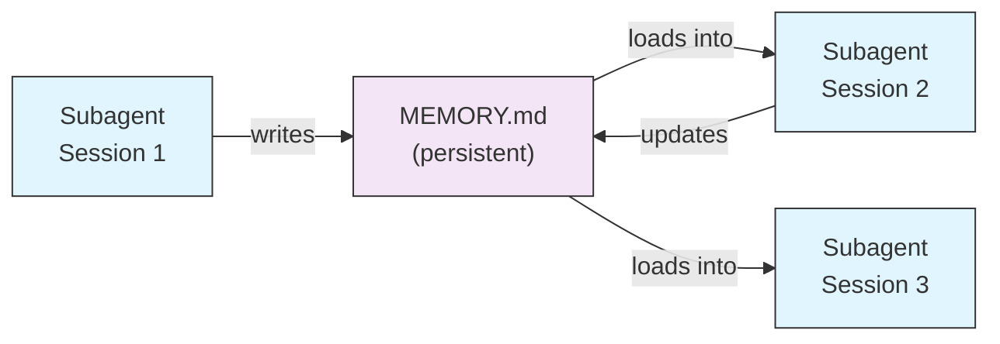
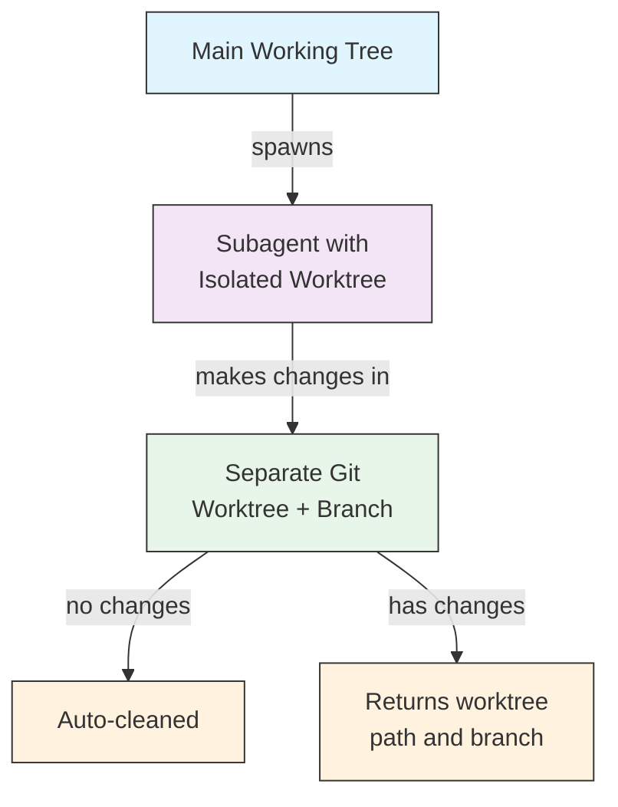
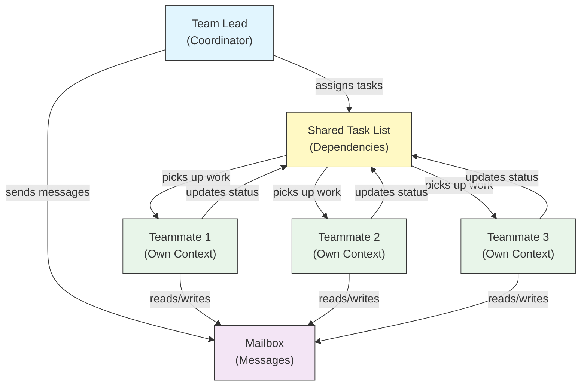
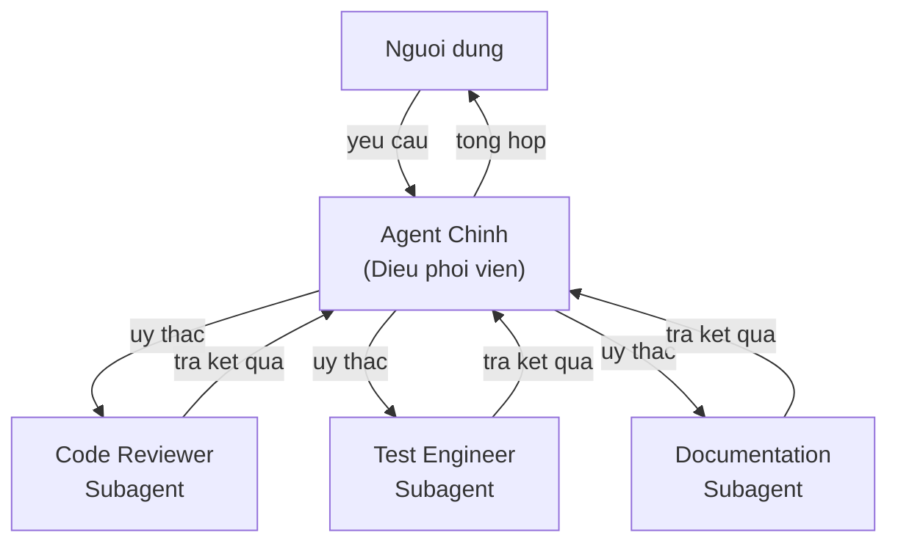
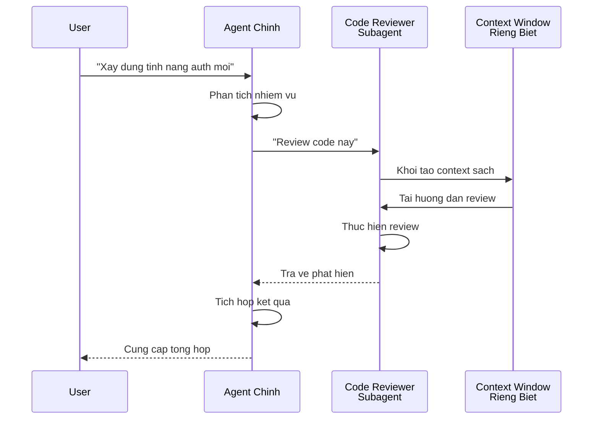
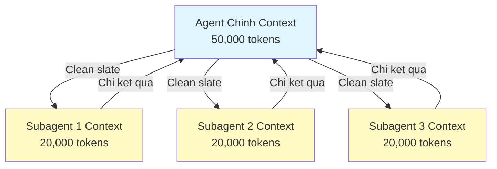
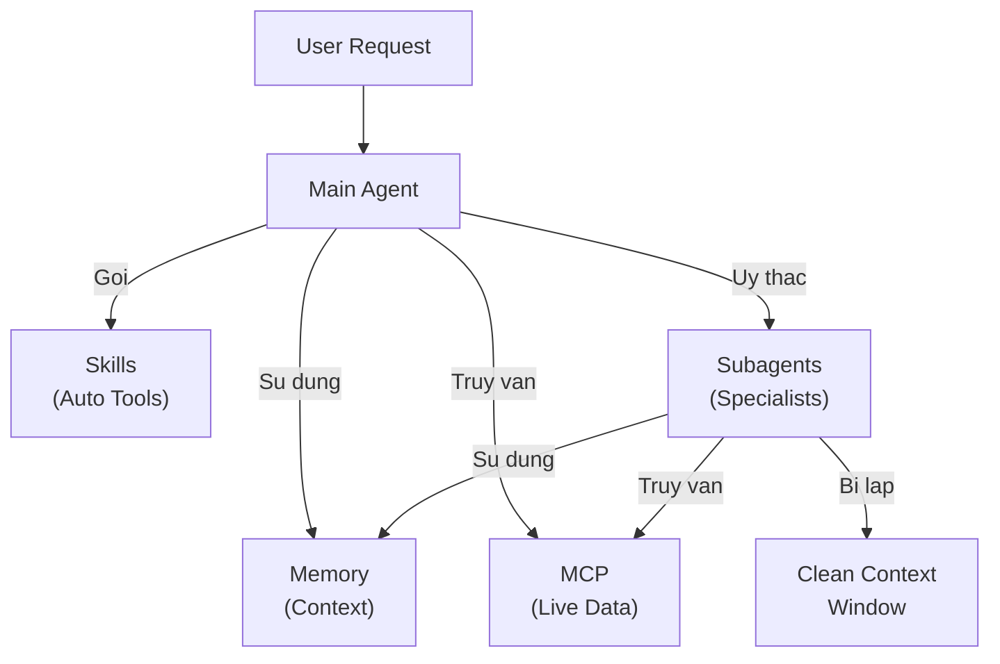

# Subagents - Hieu Chuan Toan Tap

Subagents la cac tro ly AI chuyen ma ma Claude Code co the uy thac cong viec. Moi subagent co muc dich cu the, su dung context window rieng biet khoi cuoc thoai chinh, va co thể duoc cau hinh voi cac cong cu chi dinh va system prompt tuy chinh.

## Muc Luc

1. [Tong Quan](#overview)
2. [ Loi Ich Chinh](#key-benefits)
3. [Vi Tri Tep](#file-locations)
4. [Cau Hinh](#configuration)
5. [Subagents Co San](#built-in-subagents)
6. [Quan Ly Subagents](#managing-subagents)
7. [Su Dung Subagents](#using-subagents)
8. [Resumable Agents](#resumable-agents)
9. [Chuoi Subagents](#chaining-subagents)
10. [Persistent Memory cho Subagents](#persistent-memory-for-subagents)
11. [Background Subagents](#background-subagents)
12. [Worktree Isolation](#worktree-isolation)
13. [Gioi Han Subagents Co The Sinh](#restrict-spawnable-subagents)
14. [Lenh CLI `claude agents`](#claude-agents-cli-command)
15. [Agent Teams (Thu Nghiem)](#agent-teams-experimental)
16. [Bao Mat Plugin Subagent](#plugin-subagent-security)
17. [Kien Truc](#architecture)
18. [Quan Ly Context](#context-management)
19. [Khi Nao Nen Dung Subagents](#when-to-use-subagents)
20. [Cac Thuc Tot Nhat](#best-practices)
21. [Vi Du Subagents Trong Thu Muc Nay](#example-subagents-in-this-folder)
22. [Huong Dan Cai Dat](#installation-instructions)
23. [Cac Khai Niem Lien Quan](#related-concepts)

---

## Overview

Subagents cho phep thuc thi cong viec uy thac trong Claude Code bang cach:

- Tao **cac tro ly AI bi lap** voi context window rieng biet
- Cung cap **system prompt tuy chinh** cho chuyen mon dac thu
- Thuc thi **kiem soat quyen truy cap cong cu** de han che kha nang
- Ngan chan **o nhiem context** tu cac cong viec phuc tap
- Cho phep **thuc thi song song** nhieu tac vu chuyen ma

Moi subagent hoat dong doc lap voi trang thai sach, chi nhan context cu the can thiet cho nhiem vu cua chung, sau do tra ket qua ve cho agent chinh de tong hop.

**Bat Dau Nhanh**: Su dung lenh `/agents` de tao, xem, chinh sua va quan ly subagents mot cach tuong tac.

---

## Key Benefits

| Loi Ich | Mo Ta |
|---------|-------|
| **Bao toan context** | Hoat dong trong context rieng, ngan chan o nhiem cuoc thoai chinh |
| **Chuyen mon dac thu** | Duoc tinh chuyen cho linh vuc cu the voi ty le thanh cong cao hon |
| **Tai su dung** | Su dung qua nhieu du an va chia se voi nhom |
| **Quyen linh hoat** | Muc do truy cap cong cu khac nhau cho tung loai subagent |
| **Mo rong** | Nhieu agent lam viec cung luc tren nhieu khia canh |

---

## File Locations

Cac tep subagent co the duoc luu tru o nhieu vi tri khac nhau voi pham vi khac nhau:

| Do uu tien | Loai | Vi tri | Pham vi |
|----------|------|----------|-------|
| 1 (cao nhat) | **CLI-dinh nghia** | Qua co `--agents` (JSON) | Chi phien lam viec |
| 2 | **Project subagents** | `.claude/agents/` | Du an hien tai |
| 3 | **User subagents** | `~/.claude/agents/` | Tat ca du an |
| 4 (thap nhat) | **Plugin agents** | Thu muc `agents/` cua plugin | Qua plugins |

Khi co ten trung lap, nguon co do uu tien cao hon se duoc uu tien.

---

## Configuration

### Dinh Dang Tep

Subagents duoc dinh nghia bang YAML frontmatter theo sau la system prompt trong markdown:

```yaml
---
name: your-sub-agent-name
description: Description of when this subagent should be invoked
tools: tool1, tool2, tool3  # Optional - inherits all tools if omitted
disallowedTools: tool4  # Optional - explicitly disallowed tools
model: sonnet  # Optional - sonnet, opus, haiku, or inherit
permissionMode: default  # Optional - permission mode
maxTurns: 20  # Optional - limit agentic turns
skills: skill1, skill2  # Optional - skills to preload into context
mcpServers: server1  # Optional - MCP servers to make available
memory: user  # Optional - persistent memory scope (user, project, local)
background: false  # Optional - run as background task
effort: high  # Optional - reasoning effort (low, medium, high, max)
isolation: worktree  # Optional - git worktree isolation
initialPrompt: "Start by analyzing the codebase"  # Optional - auto-submitted first turn
hooks:  # Optional - component-scoped hooks
  PreToolUse:
    - matcher: "Bash"
      hooks:
        - type: command
          command: "./scripts/security-check.sh"
---

Your subagent's system prompt goes here. This can be multiple paragraphs
and should clearly define the subagent's role, capabilities, and approach
to solving problems.
```

### Truong Cau Hinh

| Truong | Bat buoc | Mo Ta |
|-------|----------|-------------|
| `name` | Co | Dinh danh duy nhat (chu thuong va dau gach ngang) |
| `description` | Co | Mo ta ngon ngu tu nhien ve muc dich. Bao gom "use PROACTIVELY" de khuyen goi goi tu dong |
| `tools` | Khong | Danh sach cong cu cu the, phan cach bang dau phay. Bo qua de ke thua tat ca. Ho tro cu phap `Agent(agent_name)` de han che subagents co the sinh |
| `disallowedTools` | Khong | Danh sach cong cu ma subagent khong duoc su dung |
| `model` | Khong | Model su dung: `sonnet`, `opus`, `haiku`, ID model day du, hoac `inherit`. Mac dinh la model subagent da cau hinh |
| `permissionMode` | Khong | `default`, `acceptEdits`, `dontAsk`, `bypassPermissions`, `plan` |
| `maxTurns` | Khong | So luot agentic toi da ma subagent co the thuc hien |
| `skills` | Khong | Danh sach skills de nap truoc. Tiem noi dung skill day du vao context cua subagent khi khoi dong |
| `mcpServers` | Khong | MCP servers de kha dung cho subagent |
| `hooks` | Khong | Component-scoped hooks (PreToolUse, PostToolUse, Stop) |
| `memory` | Khong | Pham vi thu muc memory lien tuc: `user`, `project`, hoac `local` |
| `background` | Khong | Dat `true` de luon chay subagent nay nhu tac vu nen |
| `effort` | Khong | Muc do lap luan: `low`, `medium`, `high`, hoac `max` |
| `isolation` | Khong | Dat `worktree` de cap cho subagent git worktree rieng |
| `initialPrompt` | Khong | Tu dong gui lan dau tien khi subagent chay nhu agent chinh |

### Tuy Chon Cau Hinh Cong Cu

**Tuy chon 1: Ke thu tat ca cong cu (bo qua truong)**
```yaml
---
name: full-access-agent
description: Agent with all available tools
---
```

**Tuy chon 2: Chi dinh tung cong cu**
```yaml
---
name: limited-agent
description: Agent with specific tools only
tools: Read, Grep, Glob, Bash
---
```

**Tuy chon 3: Truy cap cong cu co dieu kien**
```yaml
---
name: conditional-agent
description: Agent with filtered tool access
tools: Read, Bash(npm:*), Bash(test:*)
---
```

### Cau Hinh Qua CLI

Dinh nghia subagents cho mot phien duy nhat su dung co `--agents` voi dinh dang JSON:

```bash
claude --agents '{
  "code-reviewer": {
    "description": "Expert code reviewer. Use proactively after code changes.",
    "prompt": "You are a senior code reviewer. Focus on codes quality, security, and best practices.",
    "tools": ["Read", "Grep", "Glob", "Bash"],
    "model": "sonnet"
  }
}'
```

**Dinh dang JSON cho co `--agents`:**

```json
{
  "agent-name": {
    "description": "Required: when to invoke this agent",
    "prompt": "Required: system prompt for the agent",
    "tools": ["Optional", "array", "of", "tools"],
    "model": "optional: sonnet|opus|haiku"
  }
}
```

**Do uu tien cua Dinh Nghia Agent:**

Cac dinh nghia agent duoc tai theo thu tu uu tien sau (ket qua dau tien thang):
1. **CLI-dinh nghia** - Co `--agents` (chi phien, JSON)
2. **Muc project** - `.claude/agents/` (du an hien tai)
3. **Muc user** - `~/.claude/agents/` (tat ca du an)
4. **Muc plugin** - Thu muc `agents/` cua plugin

Dieu nay cho phep dinh nghia CLI ghi de tat ca cac nguon khac cho mot phien duy nhat.

---

## Built-in Subagents

Claude Code bao gom mot so subagents co san luon kha dung:

| Agent | Model | Muc dich |
|-------|-------|---------|
| **general-purpose** | Ke thua | Cong viec phuc tap, nhieu buoc |
| **Plan** | Ke thua | Nghien cuu cho che do ke hoach |
| **Explore** | Haiku | Tham do codebase chi doc (nhanh/trung binh/ky lam) |
| **Bash** | Ke thua | Lenh terminal trong context rieng biet |
| **statusline-setup** | Sonnet | Cau hinh dong trang thai |
| **Claude Code Guide** | Haiku | Tra loi cau hoi ve tinh nang Claude Code |

### General-Purpose Subagent

| Thuoc tinh | Gia tri |
|----------|-------|
| **Model** | Ke thua tu cha |
| **Cong cu** | Tat ca cong cu |
| **Muc dich** | Nghien cuu phuc tap, thao tac nhieu buoc, thay doi ma |

**Khi duoc dung**: Cac nhiem vu yeu cau ca tham do va thay doi voi lap luan phuc tap.

### Plan Subagent

| Thuoc tinh | Gia tri |
|----------|-------|
| **Model** | Ke thua tu cha |
| **Cong cu** | Read, Glob, Grep, Bash |
| **Muc dich** | Duoc su dung tu dong trong che do ke hoach de nghien cuu codebase |

**Khi duoc dung**: Khi Claude can hieu codebase truoc khi trinh bay ke hoach.

### Explore Subagent

| Thuoc tinh | Gia tri |
|----------|-------|
| **Model** | Haiku (nhanh, do tre thap) |
| **Che do** | Chi doc nghiem ngat |
| **Cong cu** | Glob, Grep, Read, Bash (chi lenh chi doc) |
| **Muc dich** | Tim kiem va phan tich codebase nhanh |

**Khi duoc dung**: Khi tim hieu/code ma khong thay doi.

**Muc Do Ky Luong** - Chi dinh do sau cua viec tham do:
- **"quick"** - Tim kiem nhanh voi it tham do, phu hop de tim pattern cu the
- **"medium"** - Tham do vua phai, can bang toc do va do ky, cach tiep can mac dinh
- **"very thorough"** - Phan tich toan dien tren nhieu vi tri va quy uoc dat ten, co the mat thoi gian lau hon

### Bash Subagent

| Thuoc tinh | Gia tri |
|----------|-------|
| **Model** | Ke thua tu cha |
| **Cong cu** | Bash |
| **Muc dich** | Thuc thi lenh terminal trong context window rieng biet |

**Khi duoc dung**: Khi chay lenh shell huong loi tu context bi lap.

### Statusline Setup Subagent

| Thuoc tinh | Gia tri |
|----------|-------|
| **Model** | Sonnet |
| **Cong cu** | Read, Write, Bash |
| **Muc dich** | Cau hinh hien thi dong trang thai Claude Code |

**Khi duoc dung**: Khi thiet lap hoac tuy chinh dong trang thai.

### Claude Code Guide Subagent

| Thuoc tinh | Gia tri |
|----------|-------|
| **Model** | Haiku (nhanh, do tre thap) |
| **Cong cu** | Chi doc |
| **Muc dich** | Tra loi cau hoi ve tinh nang va cach su dung Claude Code |

**Khi duoc dung**: Khi nguoi dung hoi ve cach Claude Code hoat dong hoac cach su dung tinh nang cu the.

---

## Quản Ly Subagents

### Su Dung Lenh `/agents` (Khuyen Nghi)

```bash
/agents
```

Lenh nay cung cap menu tuong tac de:
- Xem tat ca subagents kha dung (co san, user, va project)
- Tao subagents moi voi huong dan thiet lap
- Chinh sua subagents tuy chinh va quyen truy cap cong cu
- Xoa subagents tuy chinh
- Xem subagents nao dang hoat dong khi co trung lap

### Quan Ly Tep Truc Tiep

```bash
# Tao project subagent
mkdir -p .claude/agents
cat > .claude/agents/test-runner.md << 'EOF'
---
name: test-runner
description: Use proactively to run tests and fix failures
---

You are a test automation expert. When you see code changes, proactively
run the appropriate tests. If tests fail, analyze the failures and fix
them while preserving the original test intent.
EOF

# Tao user subagent (kha dung trong tat ca du an)
mkdir -p ~/.claude/agents
```

---

## Su Dung Subagents

### Uy Thac Tu Dong

Claude chu dong uy thac nhiem vu dua tren:
- Mo ta nhiem vu trong yeu cau cua ban
- Truong `description` trong cau hinh subagent
- Context hien tai va cong cu kha dung

De khuyen goi su dung chu dong, them "use PROACTIVELY" hoac "MUST BE USED" vao truong `description`:

```yaml
---
name: code-reviewer
description: Expert code review specialist. Use PROACTIVELY after writing or modifying code.
---
```

### Goi Tu Dong

Ban co the yeu cau mot subagent cu the:

```
> Use the test-runner subagent to fix failing tests
> Have the code-reviewer subagent look at my recent changes
> Ask the debugger subagent to investigate this error
```

### Goi Qua @-Mention

Su dung tien to `@` de dam bao subagent cu the duoc goi (bo qua heuristics uy thac tu dong):

```
> @"code-reviewer (agent)" review the auth module
```

### Phien Lam Viec Voi Agent Chi Dinh

Chay toan bo phien lam viec su dung mot agent cu the lam agent chinh:

```bash
# Qua co CLI
claude --agent code-reviewer

# Qua settings.json
{
  "agent": "code-reviewer"
}
```

### Liet Ke Agents Kha Dung

Su dung lenh `claude agents` de liet ke tat ca agents da cau hinh tu tat ca nguon:

```bash
claude agents
```

---

## Resumable Agents

Subagents co the tiep tuc cuoc thoai truoc do voi day du context duoc bao ton:

```bash
# Goi ban dau
> Use the code-analyzer agent to start reviewing the authentication module
# Tra ve agentId: "abc123"

# Tiep tuc agent sau do
> Resume agent abc123 and now analyze the authorization logic as well
```

**Truong hop su dung**:
- Nghien cuu dai han qua nhieu phien
- Tinh chinh lap di lap lai ma khong mat context
- Quy trinh nhieu buoc bao toan context

---

## Chuỗi Subagents

Thuc thi nhieu subagents theo chuoi:

```bash
> First use the code-analyzer subagent to find performance issues,
  then use the optimizer subagent to fix them
```

Dieu nay cho phep quy trinh phuc tap trong do ket qua cua mot subagent dau vao subagent khac.

---

## Persistent Memory cho Subagents

Truong `memory` cap cho subagents mot thu muc lien tuc ton tai qua cac cuoc thoai. Dieu nay cho phep subagents tich luy kien thuc theo thoi gian, luu tru ghi chu, phat hien, va context giu lai giua cac phien.

### Memory Scopes

| Pham vi | Thu muc | Truong hop su dung |
|-------|-----------|----------|
| `user` | `~/.claude/agent-memory/<name>/` | Ghi chu va tuy thich ca nhan tren tat ca du an |
| `project` | `.claude/agent-memory/<name>/` | Kien thuc chuyen biet du an, chia se voi nhom |
| `local` | `.claude/agent-memory-local/<name>/` | Thong tin local khong commit vao version control |

### Cach Hoat Dong

- 200 dong dau tien cua `MEMORY.md` trong thu muc memory duoc tu dong tai vao system prompt cua subagent
- Cong cu `Read`, `Write`, va `Edit` duoc tu dong kich hoat cho subagent de quan ly tep memory
- Subagent co the tao them tep trong thu muc memory cua no khi can

### Vi Du Cau Hinh

```yaml
---
name: researcher
memory: user
---

You are a research assistant. Use your memory directory to store findings,
track progress across sessions, and build up knowledge over time.

Check your MEMORY.md file at the start of each session to recall previous context.
```



---

## Background Subagents

Subagents co the chay trong nen, giai phong cuoc thoai chinh cho cac tac vu khac.

### Cau Hinh

Dat `background: true` trong frontmatter de luon chay subagent nhu tac vu nen:

```yaml
---
name: long-runner
background: true
description: Performs long-running analysis tasks in the background
---
```

### Phim Tat

| Phim tat | Hanh dong |
|----------|--------|
| `Ctrl+B` | Chuyen tac vu subagent dang chay xuong nen |
| `Ctrl+F` | Tat ca agent nen (nhan hai lan de xac nhan) |

### Vo Hieu Hoa Tac Vu Nen

Dat bien moi truong de vo hieu hoa hoan toan ho tro tac vu nen:

```bash
export CLAUDE_CODE_DISABLE_BACKGROUND_TASKS=1
```

---

## Worktree Isolation

Tuy chon `isolation: worktree` cap cho subagent mot git worktree rieng, cho phep no thay doi doc lap ma khong anh huong den working tree chinh.

### Cau Hinh

```yaml
---
name: feature-builder
isolation: worktree
description: Implements features in an isolated git worktree
tools: Read, Write, Edit, Bash, Grep, Glob
---
```

### Cach Hoat Dong



- Subagent hoat dong trong git worktree rieng tren branch rieng biet
- Neu subagent khong thay doi gi, worktree duoc tu dong don dep
- Neu co thay doi, duong dan worktree va ten branch duoc tra ve agent chinh de xem xet hoac hop nhat

---

## Gioi Han Subagents Co The Sinh

Ban co the kiem soat subagent nao duoc phep sinh bang cach su dung cu phap `Agent(agent_type)` trong truong `tools`. Day la cach allowlist nhung subagent cu the cho uy thac.

> **Luu y**: Trong v2.1.63, cong cu `Task` duoc doi ten thanh `Agent`. Tham chieu `Task(...)` cu van hoat dong nhu别名.

### Vi Du

```yaml
---
name: coordinator
description: Coordinates work between specialized agents
tools: Agent(worker, researcher), Read, Bash
---

You are a coordinator agent. You can delegate work to the "worker" and
"researcher" subagents only. Use Read and Bash for your own exploration.
```

Trong vi du nay, subagent `coordinator` chi co the sinh subagent `worker` va `researcher`. No khong the sinh bat ky subagent nao khac, ngay ca khi chung duoc dinh nghia o noi khac.

---

## Lenh CLI `claude agents`

Lenh `claude agents` liet ke tat ca agents da cau hinh, nhom theo nguon (co san, muc user, muc project):

```bash
claude agents
```

Lenh nay:
- Hien thi tat ca agents kha dung tu tat ca nguon
- Nhom agents theo vi tri nguon
- Chi ra ** Overrides** khi agent o muc do uu tien cao hon che lap agent o muc thap hon (vi du: agent muc project co cung ten voi agent muc user)

---

## Agent Teams (Thu Nghiem)

Agent Teams dieu phoi nhieu instance Claude Code lam viec cung nhau tren cac nhiem phuc tap. Khac voi subagents (nhiem vy uy thac tra ket qua), cac dong doi lam viec doc lap voi context cua rieng chung va giao tiep truc tiep qua he thong shared mailbox.

> **Luu y**: Agent Teams dang thuc nghiem va yeu cau Claude Code v2.1.32+. Kich hoat truoc khi su dung.

### Subagents vs Agent Teams

| Khia canh | Subagents | Agent Teams |
|--------|-----------|-------------|
| **Mo hinh uy thac** | Cha uy thac nhiem vu con, cho ket qua | Truong nhom giao viec, dong doi thuc hien doc lap |
| **Context** | Context moi cho moi nhiem vu, ket qua duoc chiet xuat lai | Moi dong doi duy tri context lien tuc cua rieng minh |
| **Dieu phoi** | Tuan tu hoac song song, quan ly boi cha | Danh sach nhiem vu chia se voi quan ly phu thuoc tu dong |
| **Giao tiep** | Chi gia tri tra ve | Tin nhan giua cac agent qua mailbox |
| **Tiep tuc phien** | Duong khong ho tro voi dong doi trong tien trinh |
| **Phu hop nhat** | Nhiem vu con tap trung, ro rang | Du an nhieu file lon yeu cau lam viec song song |

### Bat Agent Teams

Dat bien moi truong hoac them vao `settings.json`:

```bash
export CLAUDE_CODE_EXPERIMENTAL_AGENT_TEAMS=1
```

Hoac trong `settings.json`:

```json
{
  "env": {
    "CLAUDE_CODE_EXPERIMENTAL_AGENT_TEAMS": "1"
  }
}
```

### Bat Dau Mot Nhom

Sau khi da bat, yeu cau Claude lam viec voi dong doi trong prompt:

```
User: Build the authentication module. Use a team -- one teammate for the API endpoints,
      one for the database schema, and one for the test suite.
```

Claude se tao nhom, gan nhiem vu, va dieu phoi cong viec tu dong.

### Che Do Hien Thi

Kiem soat cach hien thi hoat dong dong doi:

| Che do | Co | Mo Ta |
|------|------|-------------|
| **Auto** | `--teammate-mode auto` | Tu dong chon che do hien thi tot nhat cho terminal cua ban |
| **In-process** | `--teammate-mode in-process` | Hien thi ket qua dong doi noi tuyen trong terminal hien tai (mac dinh) |
| **Split-panes** | `--teammate-mode tmux` | Mo moi dong doi trong tmux hoac iTerm2 pane rieng biet |

```bash
claude --teammate-mode tmux
```

Ban cung co the dat che do hien thi trong `settings.json`:

```json
{
  "teammateMode": "tmux"
}
```

> **Luu y**: Split-pane mode yeu cau tmux hoac iTerm2. Khong kha dung trong VS Code terminal, Windows Terminal, hoac Ghostty.

### Dieu Huong

Su dung `Shift+Down` de dieu huong giua cac dong doi trong che do split-pane.

### Cau Hinh Nhom

Cau hinh nhom duoc luu tru tai `~/.claude/teams/{team-name}/config.json`.

### Kien Truc



**Cac thanh phan chinh**:

- **Team Lead**: Phien Claude Code chinh tao nhom, giao nhiem vu va dieu phoi
- **Shared Task List**: Danh sach nhiem vu dong bo voi theo doi phu thuoc tu dong
- **Mailbox**: He thong tin nhan giua cac agent de dong doi giao tiep trang thai va dieu phoi
- **Teammates**: Cac instance Claude Code doc lap, moi cai co context window rieng

### Phan Cong Nhiem Vu va Tin Nhan

Truong nhom chia cong viec thanh nhiem vu va giao cho dong doi. Danh sach nhiem vu chia se xu ly:

- **Quan ly phu thuoc tu dong** -- nhiem vu cho doi phu thuoc hoan thanh
- **Theo doi trang thai** -- dong doi cap nhat trang thai nhiem vu khi lam viec
- **Tin nhan giua cac agent** -- dong doi gui tin nhan qua mailbox de dieu phoi (vi du: "Database schema san sang, ban co the bat dau viet queries")

### Quy Trinh Phe Duyet Ke Hoach

Cho nhiem vu phuc tap, truong nhom tao ke hoach thuc hien truoc khi dong doi bat dau. Nguoi dung xem xet va phe duyet ke hoach, dam bao cach tiep can cua nhom phu hop voi mong doi truoc khi thay doi ma duoc thuc hien.

### Hook Events Cho Teams

Agent Teams gioi thieu hai [hook events](../../nang-cao/08-hooks/) bo sung:

| Event | Chay Khi | Truong hop su dung |
|-------|-----------|----------|
| `TeammateIdle` | Dong doi hoan thanh nhiem vu hien tai va khong co viec cho | Goi thong bao, gan nhiem vu tiep theo |
| `TaskCompleted` | Nhiem vu trong danh sach chia se duoc danh dau hoan thanh | Chay xac thuc, cap nhat bang dieu khien, chuoi cong viec phu thuoc |

### Cac Thuc Tot Nhat

- **Kich thuoc nhom**: Giu nhom o 3-5 dong doi de dieu phoi toi uu
- **Phan loai nhiem vu**: Chia cong viec thanh nhiem vu 5-15 phut -- du nho de song song hoa, du lon de co y nghia
- **Tranh xung dot tep**: Gan tep hoac thu muc khac nhau cho dong doi khac nhau de tranh xung dot hop nhat
- **Bat dau don gian**: Su dung che do in-process cho lan dau; chuyen sang split-panes khi quen
- **Mo ta nhiem vu ro rang**: Cung cap mo ta cu the, co the hanh dong de dong doi lam viec doc lap

### Han Che

- **Thu nghiem**: Hanh vi tinh nang co the thay doi trong phat hanh tuong lai
- **Khong tiep tuc phien**: Dong doi trong tien trinh khong the tiep tuc sau khi phien ket thuc
- **Mot nhom moi phien**: Khong the tao nhom long nhau hoac nhieu nhom trong mot phien
- **Lanh dao co dinh**: Vai tro truong nhom khong the chuyen cho dong doi
- **Han che split-pane**: Yeu cau tmux/iTerm2; khong kha dung trong VS Code terminal, Windows Terminal, hoac Ghostty
- **Khong co nhom xuyen phien**: Dong doi chi ton tai trong phien hien tai

> **Canh bao**: Agent Teams dang thuc nghiem. Kiem tra voi cong viec khong quan trong truoc va theo doi dieu phoi dong doi de phat hien hanh vi bat thuong.

---

## Bao Mat Plugin Subagent

Cac subagent do plugin cung cap co kha nang frontmatter bi han che vi ly do bao mat. Nhung truong sau **khong duoc phep** trong dinh nghia subagent plugin:

- `hooks` - Khong the dinh nghia lifecycle hooks
- `mcpServers` - Khong cau hinh MCP servers
- `permissionMode` - Khong the ghi de cai dat quyen

Dieu nay ngan plugins leo thang quyen hoac thuc thi lenh tuy y qua subagent hooks.

---

## Kien Truc

### Kien Truc Tong Quan



### Vong Doi Subagent



---

## Quan Ly Context



### Diem Chinh

- Moi subagent nhan **context window moi** ma khong co lich su thoai chinh
- Chi **context lien quan** duoc chuyen den subagent cho nhiem vu cu the
- Ket qua duoc **chiet xuat** lai agent chinh
- Dieu nay ngan **can kit token context** tren du an dai

### Xem Xet Hieu Suat

- **Hieu qua context** - Agents bao toan context chinh, cho phep phien lam viec dai hon
- **Do tre** - Subagents bat dau voi trang thai sach va co the them độ tre thu thap context ban dau

### Hanh Vi Chinh

- **Khong sinh long nhau** - Subagents khong the sinh subagent khac
- **Quyen nen** - Subagent nen tu dong tu choi quyen chua duoc phe duyet truoc
- **Chuyen nen** - Nhan `Ctrl+B` de chuyen tac vu dang chay xuong nen
- **Ban ghi** - Ban ghi subagent duoc luu tai `~/.claude/projects/{project}/{sessionId}/subagents/agent-{agentId}.jsonl`
- **Tu dong nen** - Subagent context tu dong nen o ~95% dung luong (ghi de voi bien moi truong `CLAUDE_AUTOCOMPACT_PCT_OVERRIDE`)

---

## Khi Nao Nen Dung Subagents

| Tinh huong | Dung Subagent | Tai sao |
|----------|--------------|-----|
| Tinh nang phuc tap voi nhieu buoc | Co | Phan tach moi quan tam, ngan o nhiem context |
| Review code nhanh | Khong | Qua tai khong can thiet |
| Thuc thi nhiem vu song song | Co | Moi subagent co context rieng |
| Can chuyen mon dac thu | Co | System prompt tuy chinh |
| Phan tich dai han | Co | Ngan can kit context chinh |
| Mot nhiem vu duy nhat | Khong | Them do tre khong can thiet |

---

## Best Practices

### Nguyen Tac Thiet Ke

**Nen:**
- Bat dau voi agents Claude tao - Tao subagent ban dau voi Claude, sau do lap di lap mai de tuy chinh
- Thiet ke subagents tap trung - Trach nhien ro rang, duy nhat thay vi mot agent lam tat ca
- Viet prompt chi tiet - Bao gom huong dan, vi du, va rang buoc cu the
- Han che quyen cong cu - Chi cap cong cu can thiet cho muc dich subagent
- Version control - Check-in subagents vao version control de hop tac nhom

**Khong nen:**
- Tao subagents trung lap vai tro
- Cap quyen cong cu khong can thiet
- Dung subagents cho nhiem vu don gian, mot buoc
- Tron lan moi quan tam trong prompt cua mot subagent
- Bo qua viec truyen context can thiet

### Thuc Tot Nhat Cho System Prompt

1. **Cu The Ve Vai Tro**
   ```
   You are an expert code reviewer specializing in [specific areas]
   ```

2. **Dinh Nghia Do Uu Tien Ro Rang**
   ```
   Review priorities (in order):
   1. Security Issues
   2. Performance Problems
   3. Code Quality
   ```

3. **Chi Dinh Dinh Dang Dau Ra**
   ```
   For each issue provide: Severity, Category, Location, Description, Fix, Impact
   ```

4. **Bao Gom Buoc Hanh Dong**
   ```
   When invoked:
   1. Run git diff to see recent changes
   2. Focus on modified files
   3. Begin review immediately
   ```

### Chien Luoc Truy Cap Cong Cu

1. **Bat Dau Han Che**: Bat dau voi chi cong cu can thiet
2. **Mo Rong Khi Can**: Them cong cu khi yeu cau doi hoi
3. **Chi Doc Khi Co The**: Dung Read/Grep cho agents phan tich
4. **Thuc Thi Khoi Lap**: Han che lenh Bash voi pattern cu the

---

## Vi Du Subagents Trong Thu Muc Nay

Thu muc nay chua cac example subagents san sang su dung:

### 1. Code Reviewer (`code-reviewer.md`)

**Muc dich**: Phan tich chat luong code va kha nang bao tri toan dien

**Cong cu**: Read, Grep, Glob, Bash

**Chuyen mon**:
- Phat hien lo hong bao mat
- Nhan dien toi uu hoa hieu suat
- Danh gia kha nang bao tri ma
- Phan tich do phu test

**Su dung khi**: Can review code tu dong voi tap trung vao chat luong va bao mat

---

### 2. Test Engineer (`test-engineer.md`)

**Muc dich**: Chien luoc test, phan tich do phu, va kiem tra tu dong

**Cong cu**: Read, Write, Bash, Grep

**Chuyen mon**:
- Tao unit test
- Thiet ke integration test
- Nhan dien truong hop bien
- Phan tich do phu (muc tieu >80%)

**Su dung khi**: Can tao bo test toan dien hoac phan tich do phu

---

### 3. Documentation Writer (`documentation-writer.md`)

**Muc dich**: Tai lieu ky thuat, tai lieu API, va huong dan su dung

**Cong cu**: Read, Write, Grep

**Chuyen mon**:
- Tai lieu endpoint API
- Tao huong dan su dung
- Tai lieu kien truc
- Cai thien chu thich ma

**Su dung khi**: Can tao hoac cap nhat tai lieu du an

---

### 4. Secure Reviewer (`secure-reviewer.md`)

**Muc dich**: Review code tap trung bao mat voi quyen toi thieu

**Cong cu**: Read, Grep

**Chuyen mon**:
- Phat hien lo hong bao mat
- Van de xu thuc/uy quyen
- Nguy co lo du lieu
- Tan cong injection

**Su dung khi**: Can kiem tra bao mat ma khong co kha nang thay doi

---

### 5. Implementation Agent (`implementation-agent.md`)

**Muc dich**: Day du kha nang thuc hien cho phat trien tinh nang

**Cong cu**: Read, Write, Edit, Bash, Grep, Glob

**Chuyen mon**:
- Thuc hien tinh nang
- Sinh ma
- Xay dung va thuc thi test
- Sua doi codebase

**Su dung khi**: Can subagent thuc hien tinh nang tu dau den cuoi

---

### 6. Debugger (`debugger.md`)

**Muc dich**: Chuyen gia gop loi cho loi, test that bai, va hanh vi unexpected

**Cong cu**: Read, Edit, Bash, Grep, Glob

**Chuyen mon**:
- Phan tich nguyen nhan goc
- Dieu tra loi
- Giai quyet test that bai
- Thuc hien sua loi toi thieu

**Su dung khi**: Gap loi, error, hoac hanh vi bat thuong

---

### 7. Data Scientist (`data-scientist.md`)

**Muc dich**: Chuyen gia phan tich du lieu cho truy van SQL va insights

**Cong cu**: Bash, Read, Write

**Chuyen mon**:
- Toi uu truy van SQL
- Thao tac BigQuery
- Phan tich va truc quan hoa du lieu
- Thong ke thong ke

**Su dung khi**: Can phan tich du lieu, truy van SQL, hoac thao tac BigQuery

---

## Cai Dat

### Phuong phap 1: Dung Lenh /agents (Khuyen Nghi)

```bash
/agents
```

Sau do:
1. Chon 'Create New Agent'
2. Chon muc project hoac user
3. Mo ta chi tiet subagent
4. Chon cong cu de cap quyen (hoac de trong de ke thu tat ca)
5. Luu va su dung

### Phuong phap 2: Copy Vao Project

Copy cac tep agent vao thu muc `.claude/agents/` cua project:

```bash
# Dieu huong den project
cd /path/to/your/project

# Tao thu muc agents neu chua co
mkdir -p .claude/agents

# Copy tat ca tep agent tu thu muc nay
cp /path/to/05-subagents/*.md .claude/agents/

# Xoa README (khong can trong .claude/agents)
rm .claude/agents/README.md
```

### Phuong phap 3: Copy Vao Thu Muc User

Cho agents kha dung trong tat ca project:

```bash
# Tao thu muc user agents
mkdir -p ~/.claude/agents

# Copy agents
cp /path/to/05-subagents/code-reviewer.md ~/.claude/agents/
cp /path/to/05-subagents/debugger.md ~/.claude/agents/
# ... copy cac tep khac khi can
```

### Xac Minh

Sau khi cai dat, xac minh agents duoc nhan dien:

```bash
/agents
```

Ban se thay agents da cai dat duoc liet ke cung voi nhung agents co san.

---

## Cau Truc Tep

```
project/
├── .claude/
│   └── agents/
│       ├── code-reviewer.md
│       ├── test-engineer.md
│       ├── documentation-writer.md
│       ├── secure-reviewer.md
│       ├── implementation-agent.md
│       ├── debugger.md
│       └── data-scientist.md
└── ...
```

---

## Cac Khai Niem Lien Quan

### Tinh Nang Lien Quan

- **[Slash Commands](../../co-ban/01-slash-commands/)** - Phim tat nguoi dung goi
- **[Memory](../../co-ban/02-memory/)** - Context lien tuc xuyen phien
- **[Skills](../../trung-cap/04-skills/)** - Kha nang tu dong tai su dung
- **[MCP Protocol](../../trung-cap/06-mcp/)** - Truy cap du lieu ben ngoai thoi gian thuc
- **[Hooks](../../nang-cao/08-hooks/)** - Tu dong hoa lenh shell theo su kien
- **[Plugins](../../trung-cap/07-plugins/)** - Goi mo rong

### So Sánh Voi Tinh Nang Khac

| Tinh nang | Nguoi dung goi | Tu dong goi | Lien tuc | Truy cap ben ngoai | Context bi lap |
|---------|--------------|--------------|-----------|------------------|------------------|
| **Slash Commands** | Co | Khong | Khong | Khong | Khong |
| **Subagents** | Co | Co | Khong | Khong | Co |
| **Memory** | Tu dong | Tu dong | Co | Khong | Khong |
| **MCP** | Tu dong | Co | Khong | Co | Khong |
| **Skills** | Co | Co | Khong | Khong | Khong |

### Integration Pattern



---

## Tai Lieu Bo Sung

- [Tai Lieu Chinh Thuc ve Subagents](https://code.claude.com/docs/en/sub-agents)
- [Tai Lieu CLI](https://code.claude.com/docs/en/cli-reference) - Co `--agents` va tuy chon CLI khac
- [Plugins Guide](../../trung-cap/07-plugins/) - De dong goi agents voi tinh nang khac
- [Skills Guide](../../trung-cap/04-skills/) - Cho kha nang tu dong goi
- [Memory Guide](../../co-ban/02-memory/) - Cho context lien tuc
- [Hooks Guide](../../nang-cao/08-hooks/) - Cho tu dong hoa theo su kien

---

*Cap nhat cuoi thang 3/2026*

*Huon dan nay bao pham day du cau hinh subagent, cac kieu mau uy thac, va thuc tot nhat cho Claude Code.*
