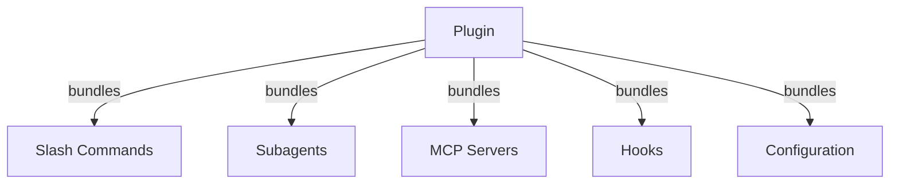
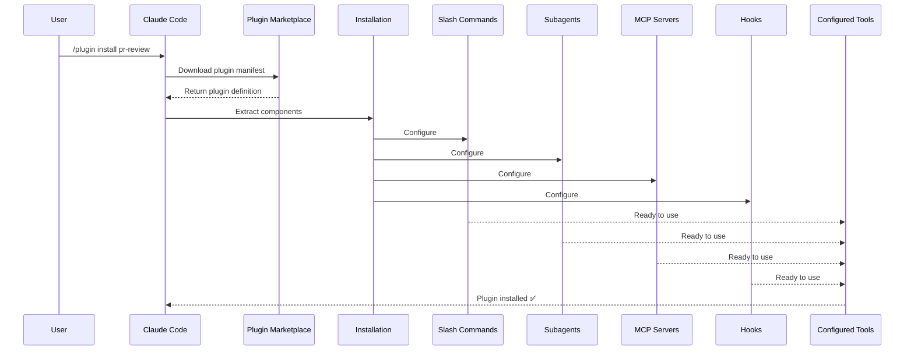
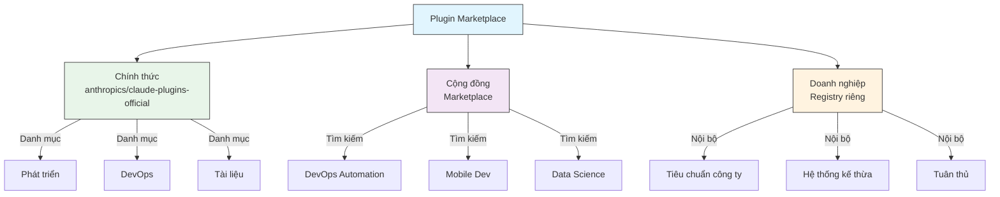
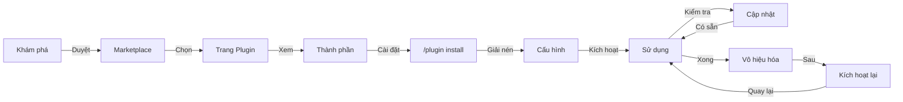
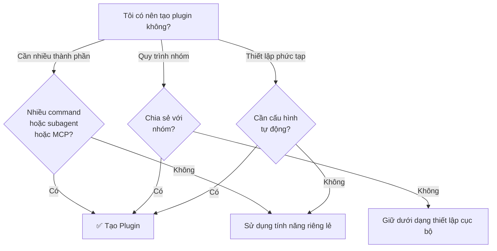

# Plugin Claude Code

Thư mục này chứa các ví dụ plugin hoàn chỉnh, gói nhiều tính năng Claude Code thành các package gắn kết, có thể cài đặt.

## Tổng quan

Plugin Claude Code là các bộ sưu tập tùy chỉnh được đóng gói sẵn (slash command, subagent, server MCP và hook) cài đặt chỉ bằng một lệnh. Chúng đại diện cho cơ chế mở rộng cấp cao nhất—kết hợp nhiều tính năng thành các package gắn kết, có thể chia sẻ.

## Kiến trúc Plugin



## Quy trình tải Plugin



## Loại Plugin & Phân phối

| Loại | Phạm vi | Chia sẻ | Thẩm quyền | Ví dụ |
|------|-------|--------|-----------|----------|
| Chính thức | Toàn cục | Tất cả người dùng | Anthropic | PR Review, Security Guidance |
| Cộng đồng | Công khai | Tất cả người dùng | Cộng đồng | DevOps, Data Science |
| Tổ chức | Nội bộ | Thành viên nhóm | Công ty | Tiêu chuẩn nội bộ, công cụ |
| Cá nhân | Cá nhân | Một người dùng | Nhà phát triển | Quy trình tùy chỉnh |

## Cấu trúc định nghĩa Plugin

Manifest plugin sử dụng định dạng JSON trong `.claude-plugin/plugin.json`:

```json
{
  "name": "my-first-plugin",
  "description": "A greeting plugin",
  "version": "1.0.0",
  "author": {
    "name": "Your Name"
  },
  "homepage": "https://example.com",
  "repository": "https://github.com/user/repo",
  "license": "MIT"
}
```

## Ví dụ cấu trúc Plugin

```
my-plugin/
├── .claude-plugin/
│   └── plugin.json       # Manifest (tên, mô tả, phiên bản, tác giả)
├── commands/             # Skills dưới dạng file Markdown
│   ├── task-1.md
│   ├── task-2.md
│   └── workflows/
├── agents/               # Định nghĩa subagent tùy chỉnh
│   ├── specialist-1.md
│   ├── specialist-2.md
│   └── configs/
├── skills/               # Agent Skills với file SKILL.md
│   ├── skill-1.md
│   └── skill-2.md
├── hooks/                # Event handlers trong hooks.json
│   └── hooks.json
├── .mcp.json             # Cấu hình server MCP
├── .lsp.json             # Cấu hình server LSP
├── settings.json         # Cài đặt mặc định
├── templates/
│   └── issue-template.md
├── scripts/
│   ├── helper-1.sh
│   └── helper-2.py
├── docs/
│   ├── README.md
│   └── USAGE.md
└── tests/
    └── plugin.test.js
```

### Cấu hình server LSP

Plugin có thể bao gồm hỗ trợ Language Server Protocol (LSP) để hỗ trợ mã thông minh theo thời gian thực. Server LSP cung cấp chẩn đoán, điều hướng mã và thông tin ký hiệu khi bạn làm việc.

**Vị trí cấu hình**:
- File `.lsp.json` trong thư mục gốc của plugin
- Khóa `lsp` trong `plugin.json`

#### Tham chiếu trường

| Trường | Bắt buộc | Mô tả |
|-------|----------|-------------|
| `command` | Có | Binary server LSP (phải có trong PATH) |
| `extensionToLanguage` | Có | Ánh xạ phần mở rộng file sang ID ngôn ngữ |
| `args` | Không | Đối số dòng lệnh cho server |
| `transport` | Không | Phương thức giao tiếp: `stdio` (mặc định) hoặc `socket` |
| `env` | Không | Biến môi trường cho tiến trình server |
| `initializationOptions` | Không | Tùy chọn gửi trong quá trình khởi tạo LSP |
| `settings` | Không | Cấu hình workspace chuyển cho server |
| `workspaceFolder` | Không | Ghi đè đường dẫn thư mục workspace |
| `startupTimeout` | Không | Thời gian tối đa (ms) chờ server khởi động |
| `shutdownTimeout` | Không | Thời gian tối đa (ms) để tắt đúng cách |
| `restartOnCrash` | Không | Tự động khởi động lại nếu server bị crash |
| `maxRestarts` | Không | Số lần khởi động lại tối đa trước khi bỏ cuộc |

#### Ví dụ cấu hình

**Go (gopls)**:

```json
{
  "go": {
    "command": "gopls",
    "args": ["serve"],
    "extensionToLanguage": {
      ".go": "go"
    }
  }
}
```

**Python (pyright)**:

```json
{
  "python": {
    "command": "pyright-langserver",
    "args": ["--stdio"],
    "extensionToLanguage": {
      ".py": "python",
      ".pyi": "python"
    }
  }
}
```

**TypeScript**:

```json
{
  "typescript": {
    "command": "typescript-language-server",
    "args": ["--stdio"],
    "extensionToLanguage": {
      ".ts": "typescript",
      ".tsx": "typescriptreact",
      ".js": "javascript",
      ".jsx": "javascriptreact"
    }
  }
}
```

#### Plugin LSP có sẵn

Kho plugin chính thức bao gồm các plugin LSP đã cấu hình sẵn:

| Plugin | Ngôn ngữ | Binary Server | Lệnh cài đặt |
|--------|----------|---------------|----------------|
| `pyright-lsp` | Python | `pyright-langserver` | `pip install pyright` |
| `typescript-lsp` | TypeScript/JavaScript | `typescript-language-server` | `npm install -g typescript-language-server typescript` |
| `rust-lsp` | Rust | `rust-analyzer` | Cài qua `rustup component add rust-analyzer` |

#### Khả năng LSP

Sau khi cấu hình, server LSP cung cấp:

- **Chẩn đoán tức thì** — lỗi và cảnh báo xuất hiện ngay lập tức sau khi chỉnh sửa
- **Điều hướng mã** — chuyển đến định nghĩa, tìm tham chiếu, triển khai
- **Thông tin hover** — chữ ký kiểu và tài liệu khi hover
- **Danh sách ký hiệu** — duyệt ký hiệu trong file hoặc workspace hiện tại

## Tùy chọn Plugin (v2.1.83+)

Plugin có thể khai báo các tùy chọn có thể cấu hình bởi người dùng trong manifest qua `userConfig`. Các giá trị đánh dấu `sensitive: true` được lưu trong keychain hệ thống thay vì file cài đặt văn bản thuần:

```json
{
  "name": "my-plugin",
  "version": "1.0.0",
  "userConfig": {
    "apiKey": {
      "description": "API key for the service",
      "sensitive": true
    },
    "region": {
      "description": "Deployment region",
      "default": "us-east-1"
    }
  }
}
```

## Dữ liệu Plugin liên tục (`${CLAUDE_PLUGIN_DATA}`) (v2.1.78+)

Plugin có quyền truy cập vào thư mục trạng thái liên tục qua biến môi trường `${CLAUDE_PLUGIN_DATA}`. Thư mục này là duy nhất cho mỗi plugin và tồn tại qua các phiên, phù hợp cho bộ nhớ đệm, cơ sở dữ liệu và các trạng thái liên tục khác:

```json
{
  "hooks": {
    "PostToolUse": [
      {
        "command": "node ${CLAUDE_PLUGIN_DATA}/track-usage.js"
      }
    ]
  }
}
```

Thư mục được tạo tự động khi plugin được cài đặt. File lưu trữ ở đây sẽ tồn tại đến khi plugin bị gỡ cài đặt.

## Plugin nội tuyến qua Cài đặt (`source: 'settings'`) (v2.1.80+)

Plugin có thể được định nghĩa nội tuyến trong file cài đặt dưới dạng mục marketplace sử dụng trường `source: 'settings'`. Điều này cho phép nhúng định nghĩa plugin trực tiếp mà không cần repository hoặc marketplace riêng:

```json
{
  "pluginMarketplaces": [
    {
      "name": "inline-tools",
      "source": "settings",
      "plugins": [
        {
          "name": "quick-lint",
          "source": "./local-plugins/quick-lint"
        }
      ]
    }
  ]
}
```

## Cài đặt Plugin

Plugin có thể gửi kèm file `settings.json` để cung cấp cấu hình mặc định. Hiện tại hỗ trợ khóa `agent`, đặt agent thread chính cho plugin:

```json
{
  "agent": "agents/specialist-1.md"
}
```

Khi plugin bao gồm `settings.json`, các giá trị mặc định của nó được áp dụng khi cài đặt. Người dùng có thể ghi đè các cài đặt này trong cấu hình project hoặc người dùng của họ.

## Phương pháp tiếp cận Độc lập so với Plugin

| Phương pháp | Tên lệnh | Cấu hình | Phù hợp nhất |
|----------|---------------|---|---|
| **Độc lập** | `/hello` | Thiết lập thủ công trong CLAUDE.md | Cá nhân, cụ thể project |
| **Plugin** | `/plugin-name:hello` | Tự động qua plugin.json | Chia sẻ, phân phối, sử dụng nhóm |

Sử dụng **slash command độc lập** cho quy trình cá nhân nhanh chóng. Sử dụng **plugin** khi bạn muốn gói nhiều tính năng, chia sẻ với nhóm hoặc xuất bản để phân phối.

## Ví dụ thực tế

### Ví dụ 1: Plugin PR Review

**File:** `.claude-plugin/plugin.json`

```json
{
  "name": "pr-review",
  "version": "1.0.0",
  "description": "Hoàn thiện quy trình review PR với kiểm tra bảo mật, testing và tài liệu",
  "author": {
    "name": "Anthropic"
  },
  "repository": "https://github.com/anthropic/pr-review",
  "license": "MIT"
}
```

**File:** `commands/review-pr.md`

```markdown
---
name: Review PR
description: Khởi động review PR toàn diện với kiểm tra bảo mật và testing
---

# PR Review

Lệnh này khởi động quy trình review pull request hoàn chỉnh bao gồm:

1. Phân tích bảo mật
2. Xác minh độ phủ test
3. Cập nhật tài liệu
4. Kiểm tra chất lượng mã nguồn
5. Đánh giá tác động hiệu năng
```

**File:** `agents/security-reviewer.md`

```yaml
---
name: security-reviewer
description: Review mã nguồn tập trung vào bảo mật
tools: read, grep, diff
---

# Security Reviewer

Chuyên tìm kiếm lỗ hổng bảo mật:
- Vấn đề xác thực/phân quyền
- Phơi bày dữ liệu
- Tấn công injection
- Cấu hình bảo mật
```

**Cài đặt:**

```bash
/plugin install pr-review

# Kết quả:
# ✅ 3 slash command đã cài đặt
# ✅ 3 subagent đã cấu hình
# ✅ 2 server MCP đã kết nối
# ✅ 4 hook đã đăng ký
# ✅ Sẵn sàng sử dụng!
```

### Ví dụ 2: Plugin DevOps

**Các thành phần:**

```
devops-automation/
├── commands/
│   ├── deploy.md
│   ├── rollback.md
│   ├── status.md
│   └── incident.md
├── agents/
│   ├── deployment-specialist.md
│   ├── incident-commander.md
│   └── alert-analyzer.md
├── mcp/
│   ├── github-config.json
│   ├── kubernetes-config.json
│   └── prometheus-config.json
├── hooks/
│   ├── pre-deploy.js
│   ├── post-deploy.js
│   └── on-error.js
└── scripts/
    ├── deploy.sh
    ├── rollback.sh
    └── health-check.sh
```

### Ví dụ 3: Plugin Documentation

**Các thành phần đóng gói:**

```
documentation/
├── commands/
│   ├── generate-api-docs.md
│   ├── generate-readme.md
│   ├── sync-docs.md
│   └── validate-docs.md
├── agents/
│   ├── api-documenter.md
│   ├── code-commentator.md
│   └── example-generator.md
├── mcp/
│   ├── github-docs-config.json
│   └── slack-announce-config.json
└── templates/
    ├── api-endpoint.md
    ├── function-docs.md
    └── adr-template.md
```

## Marketplace Plugin

Thư mục plugin được quản lý bởi Anthropic chính thức là `anthropics/claude-plugins-official`. Quản trị viên doanh nghiệp cũng có thể tạo marketplace plugin riêng để phân phối nội bộ.



### Cấu hình Marketplace

Người dùng doanh nghiệp và nâng cao có thể kiểm soát hành vi marketplace thông qua cài đặt:

| Cài đặt | Mô tả |
|---------|-------------|
| `extraKnownMarketplaces` | Thêm nguồn marketplace bổ sung ngoài giá trị mặc định |
| `strictKnownMarketplaces` | Kiểm soát marketplace nào người dùng được phép thêm |
| `deniedPlugins` | Danh sách chặn do quản trị viên quản lý để ngăn cài đặt plugin cụ thể |

### Tính năng Marketplace bổ sung

- **Timeout git mặc định**: Tăng từ 30s lên 120s cho các repository plugin lớn
- **Registry npm tùy chỉnh**: Plugin có thể chỉ định URL registry npm tùy chỉnh để phân giải phụ thuộc
- **Ghim phiên bản**: Khóa plugin vào phiên bản cụ thể cho môi trường tái lập

### Lược đồ định nghĩa Marketplace

Marketplace plugin được định nghĩa trong `.claude-plugin/marketplace.json`:

```json
{
  "name": "my-team-plugins",
  "owner": "my-org",
  "plugins": [
    {
      "name": "code-standards",
      "source": "./plugins/code-standards",
      "description": "Thực thi tiêu chuẩn mã hóa nhóm",
      "version": "1.2.0",
      "author": "platform-team"
    },
    {
      "name": "deploy-helper",
      "source": {
        "source": "github",
        "repo": "my-org/deploy-helper",
        "ref": "v2.0.0"
      },
      "description": "Quy trình tự động hóa triển khai"
    }
  ]
}
```

| Trường | Bắt buộc | Mô tả |
|-------|----------|-------------|
| `name` | Có | Tên marketplace ở dạng kebab-case |
| `owner` | Có | Tổ chức hoặc người dùng duy trì marketplace |
| `plugins` | Có | Mảng các mục plugin |
| `plugins[].name` | Có | Tên plugin (kebab-case) |
| `plugins[].source` | Có | Nguồn plugin (chuỗi đường dẫn hoặc đối tượng nguồn) |
| `plugins[].description` | Không | Mô tả ngắn gọn về plugin |
| `plugins[].version` | Không | Chuỗi phiên bản ngữ nghĩa |
| `plugins[].author` | Không | Tên tác giả plugin |

### Loại nguồn Plugin

Plugin có thể được lấy từ nhiều vị trí khác nhau:

| Nguồn | Cú pháp | Ví dụ |
|--------|--------|---------|
| **Đường dẫn tương đối** | Chuỗi đường dẫn | `"./plugins/my-plugin"` |
| **GitHub** | `{ "source": "github", "repo": "owner/repo" }` | `{ "source": "github", "repo": "acme/lint-plugin", "ref": "v1.0" }` |
| **URL Git** | `{ "source": "url", "url": "..." }` | `{ "source": "url", "url": "https://git.internal/plugin.git" }` |
| **Thư mục con Git** | `{ "source": "git-subdir", "url": "...", "path": "..." }` | `{ "source": "git-subdir", "url": "https://github.com/org/monorepo.git", "path": "packages/plugin" }` |
| **npm** | `{ "source": "npm", "package": "..." }` | `{ "source": "npm", "package": "@acme/claude-plugin", "version": "^2.0" }` |
| **pip** | `{ "source": "pip", "package": "..." }` | `{ "source": "pip", "package": "claude-data-plugin", "version": ">=1.0" }` |

Nguồn GitHub và git hỗ trợ các trường `ref` (nhánh/tag) và `sha` (hash commit) tùy chọn để ghim phiên bản.

### Phương pháp phân phối

**GitHub (khuyến nghị)**:
```bash
# Người dùng thêm marketplace của bạn
/plugin marketplace add owner/repo-name
```

**Dịch vụ git khác** (yêu cầu URL đầy đủ):
```bash
/plugin marketplace add https://gitlab.com/org/marketplace-repo.git
```

**Repository riêng**: Hỗ trợ qua trình trợ giúp xác thực git hoặc token môi trường. Người dùng phải có quyền đọc vào repository.

**Gửi plugin chính thức**: Gửi plugin cho danh mục curated bởi Anthropic để phân phối rộng rãi hơn.

### Chế độ nghiêm ngặt

Kiểm soát cách định nghĩa marketplace tương tác với file `plugin.json` cục bộ:

| Cài đặt | Hành vi |
|---------|----------|
| `strict: true` (mặc định) | `plugin.json` cục bộ là nguồn gốc; mục marketplace bổ sung vào nó |
| `strict: false` | Mục marketplace là toàn bộ định nghĩa plugin |

**Hạn chế tổ chức** với `strictKnownMarketplaces`:

| Giá trị | Hiệu ứng |
|-------|--------|
| Không đặt | Không hạn chế — người dùng có thể thêm bất kỳ marketplace nào |
| Mảng rỗng `[]` | Khóa — không marketplace nào được phép |
| Mảng mẫu | Danh sách cho phép — chỉ marketplace khớp mới được thêm |

```json
{
  "strictKnownMarketplaces": [
    "my-org/*",
    "github.com/trusted-vendor/*"
  ]
}
```

> **Cảnh báo**: Ở chế độ nghiêm ngặt với `strictKnownMarketplaces`, người dùng chỉ có thể cài đặt plugin từ marketplace trong danh sách cho phép. Điều này hữu ích cho môi trường doanh nghiệp yêu cầu phân phối plugin được kiểm soát.

## Vòng đời & Cài đặt Plugin



## So sánh tính năng Plugin

| Tính năng | Slash Command | Skill | Subagent | Plugin |
|---------|---------------|-------|----------|--------|
| **Cài đặt** | Sao chép thủ công | Sao chép thủ công | Cấu hình thủ công | Một lệnh |
| **Thời gian thiết lập** | 5 phút | 10 phút | 15 phút | 2 phút |
| **Đóng gói** | File đơn | File đơn | File đơn | Nhiều file |
| **Quản lý phiên bản** | Thủ công | Thủ công | Thủ công | Tự động |
| **Chia sẻ nhóm** | Sao chép file | Sao chép file | Sao chép file | ID cài đặt |
| **Cập nhật** | Thủ công | Thủ công | Thủ công | Tự động |
| **Phụ thuộc** | Không có | Không có | Không có | Có thể bao gồm |
| **Marketplace** | Không | Không | Không | Có |
| **Phân phối** | Repository | Repository | Repository | Marketplace |

## Lệnh CLI Plugin

Tất cả thao tác plugin đều khả dụng dưới dạng lệnh CLI:

```bash
claude plugin install <name>@<marketplace>   # Cài đặt từ marketplace
claude plugin uninstall <name>               # Gỡ bỏ plugin
claude plugin list                           # Liệt kê plugin đã cài đặt
claude plugin enable <name>                  # Kích hoạt plugin bị vô hiệu hóa
claude plugin disable <name>                 # Vô hiệu hóa plugin
claude plugin validate                       # Xác thực cấu trúc plugin
```

## Phương pháp cài đặt

### Từ Marketplace
```bash
/plugin install plugin-name
# hoặc từ CLI:
claude plugin install plugin-name@marketplace-name
```

### Kích hoạt / Vô hiệu hóa (với phạm vi tự động phát hiện)
```bash
/plugin enable plugin-name
/plugin disable plugin-name
```

### Plugin cục bộ (cho phát triển)
```bash
# Cờ CLI để kiểm thử cục bộ (lặp lại cho nhiều plugin)
claude --plugin-dir ./path/to/plugin
claude --plugin-dir ./plugin-a --plugin-dir ./plugin-b
```

### Từ Repository Git
```bash
/plugin install github:username/repo
```

## Khi nào nên tạo Plugin



### Trường hợp sử dụng Plugin

| Trường hợp | Khuyến nghị | Lý do |
|----------|-----------------|-----|
| **Hướng dẫn nhóm** | ✅ Dùng Plugin | Thiết lập ngay lập tức, mọi cấu hình |
| **Thiết lập Framework** | ✅ Dùng Plugin | Gói các command cụ thể cho framework |
| **Tiêu chuẩn doanh nghiệp** | ✅ Dùng Plugin | Phân phối tập trung, quản lý phiên bản |
| **Tự động hóa tác vụ nhanh** | ❌ Dùng Command | Quá phức tạp |
| **Chuyên môn miền đơn** | ❌ Dùng Skill | Quá nặng, dùng skill thay thế |
| **Phân tích chuyên biệt** | ❌ Dùng Subagent | Tạo thủ công hoặc dùng skill |
| **Truy cập dữ liệu trực tiếp** | ❌ Dùng MCP | Độc lập, không gói vào plugin |

## Kiểm thử Plugin

Trước khi xuất bản, kiểm thử plugin cục bộ bằng cờ CLI `--plugin-dir` (lặp lại cho nhiều plugin):

```bash
claude --plugin-dir ./my-plugin
claude --plugin-dir ./my-plugin --plugin-dir ./another-plugin
```

Lệnh này khởi chạy Claude Code với plugin đã tải, cho phép bạn:
- Xác minh tất cả slash command đã khả dụng
- Kiểm thử subagent và agent hoạt động đúng
- Xác nhận server MCP kết nối đúng cách
- Xác thực việc thực thi hook
- Kiểm tra cấu hình server LSP
- Kiểm tra lỗi cấu hình

## Hot-Reload

Plugin hỗ trợ hot-reload trong quá trình phát triển. Khi bạn sửa đổi file plugin, Claude Code có thể tự động phát hiện thay đổi. Bạn cũng có thể buộc tải lại bằng:

```bash
/reload-plugins
```

Lệnh này đọc lại tất cả manifest, command, agent, skill, hook và cấu hình MCP/LSP mà không cần khởi động lại phiên.

## Cài đặt được quản lý cho Plugin

Quản trị viên có thể kiểm soát hành vi plugin trên toàn bộ tổ chức bằng cài đặt được quản lý:

| Cài đặt | Mô tả |
|---------|-------------|
| `enabledPlugins` | Danh sách cho phép plugin được kích hoạt mặc định |
| `deniedPlugins` | Danh sách chặn plugin không thể cài đặt |
| `extraKnownMarketplaces` | Thêm nguồn marketplace bổ sung ngoài giá trị mặc định |
| `strictKnownMarketplaces` | Hạn chế marketplace nào người dùng được phép thêm |
| `allowedChannelPlugins` | Kiểm soát plugin nào được phép trên mỗi release channel |

Các cài đặt này có thể được áp dụng ở cấp tổ chức thông qua file cấu hình được quản lý và ưu tiên hơn cài đặt cấp người dùng.

## Bảo mật Plugin

Subagent của plugin chạy trong sandbox giới hạn. Các khóa frontmatter sau **không được phép** trong định nghĩa subagent của plugin:

- `hooks` -- Subagent không thể đăng ký event handler
- `mcpServers` -- Subagent không thể cấu hình server MCP
- `permissionMode` -- Subagent không thể ghi đè mô hình phân quyền

Điều này đảm bảo plugin không thể leo thang đặc quyền hoặc sửa đổi môi trường host ngoài phạm vi đã khai báo.

## Xuất bản Plugin

**Các bước xuất bản:**

1. Tạo cấu trúc plugin với tất cả thành phần
2. Viết manifest `.claude-plugin/plugin.json`
3. Tạo `README.md` với tài liệu
4. Kiểm thử cục bộ với `claude --plugin-dir ./my-plugin`
5. Gửi lên marketplace plugin
6. Được review và phê duyệt
7. Xuất bản trên marketplace
8. Người dùng có thể cài đặt bằng một lệnh

**Ví dụ gửi plugin:**

```markdown
# PR Review Plugin

## Mô tả
Hoàn thiện quy trình review PR với kiểm tra bảo mật, testing và tài liệu.

## Bao gồm
- 3 slash command cho các loại review khác nhau
- 3 subagent chuyên biệt
- Tích hợp GitHub và CodeQL MCP
- Hook quét bảo mật tự động

## Cài đặt
```bash
/plugin install pr-review
```

## Tính năng
✅ Phân tích bảo mật
✅ Kiểm tra độ phủ test
✅ Xác minh tài liệu
✅ Đánh giá chất lượng mã nguồn
✅ Phân tích tác động hiệu năng

## Sử dụng
```bash
/review-pr
/check-security
/check-tests
```

## Yêu cầu
- Claude Code 1.0+
- Truy cập GitHub
- CodeQL (tùy chọn)
```

## Plugin so với Cấu hình thủ công

**Thiết lập thủ công (2+ giờ):**
- Cài đặt từng slash command một
- Tạo subagent riêng lẻ
- Cấu hình MCP riêng biệt
- Thiết lập hook thủ công
- Tài liệu hóa mọi thứ
- Chia sẻ với nhóm (hy vọng họ cấu hình đúng)

**Với Plugin (2 phút):**
```bash
/plugin install pr-review
# ✅ Mọi thứ đã cài đặt và cấu hình
# ✅ Sẵn sàng sử dụng ngay lập tức
# ✅ Nhóm có thể tái tạo thiết lập chính xác
```

## Thực hành tốt nhất

### Nên ✅
- Dùng tên plugin rõ ràng, mô tả
- Bao gồm README toàn diện
- Quản lý phiên bản đúng (semver)
- Kiểm thử tất cả thành phần cùng nhau
- Tài liệu hóa yêu cầu rõ ràng
- Cung cấp ví dụ sử dụng
- Bao gồm xử lý lỗi
- Gắn tag phù hợp để khám phá
- Duy trì tương thích ngược
- Giữ plugin tập trung và gắn kết
- Bao gồm kiểm thử toàn diện
- Tài liệu hóa mọi phụ thuộc

### Không nên ❌
- Không gói tính năng không liên quan
- Không mã hóa cứng thông tin xác thực
- Không bỏ qua kiểm thử
- Không quên tài liệu
- Không tạo plugin trùng lặp
- Không bỏ qua quản lý phiên bản
- Không làm phức tạp phụ thuộc thành phần
- Không quên xử lý lỗi một cách mượt mà

## Hướng dẫn cài đặt

### Cài đặt từ Marketplace

1. **Duyệt plugin có sẵn:**
   ```bash
   /plugin list
   ```

2. **Xem chi tiết plugin:**
   ```bash
   /plugin info plugin-name
   ```

3. **Cài đặt plugin:**
   ```bash
   /plugin install plugin-name
   ```

### Cài đặt từ đường dẫn cục bộ

```bash
/plugin install ./path/to/plugin-directory
```

### Cài đặt từ GitHub

```bash
/plugin install github:username/repo
```

### Liệt kê Plugin đã cài đặt

```bash
/plugin list --installed
```

### Cập nhật Plugin

```bash
/plugin update plugin-name
```

### Vô hiệu hóa/Kích hoạt Plugin

```bash
# Tạm thời vô hiệu hóa
/plugin disable plugin-name

# Kích hoạt lại
/plugin enable plugin-name
```

### Gỡ cài đặt Plugin

```bash
/plugin uninstall plugin-name
```

## Khái niệm liên quan

Các tính năng Claude Code sau hoạt động cùng plugin:

- **[Slash Commands](../../01-slash-commands/)** - Lệnh riêng lẻ đóng gói trong plugin
- **[Memory](../../02-memory/)** - Bối cảnh liên tục cho plugin
- **[Skills](../../03-skills/)** - Chuyên môn miền có thể gói vào plugin
- **[Subagents](../../04-subagents/)** - Agent chuyên biệt bao gồm dưới dạng thành phần plugin
- **[MCP Servers](../../06-mcp/)** - Tích hợp Model Context Protocol đóng gói trong plugin
- **[Hooks](../../06-hooks/)** - Event handler kích hoạt quy trình plugin

## Quy trình ví dụ hoàn chỉnh

### Quy trình đầy đủ Plugin PR Review

```
1. Người dùng: /review-pr

2. Plugin thực thi:
   ├── pre-review.js hook xác thực git repo
   ├── GitHub MCP lấy dữ liệu PR
   ├── subagent security-reviewer phân tích bảo mật
   ├── subagent test-checker xác minh độ phủ
   └── subagent performance-analyzer kiểm tra hiệu năng

3. Tổng hợp và trình bày kết quả:
   ✅ Bảo mật: Không có vấn đề nghiêm trọng
   ⚠️  Testing: Độ phủ 65% (khuyến nghị 80%+)
   ✅ Hiệu năng: Không có tác động đáng kể
   📝 Đã cung cấp 12 khuyến nghị
```

## Khắc phục sự cố

### Plugin không cài đặt được
- Kiểm tra tương thích phiên bản Claude Code: `/version`
- Xác thực cú pháp `plugin.json` bằng trình xác thực JSON
- Kiểm tra kết nối internet (với plugin từ xa)
- Xem lại quyền: `ls -la plugin/`

### Thành phần không tải
- Xác minh đường dẫn trong `plugin.json` khớp với cấu trúc thư mục thực tế
- Kiểm tra quyền file: `chmod +x scripts/`
- Xem lại cú pháp file thành phần
- Kiểm tra log: `/plugin debug plugin-name`

### Kết nối MCP thất bại
- Xác minh biến môi trường được đặt đúng
- Kiểm tra cài đặt và tình trạng server MCP
- Kiểm thử kết nối MCP độc lập bằng `/mcp test`
- Xem lại cấu hình MCP trong thư mục `mcp/`

### Lệnh không khả dụng sau cài đặt
- Đảm bảo plugin đã cài đặt thành công: `/plugin list --installed`
- Kiểm tra plugin có kích hoạt không: `/plugin status plugin-name`
- Khởi động lại Claude Code: `exit` và mở lại
- Kiểm tra xung đột tên với lệnh hiện có

### Vấn đề thực thi Hook
- Xác minh file hook có quyền đúng
- Kiểm tra cú pháp hook và tên event
- Xem lại log hook để biết lỗi chi tiết
- Kiểm thử hook thủ công nếu có thể

## Tài nguyên bổ sung

- [Tài liệu Plugin chính thức](https://code.claude.com/docs/en/plugins)
- [Khám phá Plugin](https://code.claude.com/docs/en/discover-plugins)
- [Plugin Marketplaces](https://code.claude.com/docs/en/plugin-marketplaces)
- [Tham khảo Plugin](https://code.claude.com/docs/en/plugins-reference)
- [Tham khảo Server MCP](https://modelcontextprotocol.io/)
- [Hướng dẫn cấu hình Subagent](../../04-subagents/README.md)
- [Tham khảo hệ thống Hook](../../06-hooks/README.md)
